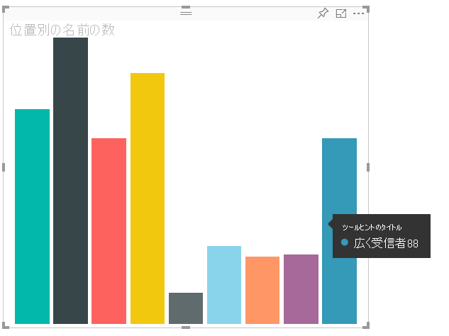
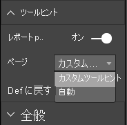

# <a name="tooltips-in-power-bi-visuals"></a><span data-ttu-id="56f11-103">Power BI ビジュアルのヒント</span><span class="sxs-lookup"><span data-stu-id="56f11-103">Tooltips in Power BI visuals</span></span>

<span data-ttu-id="56f11-104">ビジュアルで Power BI のヒントのサポートを利用できるようになりました。</span><span class="sxs-lookup"><span data-stu-id="56f11-104">Visuals can now make use of Power BI tooltip support.</span></span> <span data-ttu-id="56f11-105">Power BI のヒントでは、次の操作が処理されます。</span><span class="sxs-lookup"><span data-stu-id="56f11-105">Power BI tooltips handle the following interactions:</span></span>

* <span data-ttu-id="56f11-106">ヒントを表示する。</span><span class="sxs-lookup"><span data-stu-id="56f11-106">Show a tooltip.</span></span>
* <span data-ttu-id="56f11-107">ヒントを非表示にする。</span><span class="sxs-lookup"><span data-stu-id="56f11-107">Hide a tooltip.</span></span>
* <span data-ttu-id="56f11-108">ヒントを移動する。</span><span class="sxs-lookup"><span data-stu-id="56f11-108">Move a tooltip.</span></span>

<span data-ttu-id="56f11-109">ヒントには、タイトル、特定の色の値、指定された座標セットの不透明度を含むテキスト要素を表示できます。</span><span class="sxs-lookup"><span data-stu-id="56f11-109">Tooltips can display a textual element with a title, a value in a given color, and opacity at a specified set of coordinates.</span></span> <span data-ttu-id="56f11-110">このデータは API に提供され、Power BI ホストでは、ネイティブ ビジュアルのヒントがレンダリングされるのと同じ方法でそれがレンダリングされます。</span><span class="sxs-lookup"><span data-stu-id="56f11-110">This data is provided to the API, and the Power BI host renders it the same way it renders tooltips for native visuals.</span></span>

<span data-ttu-id="56f11-111">次の画像は、サンプルの棒グラフのヒントを示しています。</span><span class="sxs-lookup"><span data-stu-id="56f11-111">A tooltip in a sample bar chart is shown in the following image:</span></span>



<span data-ttu-id="56f11-113">前のヒントの画像は、1 つのバー カテゴリと値を示しています。</span><span class="sxs-lookup"><span data-stu-id="56f11-113">The preceding tooltip image illustrates a single bar category and value.</span></span> <span data-ttu-id="56f11-114">1 つのヒントを拡張して、複数の値を表示できます。</span><span class="sxs-lookup"><span data-stu-id="56f11-114">You can extend a single tooltip to display multiple values.</span></span>

## <a name="manage-tooltips"></a><span data-ttu-id="56f11-115">ヒントの管理</span><span class="sxs-lookup"><span data-stu-id="56f11-115">Manage tooltips</span></span>

<span data-ttu-id="56f11-116">ヒントの管理に使用するインターフェイスは、"ITooltipService" です。</span><span class="sxs-lookup"><span data-stu-id="56f11-116">The interface through which you manage tooltips is the "ITooltipService."</span></span> <span data-ttu-id="56f11-117">これは、ヒントを表示、削除、または移動する必要があることをホストに通知するために使用されます。</span><span class="sxs-lookup"><span data-stu-id="56f11-117">It's used to notify the host that a tooltip needs to be displayed, removed, or moved.</span></span>

```typescript
    interface ITooltipService {
        enabled(): boolean;
        show(options: TooltipShowOptions): void;
        move(options: TooltipMoveOptions): void;
        hide(options: TooltipHideOptions): void;
    }
```

<span data-ttu-id="56f11-118">ご利用のビジュアルでは、ビジュアル内のマウス イベントをリッスンし、`Tooltip****Options` オブジェクトに設定されている適切なコンテンツで必要に応じて、`show()`、`move()`、`hide()` の委任を呼び出す必要があります。</span><span class="sxs-lookup"><span data-stu-id="56f11-118">Your visual needs to listen to the mouse events within your visual and call the `show()`, `move()`, and `hide()` delegates, as needed, with the appropriate content populated in the `Tooltip****Options` objects.</span></span>
<span data-ttu-id="56f11-119">その後、`TooltipShowOptions` と `TooltipHideOptions` で、表示内容とこれらのイベントでの動作方法が定義されます。</span><span class="sxs-lookup"><span data-stu-id="56f11-119">`TooltipShowOptions` and `TooltipHideOptions` would in turn define what to display and how to behave in these events.</span></span>

<span data-ttu-id="56f11-120">これらのメソッドを呼び出すと、マウスの移動やタッチ イベントなどのユーザー イベントが発生するため、これらのイベントのリスナーを作成することをお勧めします。これにより、`TooltipService` メンバーが呼び出されます。</span><span class="sxs-lookup"><span data-stu-id="56f11-120">Because calling these methods involves user events such as mouse moves and touch events, it's a good idea to create listeners for these events, which would in turn invoke the `TooltipService` members.</span></span>
<span data-ttu-id="56f11-121">このサンプルでは、`TooltipServiceWrapper` というクラスで集計を行います。</span><span class="sxs-lookup"><span data-stu-id="56f11-121">Our sample aggregates in a class called `TooltipServiceWrapper`.</span></span>

### <a name="the-tooltipservicewrapper-class"></a><span data-ttu-id="56f11-122">TooltipServiceWrapper クラス</span><span class="sxs-lookup"><span data-stu-id="56f11-122">The TooltipServiceWrapper class</span></span>

<span data-ttu-id="56f11-123">このクラスの背後にある基本的な考え方は、`TooltipService` のインスタンスを保持し、関連する要素に対する D3 マウス イベントをリッスンしてから、`show()` と `hide()` を呼び出し、必要に応じて要素を呼び出すことです。</span><span class="sxs-lookup"><span data-stu-id="56f11-123">The basic idea behind this class is to hold the instance of the `TooltipService`, listen to D3 mouse events over relevant elements, and then make the calls to `show()` and `hide()` the elements when needed.</span></span>

<span data-ttu-id="56f11-124">クラスでは、これらのイベントに関連するすべての状態とロジックが保持および管理されます。ほとんどの場合、これは基になる D3 コードとのインターフェイスが対象となります。</span><span class="sxs-lookup"><span data-stu-id="56f11-124">The class holds and manages any relevant state and logic for these events, which are mostly geared at interfacing with the underlying D3 code.</span></span> <span data-ttu-id="56f11-125">D3 インターフェイスと変換は、この記事の範囲外です。</span><span class="sxs-lookup"><span data-stu-id="56f11-125">The D3 interfacing and conversion is out of scope for this article.</span></span>

<span data-ttu-id="56f11-126">完全なサンプル コードについては、[SampleBarChart ビジュアル リポジトリ](https://github.com/Microsoft/PowerBI-visuals-sampleBarChart/commit/981b021612d7b333adffe9f723ab27783c76fb14)で見つけることができます。</span><span class="sxs-lookup"><span data-stu-id="56f11-126">You can find the full sample code in [SampleBarChart visual repository](https://github.com/Microsoft/PowerBI-visuals-sampleBarChart/commit/981b021612d7b333adffe9f723ab27783c76fb14).</span></span>

### <a name="create-tooltipservicewrapper"></a><span data-ttu-id="56f11-127">TooltipServiceWrapper の作成</span><span class="sxs-lookup"><span data-stu-id="56f11-127">Create TooltipServiceWrapper</span></span>

<span data-ttu-id="56f11-128">横棒グラフのコンストラクターに `TooltipServiceWrapper` メンバーが含まれるようになりました。これは、ホスト `tooltipService` インスタンスと共にコンストラクターでインスタンス化されます。</span><span class="sxs-lookup"><span data-stu-id="56f11-128">The bar chart constructor now has a `TooltipServiceWrapper` member, which is instantiated in the constructor with the host `tooltipService` instance.</span></span>

```typescript
        private tooltipServiceWrapper: ITooltipServiceWrapper;

        this.tooltipServiceWrapper = createTooltipServiceWrapper(this.host.tooltipService, options.element);
```

<span data-ttu-id="56f11-129">`TooltipServiceWrapper` クラスでは、`tooltipService` インスタンスが、ビジュアルおよびタッチ パラメーターのルート D3 要素としても保持されます。</span><span class="sxs-lookup"><span data-stu-id="56f11-129">The `TooltipServiceWrapper` class holds the `tooltipService` instance, also as the root D3 element of the visual and touch parameters.</span></span>

```typescript
    class TooltipServiceWrapper implements ITooltipServiceWrapper {
        private handleTouchTimeoutId: number;
        private visualHostTooltipService: ITooltipService;
        private rootElement: Element;
        private handleTouchDelay: number;

        constructor(tooltipService: ITooltipService, rootElement: Element, handleTouchDelay: number) {
            this.visualHostTooltipService = tooltipService;
            this.handleTouchDelay = handleTouchDelay;
            this.rootElement = rootElement;
        }
        .
        .
        .
    }
```

<span data-ttu-id="56f11-130">このクラスでイベント リスナーを登録するための単一のエントリ ポイントは、`addTooltip` メソッドです。</span><span class="sxs-lookup"><span data-stu-id="56f11-130">The single entry point for this class to register event listeners is the `addTooltip` method.</span></span>

### <a name="the-addtooltip-method"></a><span data-ttu-id="56f11-131">addTooltip メソッド</span><span class="sxs-lookup"><span data-stu-id="56f11-131">The addTooltip method</span></span>

```typescript
        public addTooltip<T>(
            selection: d3.Selection<Element>,
            getTooltipInfoDelegate: (args: TooltipEventArgs<T>) => VisualTooltipDataItem[],
            getDataPointIdentity: (args: TooltipEventArgs<T>) => ISelectionId,
            reloadTooltipDataOnMouseMove?: boolean): void {

            if (!selection || !this.visualHostTooltipService.enabled()) {
                return;
            }
        ...
        ...
        }
```

* <span data-ttu-id="56f11-132">**selection: d3.Selection<Element>** : ヒントが処理される d3 要素。</span><span class="sxs-lookup"><span data-stu-id="56f11-132">**selection: d3.Selection<Element>**: The d3 elements over which tooltips are handled.</span></span>

* <span data-ttu-id="56f11-133">**getTooltipInfoDelegate: (args:TooltipEventArgs<T>) => VisualTooltipDataItem[]** : コンテキストごとにヒント コンテンツ (表示内容) を作成するための委任。</span><span class="sxs-lookup"><span data-stu-id="56f11-133">**getTooltipInfoDelegate: (args: TooltipEventArgs<T>) => VisualTooltipDataItem[]**: The delegate for populating the tooltip content (what to display) per context.</span></span>

* <span data-ttu-id="56f11-134">**getDataPointIdentity: (args:TooltipEventArgs<T>) => ISelectionId**: データ ポイント ID を取得するための委任 (このサンプルでは使用されません)。</span><span class="sxs-lookup"><span data-stu-id="56f11-134">**getDataPointIdentity: (args: TooltipEventArgs<T>) => ISelectionId**: The delegate for retrieving the data point ID (unused in this sample).</span></span> 

* <span data-ttu-id="56f11-135">**reloadTooltipDataOnMouseMove? boolean**: MouseMove イベント中にヒント データを更新するかどうかを示すブール値 (このサンプルでは使用されません)。</span><span class="sxs-lookup"><span data-stu-id="56f11-135">**reloadTooltipDataOnMouseMove? boolean**: A Boolean that indicates whether to refresh the tooltip data during a MouseMove event (unused in this sample).</span></span>

<span data-ttu-id="56f11-136">ご覧のとおり、`tooltipService` が無効になっている場合や、実際の選択がない場合は、アクションなしで `addTooltip` が終了します。</span><span class="sxs-lookup"><span data-stu-id="56f11-136">As you can see, `addTooltip` exits with no action if the `tooltipService` is disabled or there's no real selection.</span></span>

### <a name="call-the-show-method-to-display-a-tooltip"></a><span data-ttu-id="56f11-137">ヒントを表示するための show メソッドを呼び出す</span><span class="sxs-lookup"><span data-stu-id="56f11-137">Call the show method to display a tooltip</span></span>

<span data-ttu-id="56f11-138">次のコードに示すように、`addTooltip` メソッドでは次に D3 の `mouseover` イベントをリッスンします。</span><span class="sxs-lookup"><span data-stu-id="56f11-138">The `addTooltip` method next listens to the D3 `mouseover` event, as shown in the following code:</span></span>

```typescript
        ...
        ...
        selection.on("mouseover.tooltip", () => {
            // Ignore mouseover while handling touch events
            if (!this.canDisplayTooltip(d3.event))
                return;

            let tooltipEventArgs = this.makeTooltipEventArgs<T>(rootNode, true, false);
            if (!tooltipEventArgs)
                return;

            let tooltipInfo = getTooltipInfoDelegate(tooltipEventArgs);
            if (tooltipInfo == null)
                return;

            let selectionId = getDataPointIdentity(tooltipEventArgs);

            this.visualHostTooltipService.show({
                coordinates: tooltipEventArgs.coordinates,
                isTouchEvent: false,
                dataItems: tooltipInfo,
                identities: selectionId ? [selectionId] : [],
            });
        });
```

* <span data-ttu-id="56f11-139">**makeTooltipEventArgs**: D3 で選択された要素から tooltipEventArgs にコンテキストが抽出されます。</span><span class="sxs-lookup"><span data-stu-id="56f11-139">**makeTooltipEventArgs**: Extracts the context from the D3 selected elements into a tooltipEventArgs.</span></span> <span data-ttu-id="56f11-140">これにより、座標も計算されます。</span><span class="sxs-lookup"><span data-stu-id="56f11-140">It calculates the coordinates as well.</span></span>

* <span data-ttu-id="56f11-141">**getTooltipInfoDelegate**: その後、tooltipEventArgs からヒント コンテンツが構築されます。</span><span class="sxs-lookup"><span data-stu-id="56f11-141">**getTooltipInfoDelegate**: It then builds the tooltip content from the tooltipEventArgs.</span></span> <span data-ttu-id="56f11-142">これはビジュアルのロジックであるため、BarChart クラスへのコールバックです。</span><span class="sxs-lookup"><span data-stu-id="56f11-142">It's a callback to the BarChart class, because it is the visual's logic.</span></span> <span data-ttu-id="56f11-143">これは、ヒントに表示される実際のテキスト コンテンツです。</span><span class="sxs-lookup"><span data-stu-id="56f11-143">It's the actual text content to display in the tooltip.</span></span>

* <span data-ttu-id="56f11-144">**getDataPointIdentity**: このサンプルでは使用されません。</span><span class="sxs-lookup"><span data-stu-id="56f11-144">**getDataPointIdentity**: Unused in this sample.</span></span>

* <span data-ttu-id="56f11-145">**this.visualHostTooltipService.show**: ヒントを表示するための呼び出し。</span><span class="sxs-lookup"><span data-stu-id="56f11-145">**this.visualHostTooltipService.show**: The call to display the tooltip.</span></span>  

<span data-ttu-id="56f11-146">追加の処理については、`mouseout` および `mousemove` イベントのサンプルを参照してください。</span><span class="sxs-lookup"><span data-stu-id="56f11-146">Additional handling can be found in the sample for `mouseout` and `mousemove` events.</span></span>

<span data-ttu-id="56f11-147">詳細については、[SampleBarChart ビジュアル リポジトリ](https://github.com/Microsoft/PowerBI-visuals-sampleBarChart/commit/981b021612d7b333adffe9f723ab27783c76fb14)に関するページを参照してください。</span><span class="sxs-lookup"><span data-stu-id="56f11-147">For more information, see the [SampleBarChart visual repository](https://github.com/Microsoft/PowerBI-visuals-sampleBarChart/commit/981b021612d7b333adffe9f723ab27783c76fb14).</span></span>

### <a name="populate-the-tooltip-content-by-the-gettooltipdata-method"></a><span data-ttu-id="56f11-148">getTooltipData メソッドによるヒント コンテンツの設定</span><span class="sxs-lookup"><span data-stu-id="56f11-148">Populate the tooltip content by the getTooltipData method</span></span>

<span data-ttu-id="56f11-149">BarChart クラスは、データ ポイントの `category`、`value`、`color` を VisualTooltipDataItem[] 要素に抽出するだけの `getTooltipData` メンバーと共に追加されました。</span><span class="sxs-lookup"><span data-stu-id="56f11-149">The BarChart class was added with a `getTooltipData` member, which simply extracts the `category`, `value`, and `color` of the data point into a VisualTooltipDataItem[] element.</span></span>

```typescript
        private static getTooltipData(value: any): VisualTooltipDataItem[] {
            return [{
                displayName: value.category,
                value: value.value.toString(),
                color: value.color,
                header: 'ToolTip Title'
            }];
        }
```

<span data-ttu-id="56f11-150">前の実装では、`header` メンバーは定数ですが、動的な値を必要とする、より複雑な実装にこれを使用できます。</span><span class="sxs-lookup"><span data-stu-id="56f11-150">In the preceding implementation, the `header` member is constant, but you can use it for more complex implementations, which require dynamic values.</span></span> <span data-ttu-id="56f11-151">`VisualTooltipDataItem[]` には複数の要素を設定できます。これにより、複数の行がヒントに追加されます。</span><span class="sxs-lookup"><span data-stu-id="56f11-151">You can populate the `VisualTooltipDataItem[]` with more than one element, which adds multiple lines to the tooltip.</span></span> <span data-ttu-id="56f11-152">これは、ヒントに複数のデータ ポイントのデータが表示される可能性のある積み上げ横棒グラフなどのビジュアルで役に立つ場合があります。</span><span class="sxs-lookup"><span data-stu-id="56f11-152">It can be useful in visuals such as stacked bar charts where the tooltip may display data from more than a single data point.</span></span>

### <a name="call-the-addtooltip-method"></a><span data-ttu-id="56f11-153">addTooltip メソッドを呼び出す</span><span class="sxs-lookup"><span data-stu-id="56f11-153">Call the addTooltip method</span></span>

<span data-ttu-id="56f11-154">最後の手順では、実際のデータが変更される可能性がある場合に `addTooltip` メソッドを呼び出します。</span><span class="sxs-lookup"><span data-stu-id="56f11-154">The final step is to call the `addTooltip` method when the actual data might change.</span></span> <span data-ttu-id="56f11-155">この呼び出しは `BarChart.update()` メソッドで行われます。</span><span class="sxs-lookup"><span data-stu-id="56f11-155">This call takes place in the `BarChart.update()` method.</span></span> <span data-ttu-id="56f11-156">前述のとおり、`BarChart.getTooltipData()` のみを渡すことで、すべての 'bar' 要素の選択を監視するために呼び出しが行われます。</span><span class="sxs-lookup"><span data-stu-id="56f11-156">A call is made to monitor the selection of all the 'bar' elements, passing only the `BarChart.getTooltipData()`, as mentioned previously.</span></span>

```typescript
        this.tooltipServiceWrapper.addTooltip(this.barContainer.selectAll('.bar'),
            (tooltipEvent: TooltipEventArgs<number>) => BarChart.getTooltipData(tooltipEvent.data),
            (tooltipEvent: TooltipEventArgs<number>) => null);
```

## <a name="add-report-page-tooltips"></a><span data-ttu-id="56f11-157">レポート ページのヒントを追加する</span><span class="sxs-lookup"><span data-stu-id="56f11-157">Add report page tooltips</span></span>

<span data-ttu-id="56f11-158">レポート ページのヒントのサポートを追加するために、ほとんどの変更を *capabilities.json* ファイルで見つけることができます。</span><span class="sxs-lookup"><span data-stu-id="56f11-158">To add report page tooltips support, you'll find most changes in the *capabilities.json* file.</span></span>

<span data-ttu-id="56f11-159">サンプル スキーマは次のとおりです。</span><span class="sxs-lookup"><span data-stu-id="56f11-159">A sample schema is</span></span>

```json
{
    "tooltips": {
        "supportedTypes": {
            "default": true,
            "canvas": true
        },
        "roles": [
            "tooltips"
        ]
    }
}
```

<span data-ttu-id="56f11-160">**書式**ウィンドウでは、レポート ページのヒントを定義できます。</span><span class="sxs-lookup"><span data-stu-id="56f11-160">You can define report page tooltips in the **Format** pane.</span></span>



* <span data-ttu-id="56f11-162">`supportedTypes`:ビジュアルでサポートされるヒントの構成であり、フィールドでも反映されます。</span><span class="sxs-lookup"><span data-stu-id="56f11-162">`supportedTypes`: The tooltip configuration that's supported by the visual and reflected in the fields well.</span></span> 
   * <span data-ttu-id="56f11-163">`default`:データ フィールドを介した "自動" ヒント バインドがサポートされるかどうかを示します。</span><span class="sxs-lookup"><span data-stu-id="56f11-163">`default`: Specifies whether the "automatic" tooltips binding via the data field is supported.</span></span> 
   * <span data-ttu-id="56f11-164">`canvas`:レポート ページのヒントがサポートされるかどうかを示します。</span><span class="sxs-lookup"><span data-stu-id="56f11-164">`canvas`: Specifies whether the report page tooltips are supported.</span></span>

* <span data-ttu-id="56f11-165">`roles`:(省略可能) 定義された後、フィールドでも選択されたヒント オプションにバインドされるデータ ロールが指示されます。</span><span class="sxs-lookup"><span data-stu-id="56f11-165">`roles`: (Optional) After it's defined, it instructs what data roles are bound to the selected tooltip option in the fields well.</span></span>

<span data-ttu-id="56f11-166">詳細については、[レポート ページのヒントの使用に関するガイドライン](https://powerbi.microsoft.com/blog/power-bi-desktop-march-2018-feature-summary/#tooltips)を参照してください。</span><span class="sxs-lookup"><span data-stu-id="56f11-166">For more information, see [Report page tooltips usage guidelines](https://powerbi.microsoft.com/blog/power-bi-desktop-march-2018-feature-summary/#tooltips).</span></span>

<span data-ttu-id="56f11-167">レポート ページのヒントを表示するには、Power BI ホストで `ITooltipService.Show(options: TooltipShowOptions)` または `ITooltipService.Move(options: TooltipMoveOptions)` を呼び出した後、selectionId (前の `options` 引数の `identities` プロパティ) が使用されます。</span><span class="sxs-lookup"><span data-stu-id="56f11-167">To display the report page tooltip, after the Power BI host calls `ITooltipService.Show(options: TooltipShowOptions)` or `ITooltipService.Move(options: TooltipMoveOptions)`, it consumes the selectionId (`identities` property of the preceding `options` argument).</span></span> <span data-ttu-id="56f11-168">ヒントによって取得されるように、SelectionId では、マウスでポイントした項目の選択されたデータ (カテゴリや系列など) を表す必要があります。</span><span class="sxs-lookup"><span data-stu-id="56f11-168">To be retrieved by the tooltip, SelectionId should represent the selected data (category, series, and so on) of the item you hovered over.</span></span>

<span data-ttu-id="56f11-169">次のコードでは、selectionId を送信してヒントを表示するための呼び出し例を示しています。</span><span class="sxs-lookup"><span data-stu-id="56f11-169">An example of sending the selectionId to tooltip display calls is shown in the following code:</span></span>

```typescript
    this.tooltipServiceWrapper.addTooltip(this.barContainer.selectAll('.bar'),
        (tooltipEvent: TooltipEventArgs<number>) => BarChart.getTooltipData(tooltipEvent.data),
        (tooltipEvent: TooltipEventArgs<number>) => tooltipEvent.data.selectionID);
```
