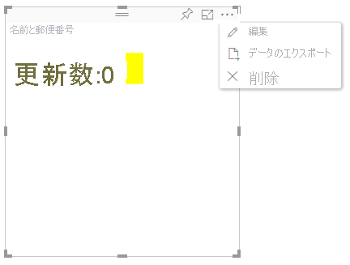

# Power BI ビジュアルの高度な編集モードAdvanced edit mode in Power BI visuals

Power BI ビジュアルに高度な UI コントロールが必要な場合は、高度な編集モードを利用できます。If you require advanced UI controls in your Power BI visual, you can take advantage of advanced edit mode. レポート編集モードになっている場合は、 **[編集]** ボタンを選択して、編集モードを **[詳細]** に設定します。When you're in report editing mode, you select an **Edit** button to set the edit mode to **Advanced**. ビジュアルでは `EditMode` フラグを使用して、この UI コントロールを表示するかどうかを決定できます。The visual can use the `EditMode` flag to determine whether it should display this UI control.

既定では、ビジュアルで高度な編集モードはサポートされません。By default, the visual doesn't support advanced edit mode. 別の動作が必要な場合は、`advancedEditModeSupport` プロパティを設定し、ビジュアルの *capabilities.json* ファイルでこれを明示的に示すことができます。If a different behavior is required, you can explicitly state this in the visual's *capabilities.json* file by setting the `advancedEditModeSupport` property.

使用可能な値は次のとおりです。The possible values are:

- `0` - NotSupported`0` - NotSupported

- `1` - SupportedNoAction`1` - SupportedNoAction

- `2` - SupportedInFocus`2` - SupportedInFocus

## 高度な編集モードを開始するEnter advanced edit mode

次の場合、 **[編集]** ボタンが表示されます。An **Edit** button is displayed if:

* *capabilities.json* ファイルで `advancedEditModeSupport` プロパティが `SupportedNoAction` または `SupportedInFocus` のいずれかに設定されているThe `advancedEditModeSupport` property is set in the *capabilities.json* file to either `SupportedNoAction` or `SupportedInFocus`.

* ビジュアルがレポート編集モードで表示されているThe visual is viewed in report editing mode.

`advancedEditModeSupport` プロパティが *capabilities.json* ファイルにない場合、または `NotSupported` に設定されている場合、 **[編集]** ボタンは表示されません。If `advancedEditModeSupport` property is missing from the *capabilities.json* file or set to `NotSupported`, the **Edit** button is not displayed.

**[編集]** を選択すると、ビジュアルでは、EditMode が `Advanced` に設定された update() 呼び出しを取得します。When you select **Edit**, the visual gets an update() call with EditMode set to `Advanced`. *capabilities.json* ファイルに設定されている値に応じて、次のアクションが実行されます。Depending on the value that's set in the *capabilities.json* file, the following actions occur:

* `SupportedNoAction`:ホストではこれ以上アクションは必要とされません。`SupportedNoAction`: No further action is required by the host.
* `SupportedInFocus`:ホストでは、ビジュアルがフォーカス モードでポップアウトされます。`SupportedInFocus`: The host pops out the visual into in focus mode.

## 高度な編集モードを終了するExit advanced edit mode

次の場合、 **[レポートに戻る]** ボタンが表示されます。The **Back to report** button is displayed if:

* *capabilities.json* ファイルで `advancedEditModeSupport` プロパティが `SupportedInFocus` に設定されているThe `advancedEditModeSupport` property is set in the *capabilities.json* file to `SupportedInFocus`.
