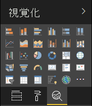

# <a name="the-analytics-pane-in-power-bi-visuals"></a><span data-ttu-id="06343-103">Power BI ビジュアルの分析ウィンドウ</span><span class="sxs-lookup"><span data-stu-id="06343-103">The Analytics pane in Power BI visuals</span></span>

<span data-ttu-id="06343-104">2018 年 11 月に、**分析**ウィンドウが[ネイティブ ビジュアル](https://docs.microsoft.com/power-bi/desktop-analytics-pane)に導入されました。</span><span class="sxs-lookup"><span data-stu-id="06343-104">The **Analytics** pane was introduced for [native visuals](https://docs.microsoft.com/power-bi/desktop-analytics-pane) in November 2018.</span></span>
<span data-ttu-id="06343-105">この記事では、API v2.5.0 を使用する Power BI ビジュアルで**分析**ウィンドウにそれらのプロパティを表示して管理する方法について検討します。</span><span class="sxs-lookup"><span data-stu-id="06343-105">This article discusses how Power BI visuals with API v2.5.0 can present and manage their properties in the **Analytics** pane.</span></span>



## <a name="manage-the-analytics-pane"></a><span data-ttu-id="06343-107">分析ウィンドウを管理する</span><span class="sxs-lookup"><span data-stu-id="06343-107">Manage the Analytics pane</span></span>

<span data-ttu-id="06343-108">[**書式**ウィンドウ](https://docs.microsoft.com/power-bi/developer/visuals/custom-visual-develop-tutorial-format-options)でプロパティを管理するように、ビジュアルの *capabilities.json* ファイルでオブジェクトを定義することで、**分析**ウィンドウを管理します。</span><span class="sxs-lookup"><span data-stu-id="06343-108">Just as you'd manage properties in the [**Format** pane](https://docs.microsoft.com/power-bi/developer/visuals/custom-visual-develop-tutorial-format-options), you manage the **Analytics** pane by defining an object in the visual's *capabilities.json* file.</span></span>

<span data-ttu-id="06343-109">**分析**ウィンドウでは、次のような違いがあります。</span><span class="sxs-lookup"><span data-stu-id="06343-109">For the **Analytics** pane, the differences are as follows:</span></span>

* <span data-ttu-id="06343-110">オブジェクトの定義で、値が 2 の **objectCategory** フィールドを追加します。</span><span class="sxs-lookup"><span data-stu-id="06343-110">Under the object's definition, you add an **objectCategory** field with a value of 2.</span></span>

    > [!NOTE]
    > <span data-ttu-id="06343-111">省略可能な `objectCategory` フィールドは、API 2.5.0 で導入されました。</span><span class="sxs-lookup"><span data-stu-id="06343-111">The optional `objectCategory` field was introduced in API 2.5.0.</span></span> <span data-ttu-id="06343-112">オブジェクトによって制御されるビジュアルの側面が定義されます (1 = 書式設定、2 = 分析)。</span><span class="sxs-lookup"><span data-stu-id="06343-112">It defines the aspect of the visual that the object controls (1 = Formatting, 2 = Analytics).</span></span> <span data-ttu-id="06343-113">`Formatting` は、外観、色、軸、ラベルなどの要素に使用されます。</span><span class="sxs-lookup"><span data-stu-id="06343-113">`Formatting` is used for such elements as look and feel, colors, axes, and labels.</span></span> <span data-ttu-id="06343-114">`Analytics` は、予測、近似曲線、参照行、図形などの要素に使用されます。</span><span class="sxs-lookup"><span data-stu-id="06343-114">`Analytics` is used for such elements as forecasts, trendlines, reference lines, and shapes.</span></span>
    >
    > <span data-ttu-id="06343-115">値が指定されていない場合、`objectCategory` は既定で "書式設定" になります。</span><span class="sxs-lookup"><span data-stu-id="06343-115">If the value isn't specified, `objectCategory` defaults to "Formatting."</span></span>

* <span data-ttu-id="06343-116">オブジェクトには、次の 2 つのプロパティが必要です。</span><span class="sxs-lookup"><span data-stu-id="06343-116">The object must have the following two properties:</span></span>
    * <span data-ttu-id="06343-117">`bool` 型の `show`。既定値は `false` です。</span><span class="sxs-lookup"><span data-stu-id="06343-117">`show` of type `bool`, with a default value of `false`.</span></span>
    * <span data-ttu-id="06343-118">`text` 型の `displayName`。</span><span class="sxs-lookup"><span data-stu-id="06343-118">`displayName` of type `text`.</span></span> <span data-ttu-id="06343-119">選択する既定値が、インスタンスの最初の表示名になります。</span><span class="sxs-lookup"><span data-stu-id="06343-119">The default value that you choose becomes the instance's initial display name.</span></span>

```json
{
  "objects": {
    "YourAnalyticsPropertiesCard": {
      "displayName": "Your analytics properties card's name",
      "objectCategory": 2,
      "properties": {
        "show": {
          "type": {
            "bool": true
          }
        },
        "displayName": {
          "type": {
            "text": true
          }
        },
      ... //any other properties for your Analytics card
      }
    }
  ...
  }
}
```

<span data-ttu-id="06343-120">他のプロパティは、**書式**オブジェクトの場合と同じ方法で定義できます。</span><span class="sxs-lookup"><span data-stu-id="06343-120">You can define other properties in the same way that you do for **Format** objects.</span></span> <span data-ttu-id="06343-121">また、**書式**ウィンドウの場合と同様に、オブジェクトを列挙することもできます。</span><span class="sxs-lookup"><span data-stu-id="06343-121">And you can enumerate objects just as you do in the **Format** pane.</span></span>

## <a name="known-limitations-and-issues-of-the-analytics-pane"></a><span data-ttu-id="06343-122">分析ウィンドウの既知の制限事項と問題</span><span class="sxs-lookup"><span data-stu-id="06343-122">Known limitations and issues of the Analytics pane</span></span>

* <span data-ttu-id="06343-123">**分析**ウィンドウでは、まだマルチインスタンスはサポートされていません。</span><span class="sxs-lookup"><span data-stu-id="06343-123">The **Analytics** pane has no multi-instance support yet.</span></span> <span data-ttu-id="06343-124">オブジェクトに静的以外の[セレクター](https://microsoft.github.io/PowerBI-visuals/docs/concepts/objects-and-properties/#selector)を含めることはできません (つまり、"selector": null)。また、Power BI ビジュアルでは、ユーザー定義の複数のカード インスタンスを含めることはできません。</span><span class="sxs-lookup"><span data-stu-id="06343-124">Objects can't have a [selector](https://microsoft.github.io/PowerBI-visuals/docs/concepts/objects-and-properties/#selector) other than static (that is, "selector": null), and Power BI visuals can't have user-defined multiple instances of a card.</span></span>
* <span data-ttu-id="06343-125">`integer` 型のプロパティが正しく表示されません。</span><span class="sxs-lookup"><span data-stu-id="06343-125">Properties of type `integer` aren't displayed correctly.</span></span> <span data-ttu-id="06343-126">回避策として、代わりに `numeric` 型を使用します。</span><span class="sxs-lookup"><span data-stu-id="06343-126">As a workaround, use type `numeric` instead.</span></span>

> [!NOTE]
> * <span data-ttu-id="06343-127">**分析**ウィンドウは、新しい情報を追加するか、表示された情報に新たな光を当てるオブジェクトに対してのみ使用します (たとえば、重要な傾向を示す動的な参照行)。</span><span class="sxs-lookup"><span data-stu-id="06343-127">Use the **Analytics** pane only for objects that add new information or shed new light on the presented information (for example, dynamic reference lines that illustrate important trends).</span></span>
> * <span data-ttu-id="06343-128">ビジュアルの外観 (つまり、書式設定) を制御するオプションはすべて、**書式設定**ウィンドウに限定する必要があります。</span><span class="sxs-lookup"><span data-stu-id="06343-128">Any options that control the look and feel of the visual (that is, formatting) should be limited to the **Formatting** pane.</span></span>
