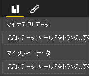

# <a name="capabilities-and-properties-of-power-bi-visuals"></a><span data-ttu-id="0ea04-103">Power BI ビジュアルの機能とプロパティ</span><span class="sxs-lookup"><span data-stu-id="0ea04-103">Capabilities and properties of Power BI visuals</span></span> 

<span data-ttu-id="0ea04-104">機能を使用して、ビジュアルに関する情報をホストに提供します。</span><span class="sxs-lookup"><span data-stu-id="0ea04-104">You use capabilities to provide information to the host about your visual.</span></span> <span data-ttu-id="0ea04-105">機能モデルのプロパティはすべて `optional` です。</span><span class="sxs-lookup"><span data-stu-id="0ea04-105">All properties on the capabilities model are `optional`.</span></span>

<span data-ttu-id="0ea04-106">ビジュアルの機能のルート オブジェクトは、`dataRoles` や `dataViewMappings` などです。</span><span class="sxs-lookup"><span data-stu-id="0ea04-106">The root objects of a visual's capabilities are `dataRoles`, `dataViewMappings`, and so on.</span></span>

```json
{
    "dataRoles": [ ... ],
    "dataViewMappings": [ ... ],
    "objects":  { ... },
    "supportsHighlight": true|false,
    "advancedEditModeSupport": 0|1|2,
    "sorting": { ... }
}

```

## <a name="define-the-data-fields-that-your-visual-expects-dataroles"></a><span data-ttu-id="0ea04-107">ビジュアルに必要なデータ フィールドを定義する: dataRoles</span><span class="sxs-lookup"><span data-stu-id="0ea04-107">Define the data fields that your visual expects: dataRoles</span></span>

<span data-ttu-id="0ea04-108">データにバインドできるフィールドを定義するには、`dataRoles` を使用します。</span><span class="sxs-lookup"><span data-stu-id="0ea04-108">To define fields that can be bound to data, you use `dataRoles`.</span></span> <span data-ttu-id="0ea04-109">`dataRoles` では、必要なすべてのプロパティを定義する `DataViewRole` オブジェクトの配列を受け取ります。</span><span class="sxs-lookup"><span data-stu-id="0ea04-109">`dataRoles` takes an array of `DataViewRole` objects, which defines all the required properties.</span></span>

### <a name="properties"></a><span data-ttu-id="0ea04-110">プロパティ</span><span class="sxs-lookup"><span data-stu-id="0ea04-110">Properties</span></span>

* <span data-ttu-id="0ea04-111">**name**:このデータ フィールドの内部名 (一意である必要があります)。</span><span class="sxs-lookup"><span data-stu-id="0ea04-111">**name**: The internal name of this data field (must be unique).</span></span>
* <span data-ttu-id="0ea04-112">**kind**: フィールドの種類:</span><span class="sxs-lookup"><span data-stu-id="0ea04-112">**kind**: The kind of field:</span></span>
    * <span data-ttu-id="0ea04-113">`Grouping`:メジャー フィールドをグループ化するために使用されるディスクリート値。</span><span class="sxs-lookup"><span data-stu-id="0ea04-113">`Grouping`: Discrete values that are used to group measure fields.</span></span>
    * <span data-ttu-id="0ea04-114">`Measure`:数値データ値。</span><span class="sxs-lookup"><span data-stu-id="0ea04-114">`Measure`: Numeric data values.</span></span>
    * <span data-ttu-id="0ea04-115">`GroupingOrMeasure`:グループ化またはメジャーのいずれかとして使用できる値。</span><span class="sxs-lookup"><span data-stu-id="0ea04-115">`GroupingOrMeasure`: Values that can be used as either a grouping or a measure.</span></span>
* <span data-ttu-id="0ea04-116">**displayName**: **プロパティ** ウィンドウでユーザーに表示される名前。</span><span class="sxs-lookup"><span data-stu-id="0ea04-116">**displayName**: The name displayed to the user in the **Properties** pane.</span></span>
* <span data-ttu-id="0ea04-117">**description**: フィールドの簡単な説明 (省略可能)。</span><span class="sxs-lookup"><span data-stu-id="0ea04-117">**description**: A short description of the field (optional).</span></span>
* <span data-ttu-id="0ea04-118">**requiredTypes**: このデータ ロールに必要なデータの型。</span><span class="sxs-lookup"><span data-stu-id="0ea04-118">**requiredTypes**: The required type of data for this data role.</span></span> <span data-ttu-id="0ea04-119">一致しない値は null に設定されます (省略可能)。</span><span class="sxs-lookup"><span data-stu-id="0ea04-119">Values that don't match are set to null (optional).</span></span>
* <span data-ttu-id="0ea04-120">**preferredTypes**: このデータ ロールで優先されるデータの型 (省略可能)。</span><span class="sxs-lookup"><span data-stu-id="0ea04-120">**preferredTypes**: The preferred type of data for this data role (optional).</span></span>

### <a name="valid-data-types-in-requiredtypes-and-preferredtypes"></a><span data-ttu-id="0ea04-121">requiredTypes と preferredTypes で有効なデータ型</span><span class="sxs-lookup"><span data-stu-id="0ea04-121">Valid data types in requiredTypes and preferredTypes</span></span>

* <span data-ttu-id="0ea04-122">**bool**: ブール値</span><span class="sxs-lookup"><span data-stu-id="0ea04-122">**bool**: A boolean value</span></span>
* <span data-ttu-id="0ea04-123">**integer**: 整数値</span><span class="sxs-lookup"><span data-stu-id="0ea04-123">**integer**: An integer (whole number) value</span></span>
* <span data-ttu-id="0ea04-124">**numeric**: 数値</span><span class="sxs-lookup"><span data-stu-id="0ea04-124">**numeric**: A numeric value</span></span>
* <span data-ttu-id="0ea04-125">**text**: テキスト値</span><span class="sxs-lookup"><span data-stu-id="0ea04-125">**text**: A text value</span></span>
* <span data-ttu-id="0ea04-126">**geography**: 地理データ</span><span class="sxs-lookup"><span data-stu-id="0ea04-126">**geography**: A geographic data</span></span>

### <a name="example"></a><span data-ttu-id="0ea04-127">例</span><span class="sxs-lookup"><span data-stu-id="0ea04-127">Example</span></span>

```json
"dataRoles": [
    {
        "displayName": "My Category Data",
        "name": "myCategory",
        "kind": "Grouping",
        "requiredTypes": [
            {
                "text": true
            },
            {
                "numeric": true
            },
            {
                "integer": true
            }
        ],
        "preferredTypes": [
            {
                "text": true
            }
        ]
    },
    {
        "displayName": "My Measure Data",
        "name": "myMeasure",
        "kind": "Measure",
        "requiredTypes": [
            {
                "integer": true
            },
            {
                "numeric": true
            }
        ],
        "preferredTypes": [
            {
                "integer": true
            }
        ]
    },
    {
        "displayNameKey": "Visual_Location",
        "name": "Locations",
        "kind": "Measure",
        "displayName": "Locations",
        "requiredTypes": [
            {
                "geography": {
                    "address": true
                }
            },
            {
                "geography": {
                    "city": true
                }
            },
            {
                "geography": {
                    "continent": true
                }
            },
            {
                "geography": {
                    "country": true
                }
            },
            {
                "geography": {
                    "county": true
                }
            },
            {
                "geography": {
                    "place": true
                }
            },
            {
                "geography": {
                    "postalCode": true
                }
            },
            {
                "geography": {
                    "region": true
                }
            },
            {
                "geography": {
                    "stateOrProvince": true
                }
            }
        ]
    }
]
```

<span data-ttu-id="0ea04-128">前のデータ ロールでは、次の画像に示すフィールドが作成されます。</span><span class="sxs-lookup"><span data-stu-id="0ea04-128">The preceding data roles would create the fields that are displayed in the following image:</span></span>



## <a name="define-how-you-want-the-data-mapped-dataviewmappings"></a><span data-ttu-id="0ea04-130">データのマップ方法を定義する: dataViewMappings</span><span class="sxs-lookup"><span data-stu-id="0ea04-130">Define how you want the data mapped: dataViewMappings</span></span>

<span data-ttu-id="0ea04-131">DataViewMappings プロパティでは、データ ロールが相互にどのように関連しているかを説明し、それらの条件付き要件を指定することができます。</span><span class="sxs-lookup"><span data-stu-id="0ea04-131">A DataViewMappings property describes how the data roles relate to each other and allows you to specify conditional requirements for the them.</span></span>

<span data-ttu-id="0ea04-132">ほとんどのビジュアルでは 1 つのマッピングが提供されますが、複数の dataViewMapping を指定することができます。</span><span class="sxs-lookup"><span data-stu-id="0ea04-132">Most visuals provide a single mapping, but you can provide multiple dataViewMappings.</span></span> <span data-ttu-id="0ea04-133">有効なマッピングごとにデータ ビューが生成されます。</span><span class="sxs-lookup"><span data-stu-id="0ea04-133">Each valid mapping produces a data view.</span></span> 

```json
"dataViewMappings": [
    {
        "conditions": [ ... ],
        "categorical": { ... },
        "table": { ... },
        "single": { ... },
        "matrix": { ... }
    }
]
```

<span data-ttu-id="0ea04-134">詳細については、「[Power BI ビジュアルでのデータ ビューのマッピングについて理解する](dataview-mappings.md)」を参照してください。</span><span class="sxs-lookup"><span data-stu-id="0ea04-134">For more information, see [Understand data view mapping in Power BI visuals](dataview-mappings.md).</span></span>

## <a name="define-property-pane-options-objects"></a><span data-ttu-id="0ea04-135">プロパティ ウィンドウのオプションを定義する: objects</span><span class="sxs-lookup"><span data-stu-id="0ea04-135">Define property pane options: objects</span></span>

<span data-ttu-id="0ea04-136">オブジェクトでは、ビジュアルに関連付けられているカスタマイズ可能なプロパティを記述します。</span><span class="sxs-lookup"><span data-stu-id="0ea04-136">Objects describe customizable properties that are associated with the visual.</span></span> <span data-ttu-id="0ea04-137">各オブジェクトには複数のプロパティを含めることができ、各プロパティにはそれに関連付けられた型があります。</span><span class="sxs-lookup"><span data-stu-id="0ea04-137">Each object can have multiple properties, and each property has a type that's associated with it.</span></span> <span data-ttu-id="0ea04-138">型は、プロパティの内容を示します。</span><span class="sxs-lookup"><span data-stu-id="0ea04-138">Types refer to what the property will be.</span></span> 

```json
"objects": {
    "myCustomObject": {
        "displayName": "My Object Name",
        "properties": { ... }
    }
}
```

<span data-ttu-id="0ea04-139">詳細については、「[Power BI ビジュアルのオブジェクトとプロパティ](objects-properties.md)」を参照してください。</span><span class="sxs-lookup"><span data-stu-id="0ea04-139">For more information, see [Objects and properties of Power BI visuals](objects-properties.md).</span></span>

## <a name="handle-partial-highlighting-supportshighlight"></a><span data-ttu-id="0ea04-140">部分的な強調表示を処理する: supportsHighlight</span><span class="sxs-lookup"><span data-stu-id="0ea04-140">Handle partial highlighting: supportsHighlight</span></span>

<span data-ttu-id="0ea04-141">既定では、この値は `false` に設定されています。これは、ページ上の何かが選択されたときに、値が自動的にフィルター処理されることを意味します。</span><span class="sxs-lookup"><span data-stu-id="0ea04-141">By default, this value is set to `false`, which means that your values are automatically filtered when something on the page is selected.</span></span> <span data-ttu-id="0ea04-142">この自動フィルター処理では、選択した値のみを表示するように、ビジュアルが更新されます。</span><span class="sxs-lookup"><span data-stu-id="0ea04-142">This automatic filtering in turn updates your visual to display only the selected value.</span></span> <span data-ttu-id="0ea04-143">完全なデータを表示するが、選択された項目のみを強調表示したい場合は、*capabilities.json* ファイルで `supportsHighlight` を `true` に設定する必要があります。</span><span class="sxs-lookup"><span data-stu-id="0ea04-143">If you want to display the full data but highlight only the selected items, you need to set `supportsHighlight` to `true` in your *capabilities.json* file.</span></span>

<span data-ttu-id="0ea04-144">詳細については、「[Power BI ビジュアルでデータ ポイントを強調表示する](highlight.md)」を参照してください。</span><span class="sxs-lookup"><span data-stu-id="0ea04-144">For more information, see [Highlight data points in Power BI visuals](highlight.md).</span></span>

## <a name="handle-advanced-edit-mode-advancededitmodesupport"></a><span data-ttu-id="0ea04-145">高度な編集モードを処理する: advancedEditModeSupport</span><span class="sxs-lookup"><span data-stu-id="0ea04-145">Handle advanced edit mode: advancedEditModeSupport</span></span>

<span data-ttu-id="0ea04-146">ビジュアルでは、高度な編集モードのサポートを宣言できます。</span><span class="sxs-lookup"><span data-stu-id="0ea04-146">A visual can declare its support of advanced edit mode.</span></span> <span data-ttu-id="0ea04-147">*capabilities.json* ファイルで特に指定されていない限り、既定では、ビジュアルで高度な編集モードはサポートされません。</span><span class="sxs-lookup"><span data-stu-id="0ea04-147">By default, a visual doesn't support advanced edit mode, unless stated otherwise in the *capabilities.json* file.</span></span>

<span data-ttu-id="0ea04-148">詳細については、「[Power BI ビジュアルの高度な編集モード](advanced-edit-mode.md)」を参照してください。</span><span class="sxs-lookup"><span data-stu-id="0ea04-148">For more information, see [Advanced edit mode in Power BI visuals](advanced-edit-mode.md).</span></span>

## <a name="data-sorting-options-for-visual-sorting"></a><span data-ttu-id="0ea04-149">ビジュアルのデータ並べ替えオプション: sorting</span><span class="sxs-lookup"><span data-stu-id="0ea04-149">Data sorting options for visual: sorting</span></span>

<span data-ttu-id="0ea04-150">ビジュアルでは、その capabilities を使用して並べ替え動作を定義できます。</span><span class="sxs-lookup"><span data-stu-id="0ea04-150">A visual can define its sorting behavior via its capabilities.</span></span> <span data-ttu-id="0ea04-151">*capabilities.json* ファイルに特に明記されていない限り、既定では、ビジュアルで並べ替え順序の変更はサポートされません。</span><span class="sxs-lookup"><span data-stu-id="0ea04-151">By default, a visual doesn't support modifying its sorting order, unless stated otherwise in the *capabilities.json* file.</span></span>

<span data-ttu-id="0ea04-152">詳細については、「[Power BI ビジュアルの並べ替えオプション](sort-options.md)」を参照してください。</span><span class="sxs-lookup"><span data-stu-id="0ea04-152">For more information, see [Sorting options for Power BI visuals](sort-options.md).</span></span>
