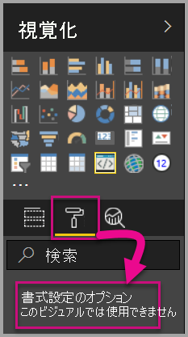
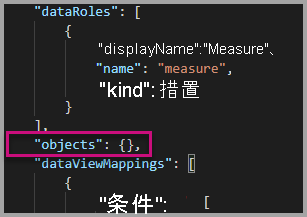
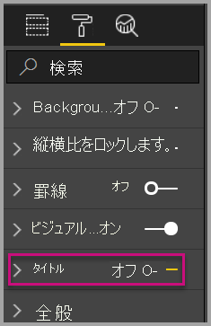
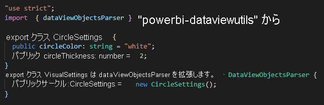
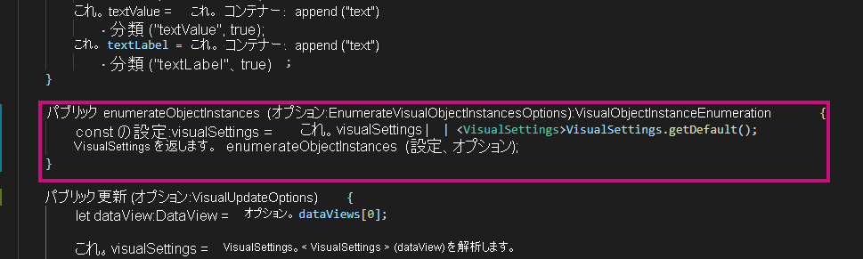
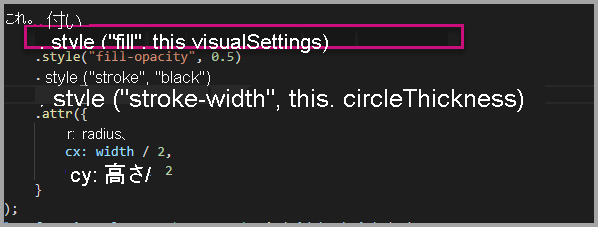
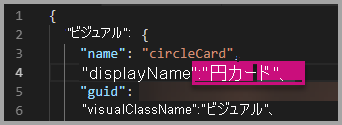
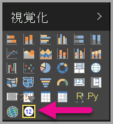

# <a name="tutorial-adding-formatting-options-to-a-power-bi-visual"></a><span data-ttu-id="d5a8e-103">チュートリアル: Power BI ビジュアルへの書式設定オプションの追加</span><span class="sxs-lookup"><span data-stu-id="d5a8e-103">Tutorial: Adding formatting options to a Power BI visual</span></span>

<span data-ttu-id="d5a8e-104">このチュートリアルでは、ビジュアルに共通プロパティを追加する方法について説明します。</span><span class="sxs-lookup"><span data-stu-id="d5a8e-104">In this tutorial, we go through how to add common properties to the visual.</span></span>

<span data-ttu-id="d5a8e-105">このチュートリアルで学習する内容は次のとおりです。</span><span class="sxs-lookup"><span data-stu-id="d5a8e-105">In this tutorial, you learn how to:</span></span>
> [!div class="checklist"]
> * <span data-ttu-id="d5a8e-106">ビジュアルのプロパティを追加する。</span><span class="sxs-lookup"><span data-stu-id="d5a8e-106">Add visual properties.</span></span>
> * <span data-ttu-id="d5a8e-107">ビジュアルをパッケージ化する。</span><span class="sxs-lookup"><span data-stu-id="d5a8e-107">Package the visual.</span></span>
> * <span data-ttu-id="d5a8e-108">カスタム ビジュアルを Power BI Desktop レポートにインポートする。</span><span class="sxs-lookup"><span data-stu-id="d5a8e-108">Import the custom visual to a Power BI Desktop report.</span></span>

## <a name="adding-formatting-options"></a><span data-ttu-id="d5a8e-109">書式設定オプションの追加</span><span class="sxs-lookup"><span data-stu-id="d5a8e-109">Adding formatting options</span></span>

1. <span data-ttu-id="d5a8e-110">**Power BI** で**書式ページ**を選択します。</span><span class="sxs-lookup"><span data-stu-id="d5a8e-110">In **Power BI**, select the **Format page**.</span></span>

    <span data-ttu-id="d5a8e-111">次のメッセージが表示されます - "*このビジュアルに対して書式設定オプションは使用できません*"。</span><span class="sxs-lookup"><span data-stu-id="d5a8e-111">You should see a message that reads - *Formatting options are unavailable for this visual.*</span></span>

    

2. <span data-ttu-id="d5a8e-113">**Visual Studio Code** で、*capabilities.json* ファイルを開きます。</span><span class="sxs-lookup"><span data-stu-id="d5a8e-113">In **Visual Studio Code**, open the *capabilities.json* file.</span></span>

3. <span data-ttu-id="d5a8e-114">**dataViewMappings** 配列の前に、**objects** を追加します (8 行目の後)。</span><span class="sxs-lookup"><span data-stu-id="d5a8e-114">Before the **dataViewMappings** array, add **objects** (after line 8).</span></span>

    ```json
    "objects": {},
    ```

    

4. <span data-ttu-id="d5a8e-116">**capabilities.json** ファイルを保存します。</span><span class="sxs-lookup"><span data-stu-id="d5a8e-116">Save the **capabilities.json** file.</span></span>

5. <span data-ttu-id="d5a8e-117">**Power BI** で、書式設定オプションをもう一度確認します。</span><span class="sxs-lookup"><span data-stu-id="d5a8e-117">In **Power BI**, review the formatting options again.</span></span>

    > [!Note]
    > <span data-ttu-id="d5a8e-118">書式設定オプションが変化していない場合は、 **[Reload Custom Visual]\(カスタム ビジュアルの再読み込み\)** を選択します。</span><span class="sxs-lookup"><span data-stu-id="d5a8e-118">If you do not see the formatting options change then select **Reload Custom Visual**.</span></span>

    

6. <span data-ttu-id="d5a8e-120">**[タイトル]** オプションを "*オフ*" に設定します。</span><span class="sxs-lookup"><span data-stu-id="d5a8e-120">Set the **Title** option to *Off*.</span></span> <span data-ttu-id="d5a8e-121">ビジュアルの左上隅にメジャー名が表示されなくなったことを確認します。</span><span class="sxs-lookup"><span data-stu-id="d5a8e-121">Notice that the visual no longer displays the measure name at the top-left corner.</span></span>

    

    

### <a name="adding-custom-formatting-options"></a><span data-ttu-id="d5a8e-124">カスタム書式設定オプションの追加</span><span class="sxs-lookup"><span data-stu-id="d5a8e-124">Adding custom formatting options</span></span>

<span data-ttu-id="d5a8e-125">カスタム プロパティを追加して、円の色や境界線の幅を設定することができます。</span><span class="sxs-lookup"><span data-stu-id="d5a8e-125">You can add custom properties to enable configuring the color of the circle, and also the border width.</span></span>

1. <span data-ttu-id="d5a8e-126">PowerShell で、カスタム ビジュアルを停止します。</span><span class="sxs-lookup"><span data-stu-id="d5a8e-126">In PowerShell, stop the custom visual.</span></span>

2. <span data-ttu-id="d5a8e-127">Visual Studio Code で、**capabilities.json** ファイルにある **objects** というラベルのオブジェクトに次の JSON フラグメントを挿入します。</span><span class="sxs-lookup"><span data-stu-id="d5a8e-127">In Visual Studio Code, in the **capabilities.json** file, insert the following JSON fragment into the object labeled **objects**.</span></span>

    ```json
    "circle": {
     "displayName": "Circle",
     "properties": {
         "circleColor": {
             "displayName": "Color",
             "description": "The fill color of the circle.",
             "type": {
                 "fill": {
                     "solid": {
                         "color": true
                     }
                 }
             }
         },
         "circleThickness": {
             "displayName": "Thickness",
             "description": "The circle thickness.",
             "type": {
                 "numeric": true
                 }
             }
         }
     },
    ```

    <span data-ttu-id="d5a8e-128">この JSON フラグメントには circle という名前のグループが記述されています。これは、circleColor と circleThickness という 2 つのオプションで構成されています。</span><span class="sxs-lookup"><span data-stu-id="d5a8e-128">The JSON fragment describes a group named circle, which consists of two options named circleColor and circleThickness.</span></span>

   

3. <span data-ttu-id="d5a8e-130">**capabilities.json** ファイルを保存します。</span><span class="sxs-lookup"><span data-stu-id="d5a8e-130">Save the **capabilities.json** file.</span></span>

4. <span data-ttu-id="d5a8e-131">**src** フォルダーの内部から**エクスプローラー ウィンドウ**に入り、**settings.ts** を選択します。</span><span class="sxs-lookup"><span data-stu-id="d5a8e-131">In the **Explorer pane**, from inside the **src** folder, and then select **settings.ts**.</span></span> <span data-ttu-id="d5a8e-132">*このファイルには、スターターのビジュアルに関する設定が記述されています*。</span><span class="sxs-lookup"><span data-stu-id="d5a8e-132">*This file represents the settings for the starter visual*.</span></span>

5. <span data-ttu-id="d5a8e-133">**settings.ts** ファイルで、2 つのクラスを次のコードに置き換えます。</span><span class="sxs-lookup"><span data-stu-id="d5a8e-133">In the **settings.ts** file, replace the two classes with the following code.</span></span>

    ```typescript
    export class CircleSettings {
        public circleColor: string = "white";
        public circleThickness: number = 2;
    }
    export class VisualSettings extends DataViewObjectsParser {
        public circle: CircleSettings = new CircleSettings();
    }
    ```

    

    <span data-ttu-id="d5a8e-135">このモジュールでは、2 つのクラスが定義されます。</span><span class="sxs-lookup"><span data-stu-id="d5a8e-135">This module defines the two classes.</span></span> <span data-ttu-id="d5a8e-136">**CircleSettings** クラスでは、**capabilities.json** ファイル内で定義されるオブジェクト (**circleColor** と **circleThickness**) の名前と一致する 2 つのプロパティが定義されます。また規定値も設定されています。</span><span class="sxs-lookup"><span data-stu-id="d5a8e-136">The **CircleSettings** class defines two properties with names that match the objects defined in the **capabilities.json** file (**circleColor** and **circleThickness**) and also sets default values.</span></span> <span data-ttu-id="d5a8e-137">**VisualSettings** クラスでは **DataViewObjectParser** クラスが継承され、**circle** という名前のプロパティが追加されます。これは *capabilities.json* ファイル内で定義されるオブジェクトと一致しており、**CircleSettings** のインスタンスを返します。</span><span class="sxs-lookup"><span data-stu-id="d5a8e-137">The **VisualSettings** class inherits the **DataViewObjectParser** class and adds a property named **circle**, which matches the object defined in the *capabilities.json* file, and returns an instance of **CircleSettings**.</span></span>

6. <span data-ttu-id="d5a8e-138">**settings.ts** ファイルを保存します。</span><span class="sxs-lookup"><span data-stu-id="d5a8e-138">Save the **settings.ts** file.</span></span>

7. <span data-ttu-id="d5a8e-139">**visual.ts** ファイルを開きます。</span><span class="sxs-lookup"><span data-stu-id="d5a8e-139">Open the **visual.ts** file.</span></span>

8. <span data-ttu-id="d5a8e-140">**visual.ts** ファイルで、</span><span class="sxs-lookup"><span data-stu-id="d5a8e-140">In the **visual.ts** file,</span></span>

    <span data-ttu-id="d5a8e-141">`VisualSettings` クラスをインポートし、</span><span class="sxs-lookup"><span data-stu-id="d5a8e-141">import `VisualSettings` class</span></span>

    ```typescript
    import { VisualSettings } from "./settings";
    ```

    <span data-ttu-id="d5a8e-142">**Visual** クラスに次のプロパティを追加します。</span><span class="sxs-lookup"><span data-stu-id="d5a8e-142">and in the **Visual** class add the following property:</span></span>

    ```typescript
    private visualSettings: VisualSettings;
    ```

    <span data-ttu-id="d5a8e-143">このプロパティには **VisualSettings** オブジェクトへの参照が格納され、ビジュアルの設定が記述されます。</span><span class="sxs-lookup"><span data-stu-id="d5a8e-143">This property stores a reference to the **VisualSettings** object, describing the visual settings.</span></span>

    

9. <span data-ttu-id="d5a8e-145">**Visual** クラスで、**update** メソッドの前に次のメソッドを追加します。</span><span class="sxs-lookup"><span data-stu-id="d5a8e-145">In the **Visual** class, add the following method before the **update** method.</span></span> <span data-ttu-id="d5a8e-146">このメソッドは、書式設定オプションを設定するために使用されます。</span><span class="sxs-lookup"><span data-stu-id="d5a8e-146">This method is used to populate the formatting options.</span></span>

    ```typescript
    public enumerateObjectInstances(options: EnumerateVisualObjectInstancesOptions): VisualObjectInstanceEnumeration {
        const settings: VisualSettings = this.visualSettings || <VisualSettings>VisualSettings.getDefault();
        return VisualSettings.enumerateObjectInstances(settings, options);
    }
    ```

    <span data-ttu-id="d5a8e-147">このメソッドは、書式設定オプションを設定するために使用されます。</span><span class="sxs-lookup"><span data-stu-id="d5a8e-147">This method is used to populate the formatting options.</span></span>

    

10. <span data-ttu-id="d5a8e-149">**update** メソッドの **radius** 変数の宣言の後に、次のコードを追加します。</span><span class="sxs-lookup"><span data-stu-id="d5a8e-149">In the **update** method, after the declaration of the **radius** variable, add the following code.</span></span>

    ```typescript
    this.visualSettings = VisualSettings.parse<VisualSettings>(dataView);

    this.visualSettings.circle.circleThickness = Math.max(0, this.visualSettings.circle.circleThickness);
    this.visualSettings.circle.circleThickness = Math.min(10, this.visualSettings.circle.circleThickness);
    ```

    <span data-ttu-id="d5a8e-150">このコードは書式設定オプションを取得します。</span><span class="sxs-lookup"><span data-stu-id="d5a8e-150">This code retrieves the format options.</span></span> <span data-ttu-id="d5a8e-151">ここでは **circleThickness** プロパティに渡される値が調整されます。負の値は 0 に変換され、10 より大きい値は 10 に変換されます。</span><span class="sxs-lookup"><span data-stu-id="d5a8e-151">It adjusts any value passed into the **circleThickness** property, converting it to 0 if negative, or 10 if it's a value greater than 10.</span></span>

    

11. <span data-ttu-id="d5a8e-153">**circle の要素**で、**fill の style** に渡される値を次の式に変更します。</span><span class="sxs-lookup"><span data-stu-id="d5a8e-153">For the **circle element**, modify the value passed to the **fill style** to the following expression.</span></span>

    ```typescript
    this.visualSettings.circle.circleColor
    ```

    

12. <span data-ttu-id="d5a8e-155">**circle の要素**で、**stroke-width の style** に渡される値を次の式に変更します。</span><span class="sxs-lookup"><span data-stu-id="d5a8e-155">For the **circle element**, modify the value passed to the **stroke-width style** to the following expression.</span></span>

    ```typescript
    this.visualSettings.circle.circleThickness
    ```

    

13. <span data-ttu-id="d5a8e-157">visual.ts ファイルを保存します。</span><span class="sxs-lookup"><span data-stu-id="d5a8e-157">Save the visual.ts file.</span></span>

14. <span data-ttu-id="d5a8e-158">PowerShell で、ビジュアルを開始します。</span><span class="sxs-lookup"><span data-stu-id="d5a8e-158">In PowerShell, start the visual.</span></span>

    ```powershell
    pbiviz start
    ```

15. <span data-ttu-id="d5a8e-159">**Power BI** のビジュアルの上に表示されるツールバーで、 **[自動再読み込みの切り替え]** を選択します。</span><span class="sxs-lookup"><span data-stu-id="d5a8e-159">In **Power BI**, in the toolbar floating above the visual, select **Toggle Auto Reload**.</span></span>

16. <span data-ttu-id="d5a8e-160">**ビジュアルの書式**オプションで、 **[Circle]** を展開します。</span><span class="sxs-lookup"><span data-stu-id="d5a8e-160">In the **visual format** options, expand **Circle**.</span></span>

    

    <span data-ttu-id="d5a8e-162">**[色]** オプションと **[太さ]** オプションを変更します。</span><span class="sxs-lookup"><span data-stu-id="d5a8e-162">Modify the **color** and **thickness** option.</span></span>

    <span data-ttu-id="d5a8e-163">**[太さ]** オプションの値を、0 より小さい値や 10 より大きい値に変更します。</span><span class="sxs-lookup"><span data-stu-id="d5a8e-163">Modify the **thickness** option to a value less than zero, and a value higher than 10.</span></span> <span data-ttu-id="d5a8e-164">すると、ビジュアルによって許容する最小値または最大値に値が更新されることを確認してください。</span><span class="sxs-lookup"><span data-stu-id="d5a8e-164">Then notice the visual updates the value to a tolerable minimum or maximum.</span></span>

## <a name="packaging-the-custom-visual"></a><span data-ttu-id="d5a8e-165">カスタム ビジュアルのパッケージ化</span><span class="sxs-lookup"><span data-stu-id="d5a8e-165">Packaging the custom visual</span></span>

<span data-ttu-id="d5a8e-166">カスタム ビジュアル プロジェクトのプロパティ値を入力し、アイコン ファイルを更新したら、カスタム ビジュアルをパッケージ化します。</span><span class="sxs-lookup"><span data-stu-id="d5a8e-166">Enter property values for the custom visual project, update the icon file, and then package the custom visual.</span></span>

1. <span data-ttu-id="d5a8e-167">**PowerShell** で、カスタム ビジュアルを停止します。</span><span class="sxs-lookup"><span data-stu-id="d5a8e-167">In **PowerShell**, stop the custom visual.</span></span>

2. <span data-ttu-id="d5a8e-168">**Visual Studio Code** で **pbiviz.json** ファイルを開きます。</span><span class="sxs-lookup"><span data-stu-id="d5a8e-168">Open the **pbiviz.json** file in **Visual Studio Code**.</span></span>

3. <span data-ttu-id="d5a8e-169">**visual** オブジェクトで、**displayName** プロパティを *Circle Card* に変更します。</span><span class="sxs-lookup"><span data-stu-id="d5a8e-169">In the **visual** object, modify the **displayName** property to *Circle Card*.</span></span>

    <span data-ttu-id="d5a8e-170">**[視覚化]** ウィンドウでアイコンにカーソルを合わせると、表示名が表示されます。</span><span class="sxs-lookup"><span data-stu-id="d5a8e-170">In the **Visualizations** pane, hovering over the icon reveals the display name.</span></span>

    

4. <span data-ttu-id="d5a8e-172">**description** プロパティに次のテキストを入力します。</span><span class="sxs-lookup"><span data-stu-id="d5a8e-172">For the **description** property, enter the following text.</span></span>

    <span data-ttu-id="d5a8e-173">*円の内側に書式設定された測定値を表示します*</span><span class="sxs-lookup"><span data-stu-id="d5a8e-173">*Displays a formatted measure value inside a circle*</span></span>

5. <span data-ttu-id="d5a8e-174">必要に応じて、**author** オブジェクトに作成者の詳細情報を入力します。</span><span class="sxs-lookup"><span data-stu-id="d5a8e-174">Optionally, in the **author** object, enter your details.</span></span>

6. <span data-ttu-id="d5a8e-175">**pbiviz.json** ファイルを保存します。</span><span class="sxs-lookup"><span data-stu-id="d5a8e-175">Save the **pbiviz.json** file.</span></span>

7. <span data-ttu-id="d5a8e-176">**assets** オブジェクトのドキュメントでアイコンへのパスが定義されていることに注意してください。</span><span class="sxs-lookup"><span data-stu-id="d5a8e-176">In the **assets** object, notice that the document defines a path to an icon.</span></span> <span data-ttu-id="d5a8e-177">このアイコンは、 **_[視覚化]_** ウィンドウに表示されるイメージです。</span><span class="sxs-lookup"><span data-stu-id="d5a8e-177">The icon is the image that appears in the **_Visualizations_** pane.</span></span> <span data-ttu-id="d5a8e-178">これは "**20 × 20 ピクセル**" の *PNG* ファイルにする必要があります。</span><span class="sxs-lookup"><span data-stu-id="d5a8e-178">It must be a **PNG** file, *20 pixels by 20 pixels*.</span></span>

8. <span data-ttu-id="d5a8e-179">エクスプローラーで icon.png ファイルをコピーして貼り付け、assets フォルダーにある既定のファイルを置き換えます。</span><span class="sxs-lookup"><span data-stu-id="d5a8e-179">In Windows Explorer, copy the icon.png file, and then paste it to replace the default file located at assets folder.</span></span>

9. <span data-ttu-id="d5a8e-180">Visual Studio Code のエクスプローラー ウィンドウで assets フォルダーを展開し、icon.png ファイルを選択します。</span><span class="sxs-lookup"><span data-stu-id="d5a8e-180">In Visual Studio Code, in the Explorer pane, expand the assets folder, and then select the icon.png file.</span></span>

10. <span data-ttu-id="d5a8e-181">アイコンを確認します。</span><span class="sxs-lookup"><span data-stu-id="d5a8e-181">Review the icon.</span></span>

    

11. <span data-ttu-id="d5a8e-183">Visual Studio Code で、すべてのファイルが保存されていることを確認します。</span><span class="sxs-lookup"><span data-stu-id="d5a8e-183">In Visual Studio Code, ensure that all files are saved.</span></span>

12. <span data-ttu-id="d5a8e-184">カスタム ビジュアルをパッケージ化するには、PowerShell で次のコマンドを入力します。</span><span class="sxs-lookup"><span data-stu-id="d5a8e-184">To package the custom visual, in PowerShell, enter the following command.</span></span>

    ```powershell
    pbiviz package
    ```

    

<span data-ttu-id="d5a8e-186">パッケージがプロジェクトの **dist** フォルダーに出力されました。</span><span class="sxs-lookup"><span data-stu-id="d5a8e-186">Now the package is output to the **dist** folder of the project.</span></span> <span data-ttu-id="d5a8e-187">パッケージには、カスタム ビジュアルを Power BI サービスまたは Power BI Desktop レポートにインポートするために必要なものがすべて含まれています。</span><span class="sxs-lookup"><span data-stu-id="d5a8e-187">The package contains everything required to import the custom visual into either the Power BI service or a Power BI Desktop report.</span></span> <span data-ttu-id="d5a8e-188">これでカスタム ビジュアルのパッケージ化が完了し、使用する準備が整いました。</span><span class="sxs-lookup"><span data-stu-id="d5a8e-188">You have now packaged the custom visual, and it is now ready for use.</span></span>

## <a name="importing-the-custom-visual"></a><span data-ttu-id="d5a8e-189">カスタム ビジュアルのインポート</span><span class="sxs-lookup"><span data-stu-id="d5a8e-189">Importing the custom visual</span></span>

<span data-ttu-id="d5a8e-190">Power BI Desktop レポートを開き、カスタム ビジュアル Circle Card をインポートできるようになりました。</span><span class="sxs-lookup"><span data-stu-id="d5a8e-190">Now you can open the Power BI Desktop report, and import the Circle Card custom visual.</span></span>

1. <span data-ttu-id="d5a8e-191">**Power BI Desktop** を開き、任意の "*サンプルのデータセット*" を使用して新しいレポートを作成します。</span><span class="sxs-lookup"><span data-stu-id="d5a8e-191">Open **Power BI Desktop**, create a new report with any *sample dataset*</span></span>

2. <span data-ttu-id="d5a8e-192">**_[視覚化]_** ウィンドウで**省略記号**を選択し、ファイルから **[インポート]** を選択します。</span><span class="sxs-lookup"><span data-stu-id="d5a8e-192">In the **_Visualizations_** pane, select the **ellipsis**, and then select **Import** from File.</span></span>

    

3. <span data-ttu-id="d5a8e-194">**インポート ウィンドウ**で、 **[インポート]** を選択します。</span><span class="sxs-lookup"><span data-stu-id="d5a8e-194">In the **import window**, select **Import**.</span></span>

4. <span data-ttu-id="d5a8e-195">開いたウィンドウで、プロジェクトのディレクトリの **dist** フォルダーに移動します。</span><span class="sxs-lookup"><span data-stu-id="d5a8e-195">In the Open window, navigate to the **dist** folder in your project directory.</span></span>

5. <span data-ttu-id="d5a8e-196">**circleCard.pbiviz** ファイルを選択して、 **[開く]** を選択します。</span><span class="sxs-lookup"><span data-stu-id="d5a8e-196">Select the **circleCard.pbiviz** file, and then select **Open**.</span></span>

6. <span data-ttu-id="d5a8e-197">ビジュアルが正常にインポートされたら、 **[OK]** を選択します。</span><span class="sxs-lookup"><span data-stu-id="d5a8e-197">When the visual has successfully imported, select **OK**.</span></span>

7. <span data-ttu-id="d5a8e-198">ビジュアルが **_[視覚化]_** ウィンドウに追加されたことを確認します。</span><span class="sxs-lookup"><span data-stu-id="d5a8e-198">Verify that the visual has been added to the **_Visualizations_** pane.</span></span>

    

8. <span data-ttu-id="d5a8e-200">**Circle Card** にカーソルを合わせると、ツールヒントが表示されることに注目してください。</span><span class="sxs-lookup"><span data-stu-id="d5a8e-200">Hover over the **Circle Card** icon, and notice the tooltip that appears.</span></span>

## <a name="debugging"></a><span data-ttu-id="d5a8e-201">デバッグ</span><span class="sxs-lookup"><span data-stu-id="d5a8e-201">Debugging</span></span>

<span data-ttu-id="d5a8e-202">カスタム ビジュアルのデバッグに関するヒントについては、[デバッグ ガイド](https://microsoft.github.io/PowerBI-visuals/docs/how-to-guide/how-to-debug/)を参照してください。</span><span class="sxs-lookup"><span data-stu-id="d5a8e-202">For tips about debugging your custom visual, see the [debugging guide](https://microsoft.github.io/PowerBI-visuals/docs/how-to-guide/how-to-debug/).</span></span>

## <a name="next-steps"></a><span data-ttu-id="d5a8e-203">次の手順</span><span class="sxs-lookup"><span data-stu-id="d5a8e-203">Next steps</span></span>

<span data-ttu-id="d5a8e-204">他のユーザーが使用できるように新しく開発したビジュアルをリストすることはできますが、その場合、**AppSource** に送信する必要があります。</span><span class="sxs-lookup"><span data-stu-id="d5a8e-204">You can list your newly developed visual for others to use by submitting it to the **AppSource**.</span></span> <span data-ttu-id="d5a8e-205">このプロセスの詳細については、「[カスタム ビジュアルを AppSource に発行する](../office-store.md)」を参照してください。</span><span class="sxs-lookup"><span data-stu-id="d5a8e-205">For more information on this process reference [Publish custom visuals to AppSource](../office-store.md).</span></span>
