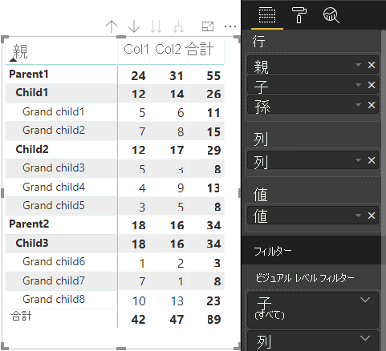

# <a name="understand-data-view-mapping-in-power-bi-visuals"></a><span data-ttu-id="006be-103">Power BI ビジュアルでのデータ ビューのマッピングについて理解する</span><span class="sxs-lookup"><span data-stu-id="006be-103">Understand data view mapping in Power BI visuals</span></span>

<span data-ttu-id="006be-104">この記事ではデータ ビュー マッピングについて説明します。データ ロールが相互にどのように関連しているか、またデータ ロールで、条件付き要件を指定できるようにするにはどうすればよいかについても説明します。</span><span class="sxs-lookup"><span data-stu-id="006be-104">This article discusses data view mapping and describes how data roles relate to each other and allow you to specify conditional requirements for them.</span></span> <span data-ttu-id="006be-105">この記事では、`dataMappings` の各種類についても説明します。</span><span class="sxs-lookup"><span data-stu-id="006be-105">The article also describes each `dataMappings` type.</span></span>

<span data-ttu-id="006be-106">有効なマッピングごとにデータ ビューが生成されますが、現在はビジュアルごとに 1 つのクエリを実行することしかサポートされていません。</span><span class="sxs-lookup"><span data-stu-id="006be-106">Each valid mapping produces a data view, but we currently support performing only one query per visual.</span></span> <span data-ttu-id="006be-107">通常、取得できるデータ ビューは 1 つだけです。</span><span class="sxs-lookup"><span data-stu-id="006be-107">You ordinarily get only one data view.</span></span> <span data-ttu-id="006be-108">ただし、次のような特定の条件では複数のデータ マッピングを実現できます。</span><span class="sxs-lookup"><span data-stu-id="006be-108">However, you can provide multiple data mappings in certain conditions, which allow:</span></span>

```json
"dataViewMappings": [
    {
        "conditions": [ ... ],
        "categorical": { ... },
        "single": { ... },
        "table": { ... },
        "matrix": { ... }
    }
]
```

<span data-ttu-id="006be-109">Power BI では、`dataViewMappings` に有効なマッピングが指定されている場合にのみ、データ ビューへのマッピングが作成されます。</span><span class="sxs-lookup"><span data-stu-id="006be-109">Power BI creates a mapping to a data view if and only if the valid mapping is filled in `dataViewMappings`.</span></span>

<span data-ttu-id="006be-110">つまり、`dataViewMappings` に定義されるものも (`categorical`) あれば、定義されないものも (`table` や `single` などの他のマッピング) あります。</span><span class="sxs-lookup"><span data-stu-id="006be-110">In other words, `categorical` might be defined in `dataViewMappings` but other mappings, such as `table` or `single`, might not be.</span></span> <span data-ttu-id="006be-111">例:</span><span class="sxs-lookup"><span data-stu-id="006be-111">For example:</span></span>

```json
"dataViewMappings": [
    {
        "categorical": { ... }
    }
]
```

<span data-ttu-id="006be-112">Power BI では、単一の `categorical` マッピングを使用してデータビューが生成され、`table` およびその他のマッピングは未定義になります。</span><span class="sxs-lookup"><span data-stu-id="006be-112">Power BI produces a data view with a single `categorical` mapping, and `table` and other mappings are undefined:</span></span>

```javascript
{
    "categorical": {
        "categories": [ ... ],
        "values": [ ... ]
    },
    "metadata": { ... }
}
```

## <a name="conditions"></a><span data-ttu-id="006be-113">条件</span><span class="sxs-lookup"><span data-stu-id="006be-113">Conditions</span></span>

<span data-ttu-id="006be-114">このセクションでは、特定のデータ マッピングに対する条件について説明します。</span><span class="sxs-lookup"><span data-stu-id="006be-114">This section describes conditions for a particular data mapping.</span></span> <span data-ttu-id="006be-115">複数の条件セットを指定できます。記述されている条件セットのいずれかにデータが一致した場合、ビジュアルによってデータが有効なものとして受け入れられます。</span><span class="sxs-lookup"><span data-stu-id="006be-115">You can provide multiple sets of conditions and, if the data matches one of the described sets of conditions, the visual accepts the data as valid.</span></span>

<span data-ttu-id="006be-116">現時点では、フィールドごとに最小値と最大値を指定できます。</span><span class="sxs-lookup"><span data-stu-id="006be-116">Currently, for each field, you can specify a minimum and maximum value.</span></span> <span data-ttu-id="006be-117">この値は、そのデータ ロールにバインドできるフィールドの数を表します。</span><span class="sxs-lookup"><span data-stu-id="006be-117">The value represents the number of fields that can be bound to that data role.</span></span> 

> [!NOTE]
> <span data-ttu-id="006be-118">条件でデータ ロールが省略されている場合は、任意の数のフィールドを持つことができます。</span><span class="sxs-lookup"><span data-stu-id="006be-118">If a data role is omitted in the condition, it can have any number of fields.</span></span>

### <a name="example-1"></a><span data-ttu-id="006be-119">例 1</span><span class="sxs-lookup"><span data-stu-id="006be-119">Example 1</span></span>

<span data-ttu-id="006be-120">各データ ロールに複数のフィールドをドラッグできます。</span><span class="sxs-lookup"><span data-stu-id="006be-120">You can drag multiple fields into each data role.</span></span> <span data-ttu-id="006be-121">この例では、category を 1 つのデータ フィールドに制限し、measure を 2 つのデータ フィールドに制限します。</span><span class="sxs-lookup"><span data-stu-id="006be-121">In this example, you limit the category to one data field and the measure to two data fields.</span></span>

```json
"conditions": [
    { "category": { "max": 1 }, "y": { "max": 2 } },
]
```

### <a name="example-2"></a><span data-ttu-id="006be-122">例 2</span><span class="sxs-lookup"><span data-stu-id="006be-122">Example 2</span></span>

<span data-ttu-id="006be-123">この例では、次の 2 つの条件のいずれかが必要です。</span><span class="sxs-lookup"><span data-stu-id="006be-123">In this example, either of two conditions is required:</span></span>
* <span data-ttu-id="006be-124">正確に 1 つの category データ フィールドと正確に 2 つの measure</span><span class="sxs-lookup"><span data-stu-id="006be-124">Exactly one category data field and exactly two measures</span></span>
* <span data-ttu-id="006be-125">正確に 2 つの category と正確に 1 つの measure。</span><span class="sxs-lookup"><span data-stu-id="006be-125">Exactly two categories and exactly one measure.</span></span>

```json
"conditions": [
    { "category": { "min": 1, "max": 1 }, "measure": { "min": 2, "max": 2 } },
    { "category": { "min": 2, "max": 2 }, "measure": { "min": 1, "max": 1 } }
]
```

## <a name="single-data-mapping"></a><span data-ttu-id="006be-126">単一のデータ マッピング</span><span class="sxs-lookup"><span data-stu-id="006be-126">Single data mapping</span></span>

<span data-ttu-id="006be-127">単一のデータ マッピングは、最も単純な形式のデータ マッピングです。</span><span class="sxs-lookup"><span data-stu-id="006be-127">Single data mapping is the simplest form of data mapping.</span></span> <span data-ttu-id="006be-128">1 つの measure フィールドを受け取り、合計を返します。</span><span class="sxs-lookup"><span data-stu-id="006be-128">It accepts a single measure field and gives you the total.</span></span> <span data-ttu-id="006be-129">フィールドが数値の場合、合計が返されます。</span><span class="sxs-lookup"><span data-stu-id="006be-129">If the field is numeric, it gives you the sum.</span></span> <span data-ttu-id="006be-130">それ以外の場合は、一意の値の数が返されます。</span><span class="sxs-lookup"><span data-stu-id="006be-130">Otherwise, it gives you a count of unique values.</span></span>

<span data-ttu-id="006be-131">単一のデータ マッピングを使用するには、マップするデータ ロールの名前を定義する必要があります。</span><span class="sxs-lookup"><span data-stu-id="006be-131">To use single data mapping, you need to define the name of the data role that you want to map.</span></span> <span data-ttu-id="006be-132">このマッピングは、1 つの measure フィールドに対してのみ機能します。</span><span class="sxs-lookup"><span data-stu-id="006be-132">This mapping works only with a single measure field.</span></span> <span data-ttu-id="006be-133">2 番目のフィールドが割り当てられている場合は、データ ビューは生成されません。そのため、データを 1 つのフィールドに制限する条件を含めることをお勧めします。</span><span class="sxs-lookup"><span data-stu-id="006be-133">If a second field is assigned, no data view is generated, so it's also a good practice to include a condition that limits the data to a single field.</span></span>

> [!NOTE]
> <span data-ttu-id="006be-134">このデータ マッピングは、他のどのデータ マッピングとも組み合わせて使用することはできません。</span><span class="sxs-lookup"><span data-stu-id="006be-134">This data mapping can't be used in conjunction with any other data mapping.</span></span> <span data-ttu-id="006be-135">データを 1 つの数値に減らすことを目的としています。</span><span class="sxs-lookup"><span data-stu-id="006be-135">It's meant to reduce data into a single numeric value.</span></span>

### <a name="example-3"></a><span data-ttu-id="006be-136">例 3</span><span class="sxs-lookup"><span data-stu-id="006be-136">Example 3</span></span>

```json
"dataViewMappings": {
    "conditions": [
        { "Y": { "max": 1 } }
    ],
    "single": {
        "role": "Y"
    }
}  
```

<span data-ttu-id="006be-137">結果のデータ ビューには引き続き他の種類 (テーブル、カテゴリなど) も含まれますが、各マッピングには single 値しか含まれていません。</span><span class="sxs-lookup"><span data-stu-id="006be-137">The resulting data view still contains the other types (table, categorical, and so on), but each mapping contains only the single value.</span></span> <span data-ttu-id="006be-138">single 内の値にのみアクセスすることをお勧めします。</span><span class="sxs-lookup"><span data-stu-id="006be-138">The best practice is to access the value only in single.</span></span>

```JSON
{
    "dataView": [
        {
            "metadata": null,
            "categorical": null,
            "matrix": null,
            "table": null,
            "tree": null,
            "single": {
                "value": 94163140.3560001
            }
        }
    ]
}
```

## <a name="categorical-data-mapping"></a><span data-ttu-id="006be-139">カテゴリ別のデータ マッピング</span><span class="sxs-lookup"><span data-stu-id="006be-139">Categorical data mapping</span></span>

<span data-ttu-id="006be-140">カテゴリ別のデータ マッピングは、1 つまたは 2 つの独立したデータ グループを取得するために使用されます。</span><span class="sxs-lookup"><span data-stu-id="006be-140">Categorical data mapping is used to get one or two independent groupings of data.</span></span>

### <a name="example-4"></a><span data-ttu-id="006be-141">例 4</span><span class="sxs-lookup"><span data-stu-id="006be-141">Example 4</span></span>

<span data-ttu-id="006be-142">データ ロールに関する前の例の定義を次に示します。</span><span class="sxs-lookup"><span data-stu-id="006be-142">Here is the definition from the previous example for data roles:</span></span>

```json
"dataRole":[
    {
        "displayName": "Category",
        "name": "category",
        "kind": "Grouping"
    },
    {
        "displayName": "Y Axis",
        "name": "measure",
        "kind": "Measure"
    }
]
```

<span data-ttu-id="006be-143">マッピングは次のようになります。</span><span class="sxs-lookup"><span data-stu-id="006be-143">Here is the mapping:</span></span>

```json
"dataViewMappings": {
    "categorical": {
        "categories": {
            "for": { "in": "category" }
        },
        "values": {
            "select": [
                { "bind": { "to": "measure" } }
            ]
        }
    }
}
```

<span data-ttu-id="006be-144">これはシンプルな例です。</span><span class="sxs-lookup"><span data-stu-id="006be-144">It's a simple example.</span></span> <span data-ttu-id="006be-145">これは次のように読み取れます。"どのフィールドでも `category` にドラッグすると、そのデータが `categorical.categories` にマップされるように、`category` データ ロールをマップします。</span><span class="sxs-lookup"><span data-stu-id="006be-145">It reads "Map my `category` data role so that for every field I drag into `category`, its data is mapped to `categorical.categories`.</span></span> <span data-ttu-id="006be-146">また、自分の `measure` データ ロールを `categorical.values` にマップします。"</span><span class="sxs-lookup"><span data-stu-id="006be-146">Also map my `measure` data role to `categorical.values`."</span></span>

* <span data-ttu-id="006be-147">**for...in**: このデータ ロール内のすべての項目について、それらをデータ クエリに含めます。</span><span class="sxs-lookup"><span data-stu-id="006be-147">**for...in**: For all the items in this data role, include them in the data query.</span></span>
* <span data-ttu-id="006be-148">**bind...to**: *for...in* と同じ結果が生成されますが、それを 1 つのフィールドに制限する条件をデータ ロールが持つことが想定されています。</span><span class="sxs-lookup"><span data-stu-id="006be-148">**bind...to**: Produces the same result as in *for...in*, but expects that the data role will have a condition restricting it to a single field.</span></span>

### <a name="example-5"></a><span data-ttu-id="006be-149">例 5</span><span class="sxs-lookup"><span data-stu-id="006be-149">Example 5</span></span>

<span data-ttu-id="006be-150">この例では、前の例の最初の 2 つのデータ ロールを使用し、さらに `grouping` と `measure2` を定義します。</span><span class="sxs-lookup"><span data-stu-id="006be-150">This example uses the first two data roles from the previous example and additionally defines `grouping` and `measure2`.</span></span>

```json
"dataRole":[
    {
        "displayName": "Category",
        "name": "category",
        "kind": "Grouping"
    },
    {
        "displayName": "Y Axis",
        "name": "measure",
        "kind": "Measure"
    },
    {
        "displayName": "Grouping with",
        "name": "grouping",
        "kind": "Grouping"
    },
    {
        "displayName": "X Axis",
        "name": "measure2",
        "kind": "Grouping"
    }
]
```

<span data-ttu-id="006be-151">マッピングは次のようになります。</span><span class="sxs-lookup"><span data-stu-id="006be-151">Here is the mapping:</span></span>

```json
"dataViewMappings":{
    "categorical": {
        "categories": {
            "for": { "in": "category" }
        },
        "values": {
            "group": {
                "by": "grouping",
                "select":[
                    { "bind": { "to": "measure" } },
                    { "bind": { "to": "measure2" } }
                ]
            }
        }
    }
}
```

<span data-ttu-id="006be-152">ここでの違いは、categorical.values をどのようにマップするかという点です。</span><span class="sxs-lookup"><span data-stu-id="006be-152">Here the difference is in how we are mapping categorical.values.</span></span> <span data-ttu-id="006be-153">ここでは、「`measure` および `measure2` のデータ ロールを、データ ロール `grouping` によってグループ化されるようにマップします」ということを示しています。</span><span class="sxs-lookup"><span data-stu-id="006be-153">We are saying that "Map my `measure` and `measure2` data roles to be grouped by the data role `grouping`."</span></span>

### <a name="example-6"></a><span data-ttu-id="006be-154">例 6</span><span class="sxs-lookup"><span data-stu-id="006be-154">Example 6</span></span>

<span data-ttu-id="006be-155">データ ロールを次に示します。</span><span class="sxs-lookup"><span data-stu-id="006be-155">Here are the data roles:</span></span>

```json
"dataRoles": [
    {
        "displayName": "Categories",
        "name": "category",
        "kind": "Grouping"
    },
    {
        "displayName": "Measures",
        "name": "measure",
        "kind": "Measure"
    },
    {
        "displayName": "Series",
        "name": "series",
        "kind": "Measure"
    }
]
```

<span data-ttu-id="006be-156">データ ビュー マッピングは次のとおりです。</span><span class="sxs-lookup"><span data-stu-id="006be-156">Here is the data view mapping:</span></span>

```json
"dataViewMappings": [
    {
        "categorical": {
            "categories": {
                "for": {
                    "in": "category"
                }
            },
            "values": {
                "group": {
                    "by": "series",
                    "select": [{
                            "for": {
                                "in": "measure"
                            }
                        }
                    ]
                }
            }
        }
    }
]
```

<span data-ttu-id="006be-157">カテゴリ別のデータ ビューは次のように視覚化できます。</span><span class="sxs-lookup"><span data-stu-id="006be-157">The categorical data view could be visualized like this:</span></span>

| <span data-ttu-id="006be-158">カテゴリ別</span><span class="sxs-lookup"><span data-stu-id="006be-158">Categorical</span></span> |  |  | | | |
|-----|-----|------|------|------|------|
| | <span data-ttu-id="006be-159">年</span><span class="sxs-lookup"><span data-stu-id="006be-159">Year</span></span> | <span data-ttu-id="006be-160">2013</span><span class="sxs-lookup"><span data-stu-id="006be-160">2013</span></span> | <span data-ttu-id="006be-161">2014</span><span class="sxs-lookup"><span data-stu-id="006be-161">2014</span></span> | <span data-ttu-id="006be-162">2015</span><span class="sxs-lookup"><span data-stu-id="006be-162">2015</span></span> | <span data-ttu-id="006be-163">2016</span><span class="sxs-lookup"><span data-stu-id="006be-163">2016</span></span> |
| <span data-ttu-id="006be-164">国</span><span class="sxs-lookup"><span data-stu-id="006be-164">Country</span></span> | | |
| <span data-ttu-id="006be-165">米国</span><span class="sxs-lookup"><span data-stu-id="006be-165">USA</span></span> | | <span data-ttu-id="006be-166">x</span><span class="sxs-lookup"><span data-stu-id="006be-166">x</span></span> | <span data-ttu-id="006be-167">x</span><span class="sxs-lookup"><span data-stu-id="006be-167">x</span></span> | <span data-ttu-id="006be-168">125</span><span class="sxs-lookup"><span data-stu-id="006be-168">125</span></span> | <span data-ttu-id="006be-169">100</span><span class="sxs-lookup"><span data-stu-id="006be-169">100</span></span> |
| <span data-ttu-id="006be-170">カナダ</span><span class="sxs-lookup"><span data-stu-id="006be-170">Canada</span></span> | | <span data-ttu-id="006be-171">x</span><span class="sxs-lookup"><span data-stu-id="006be-171">x</span></span> | <span data-ttu-id="006be-172">50</span><span class="sxs-lookup"><span data-stu-id="006be-172">50</span></span> | <span data-ttu-id="006be-173">200</span><span class="sxs-lookup"><span data-stu-id="006be-173">200</span></span> | <span data-ttu-id="006be-174">x</span><span class="sxs-lookup"><span data-stu-id="006be-174">x</span></span> |
| <span data-ttu-id="006be-175">メキシコ</span><span class="sxs-lookup"><span data-stu-id="006be-175">Mexico</span></span> | | <span data-ttu-id="006be-176">300</span><span class="sxs-lookup"><span data-stu-id="006be-176">300</span></span> | <span data-ttu-id="006be-177">x</span><span class="sxs-lookup"><span data-stu-id="006be-177">x</span></span> | <span data-ttu-id="006be-178">x</span><span class="sxs-lookup"><span data-stu-id="006be-178">x</span></span> | <span data-ttu-id="006be-179">x</span><span class="sxs-lookup"><span data-stu-id="006be-179">x</span></span> |
| <span data-ttu-id="006be-180">英国</span><span class="sxs-lookup"><span data-stu-id="006be-180">UK</span></span> | | <span data-ttu-id="006be-181">x</span><span class="sxs-lookup"><span data-stu-id="006be-181">x</span></span> | <span data-ttu-id="006be-182">x</span><span class="sxs-lookup"><span data-stu-id="006be-182">x</span></span> | <span data-ttu-id="006be-183">75</span><span class="sxs-lookup"><span data-stu-id="006be-183">75</span></span> | <span data-ttu-id="006be-184">x</span><span class="sxs-lookup"><span data-stu-id="006be-184">x</span></span> |

<span data-ttu-id="006be-185">Power BI では、それがカテゴリ別のデータ ビューとして作成されます。</span><span class="sxs-lookup"><span data-stu-id="006be-185">Power BI produces it as the categorical data view.</span></span> <span data-ttu-id="006be-186">これはカテゴリのセットです。</span><span class="sxs-lookup"><span data-stu-id="006be-186">It's the set of categories.</span></span>

```JSON
{
    "categorical": {
        "categories": [
            {
                "source": {...},
                "values": [
                    "Canada",
                    "Mexico",
                    "UK",
                    "USA"
                ],
                "identity": [...],
                "identityFields": [...],
            }
        ]
    }
}
```

<span data-ttu-id="006be-187">各カテゴリは値のセットにもマップされます。</span><span class="sxs-lookup"><span data-stu-id="006be-187">Each category maps to a set of values as well.</span></span> <span data-ttu-id="006be-188">これらの値はそれぞれ系列 (年で表現される) でグループ化されます。</span><span class="sxs-lookup"><span data-stu-id="006be-188">Each of these values is grouped by series, which is expressed as years.</span></span>

<span data-ttu-id="006be-189">たとえば、2013 年のカナダの売上は null で、2014 年のカナダの売上は 50 です。</span><span class="sxs-lookup"><span data-stu-id="006be-189">For example, Canada sales in 2013 is null, Canada sales in 2014 is 50.</span></span>

```JSON
{
    "values": [
        {
            "source": {...},
            "values": [
                null,
                300,
                null,
                null
            ],
            "identity": [...],
        },
        {
            "source": {...},
            "values": [
                50,
                null,
                150,
                null
            ],
            "identity": [...],
        },
        {
            "source": {...},
            "values": [
                200,
                null,
                null,
                125
            ],
            "identity": [...],
        },
        {
            "source": {...},
            "values": [
                null,
                null,
                null,
                100
            ],
            "identity": [...],
        }
    ]
}
```

## <a name="table-data-mapping"></a><span data-ttu-id="006be-190">テーブルのデータ マッピング</span><span class="sxs-lookup"><span data-stu-id="006be-190">Table data mapping</span></span>

<span data-ttu-id="006be-191">テーブルのデータ ビューは、単純なデータ マッピングです。</span><span class="sxs-lookup"><span data-stu-id="006be-191">The table data view is a simple data mapping.</span></span> <span data-ttu-id="006be-192">基本的には、これは数値データ ポイントを集計できるデータ ポイントの一覧です。</span><span class="sxs-lookup"><span data-stu-id="006be-192">Essentially, it's a list of data points, where numeric data points could be aggregated.</span></span>

### <a name="example-7"></a><span data-ttu-id="006be-193">例 7</span><span class="sxs-lookup"><span data-stu-id="006be-193">Example 7</span></span>

<span data-ttu-id="006be-194">特定の機能を指定:</span><span class="sxs-lookup"><span data-stu-id="006be-194">With the given capabilities:</span></span>

```json
"dataRoles": [
    {
        "displayName": "Values",
        "name": "values",
        "kind": "Measure"
    }
]
```

```json
"dataViewMappings": [
    {
        "table": {
            "rows": {
                "for": {
                    "in": "values"
                }
            }
        }
    }
]
```

<span data-ttu-id="006be-195">テーブルのデータ ビューは、次のように視覚化できます。</span><span class="sxs-lookup"><span data-stu-id="006be-195">You can visualize the table data view as the following:</span></span>  

| <span data-ttu-id="006be-196">国</span><span class="sxs-lookup"><span data-stu-id="006be-196">Country</span></span>| <span data-ttu-id="006be-197">年</span><span class="sxs-lookup"><span data-stu-id="006be-197">Year</span></span> | <span data-ttu-id="006be-198">売上</span><span class="sxs-lookup"><span data-stu-id="006be-198">Sales</span></span> |
|-----|-----|------|
| <span data-ttu-id="006be-199">米国</span><span class="sxs-lookup"><span data-stu-id="006be-199">USA</span></span> | <span data-ttu-id="006be-200">2016</span><span class="sxs-lookup"><span data-stu-id="006be-200">2016</span></span> | <span data-ttu-id="006be-201">100</span><span class="sxs-lookup"><span data-stu-id="006be-201">100</span></span> |
| <span data-ttu-id="006be-202">米国</span><span class="sxs-lookup"><span data-stu-id="006be-202">USA</span></span> | <span data-ttu-id="006be-203">2015</span><span class="sxs-lookup"><span data-stu-id="006be-203">2015</span></span> | <span data-ttu-id="006be-204">50</span><span class="sxs-lookup"><span data-stu-id="006be-204">50</span></span> |
| <span data-ttu-id="006be-205">カナダ</span><span class="sxs-lookup"><span data-stu-id="006be-205">Canada</span></span> | <span data-ttu-id="006be-206">2015</span><span class="sxs-lookup"><span data-stu-id="006be-206">2015</span></span> | <span data-ttu-id="006be-207">200</span><span class="sxs-lookup"><span data-stu-id="006be-207">200</span></span> |
| <span data-ttu-id="006be-208">カナダ</span><span class="sxs-lookup"><span data-stu-id="006be-208">Canada</span></span> | <span data-ttu-id="006be-209">2015</span><span class="sxs-lookup"><span data-stu-id="006be-209">2015</span></span> | <span data-ttu-id="006be-210">50</span><span class="sxs-lookup"><span data-stu-id="006be-210">50</span></span> |
| <span data-ttu-id="006be-211">メキシコ</span><span class="sxs-lookup"><span data-stu-id="006be-211">Mexico</span></span> | <span data-ttu-id="006be-212">2013</span><span class="sxs-lookup"><span data-stu-id="006be-212">2013</span></span> | <span data-ttu-id="006be-213">300</span><span class="sxs-lookup"><span data-stu-id="006be-213">300</span></span> |
| <span data-ttu-id="006be-214">英国</span><span class="sxs-lookup"><span data-stu-id="006be-214">UK</span></span> | <span data-ttu-id="006be-215">2014</span><span class="sxs-lookup"><span data-stu-id="006be-215">2014</span></span> | <span data-ttu-id="006be-216">150</span><span class="sxs-lookup"><span data-stu-id="006be-216">150</span></span> |
| <span data-ttu-id="006be-217">米国</span><span class="sxs-lookup"><span data-stu-id="006be-217">USA</span></span> | <span data-ttu-id="006be-218">2015</span><span class="sxs-lookup"><span data-stu-id="006be-218">2015</span></span> | <span data-ttu-id="006be-219">75</span><span class="sxs-lookup"><span data-stu-id="006be-219">75</span></span> |

<span data-ttu-id="006be-220">Power BI では、ご利用のデータはテーブル データ ビューとして表示されます。</span><span class="sxs-lookup"><span data-stu-id="006be-220">Power BI displays your data as the table data view.</span></span> <span data-ttu-id="006be-221">データが順序付けられていると想定しないでください。</span><span class="sxs-lookup"><span data-stu-id="006be-221">You shouldn't assume that the data is ordered.</span></span>

```JSON
{
    "table" : {
        "columns": [...],
        "rows": [
            [
                "Canada",
                2014,
                50
            ],
            [
                "Canada",
                2015,
                200
            ],
            [
                "Mexico",
                2013,
                300
            ],
            [
                "UK",
                2014,
                150
            ],
            [
                "USA",
                2015,
                100
            ],
            [
                "USA",
                2015,
                75
            ],
            [
                "USA",
                2016,
                100
            ]
        ]
    }
}
```

<span data-ttu-id="006be-222">目的のフィールドを選択してから、[合計] を選択することで、データを集計できます。</span><span class="sxs-lookup"><span data-stu-id="006be-222">You can aggregate the data by selecting the desired field and then selecting sum.</span></span>  


## <a name="matrix-data-mapping"></a><span data-ttu-id="006be-224">マトリックスのデータ マッピング</span><span class="sxs-lookup"><span data-stu-id="006be-224">Matrix data mapping</span></span>

<span data-ttu-id="006be-225">マトリックスのデータ マッピングはテーブルのデータ マッピングに似ていますが、行が階層的に表示されます。</span><span class="sxs-lookup"><span data-stu-id="006be-225">Matrix data mapping is similar to table data mapping, but the rows are presented hierarchically.</span></span> <span data-ttu-id="006be-226">データ ロール値はいずれも列ヘッダー値として使用することができます。</span><span class="sxs-lookup"><span data-stu-id="006be-226">Any of the data role values can be used as a column header value.</span></span>

```json
{
    "dataRoles": [
        {
            "name": "Category",
            "displayName": "Category",
            "displayNameKey": "Visual_Category",
            "kind": "Grouping"
        },
        {
            "name": "Column",
            "displayName": "Column",
            "displayNameKey": "Visual_Column",
            "kind": "Grouping"
        },
        {
            "name": "Measure",
            "displayName": "Measure",
            "displayNameKey": "Visual_Values",
            "kind": "Measure"
        }
    ],
    "dataViewMappings": [
        {
            "matrix": {
                "rows": {
                    "for": {
                        "in": "Category"
                    }
                },
                "columns": {
                    "for": {
                        "in": "Column"
                    }
                },
                "values": {
                    "select": [
                        {
                            "for": {
                                "in": "Measure"
                            }
                        }
                    ]
                }
            }
        }
    ]
}
```

<span data-ttu-id="006be-227">Power BI によって階層データ構造が作成されます。</span><span class="sxs-lookup"><span data-stu-id="006be-227">Power BI creates a hierarchical data structure.</span></span> <span data-ttu-id="006be-228">ツリー階層のルートには、`Category` データ ロールの **[親]** 列からのデータと、データ ロール テーブルの **[子]** 列からの子が含まれます。</span><span class="sxs-lookup"><span data-stu-id="006be-228">The root of the tree hierarchy includes the data from the **Parents** column of the `Category` data role, with children from the **Children** column of the data role table.</span></span>

<span data-ttu-id="006be-229">データセット:</span><span class="sxs-lookup"><span data-stu-id="006be-229">Dataset:</span></span>

| <span data-ttu-id="006be-230">親</span><span class="sxs-lookup"><span data-stu-id="006be-230">Parents</span></span> | <span data-ttu-id="006be-231">子</span><span class="sxs-lookup"><span data-stu-id="006be-231">Children</span></span> | <span data-ttu-id="006be-232">孫</span><span class="sxs-lookup"><span data-stu-id="006be-232">Grandchildren</span></span> | <span data-ttu-id="006be-233">選択</span><span class="sxs-lookup"><span data-stu-id="006be-233">Columns</span></span> | <span data-ttu-id="006be-234">値</span><span class="sxs-lookup"><span data-stu-id="006be-234">Values</span></span> |
|-----|-----|------|-------|-------|
| <span data-ttu-id="006be-235">Parent1</span><span class="sxs-lookup"><span data-stu-id="006be-235">Parent1</span></span> | <span data-ttu-id="006be-236">Child1</span><span class="sxs-lookup"><span data-stu-id="006be-236">Child1</span></span> | <span data-ttu-id="006be-237">Grand child1</span><span class="sxs-lookup"><span data-stu-id="006be-237">Grand child1</span></span> | <span data-ttu-id="006be-238">Col1</span><span class="sxs-lookup"><span data-stu-id="006be-238">Col1</span></span> | <span data-ttu-id="006be-239">5</span><span class="sxs-lookup"><span data-stu-id="006be-239">5</span></span> |
| <span data-ttu-id="006be-240">Parent1</span><span class="sxs-lookup"><span data-stu-id="006be-240">Parent1</span></span> | <span data-ttu-id="006be-241">Child1</span><span class="sxs-lookup"><span data-stu-id="006be-241">Child1</span></span> | <span data-ttu-id="006be-242">Grand child1</span><span class="sxs-lookup"><span data-stu-id="006be-242">Grand child1</span></span> | <span data-ttu-id="006be-243">Col2</span><span class="sxs-lookup"><span data-stu-id="006be-243">Col2</span></span> | <span data-ttu-id="006be-244">6</span><span class="sxs-lookup"><span data-stu-id="006be-244">6</span></span> |
| <span data-ttu-id="006be-245">Parent1</span><span class="sxs-lookup"><span data-stu-id="006be-245">Parent1</span></span> | <span data-ttu-id="006be-246">Child1</span><span class="sxs-lookup"><span data-stu-id="006be-246">Child1</span></span> | <span data-ttu-id="006be-247">Grand child2</span><span class="sxs-lookup"><span data-stu-id="006be-247">Grand child2</span></span> | <span data-ttu-id="006be-248">Col1</span><span class="sxs-lookup"><span data-stu-id="006be-248">Col1</span></span> | <span data-ttu-id="006be-249">7</span><span class="sxs-lookup"><span data-stu-id="006be-249">7</span></span> |
| <span data-ttu-id="006be-250">Parent1</span><span class="sxs-lookup"><span data-stu-id="006be-250">Parent1</span></span> | <span data-ttu-id="006be-251">Child1</span><span class="sxs-lookup"><span data-stu-id="006be-251">Child1</span></span> | <span data-ttu-id="006be-252">Grand child2</span><span class="sxs-lookup"><span data-stu-id="006be-252">Grand child2</span></span> | <span data-ttu-id="006be-253">Col2</span><span class="sxs-lookup"><span data-stu-id="006be-253">Col2</span></span> | <span data-ttu-id="006be-254">8</span><span class="sxs-lookup"><span data-stu-id="006be-254">8</span></span> |
| <span data-ttu-id="006be-255">Parent1</span><span class="sxs-lookup"><span data-stu-id="006be-255">Parent1</span></span> | <span data-ttu-id="006be-256">Child2</span><span class="sxs-lookup"><span data-stu-id="006be-256">Child2</span></span> | <span data-ttu-id="006be-257">Grand child3</span><span class="sxs-lookup"><span data-stu-id="006be-257">Grand child3</span></span> | <span data-ttu-id="006be-258">Col1</span><span class="sxs-lookup"><span data-stu-id="006be-258">Col1</span></span> | <span data-ttu-id="006be-259">5</span><span class="sxs-lookup"><span data-stu-id="006be-259">5</span></span> |
| <span data-ttu-id="006be-260">Parent1</span><span class="sxs-lookup"><span data-stu-id="006be-260">Parent1</span></span> | <span data-ttu-id="006be-261">Child2</span><span class="sxs-lookup"><span data-stu-id="006be-261">Child2</span></span> | <span data-ttu-id="006be-262">Grand child3</span><span class="sxs-lookup"><span data-stu-id="006be-262">Grand child3</span></span> | <span data-ttu-id="006be-263">Col2</span><span class="sxs-lookup"><span data-stu-id="006be-263">Col2</span></span> | <span data-ttu-id="006be-264">3</span><span class="sxs-lookup"><span data-stu-id="006be-264">3</span></span> |
| <span data-ttu-id="006be-265">Parent1</span><span class="sxs-lookup"><span data-stu-id="006be-265">Parent1</span></span> | <span data-ttu-id="006be-266">Child2</span><span class="sxs-lookup"><span data-stu-id="006be-266">Child2</span></span> | <span data-ttu-id="006be-267">Grand child4</span><span class="sxs-lookup"><span data-stu-id="006be-267">Grand child4</span></span> | <span data-ttu-id="006be-268">Col1</span><span class="sxs-lookup"><span data-stu-id="006be-268">Col1</span></span> | <span data-ttu-id="006be-269">4</span><span class="sxs-lookup"><span data-stu-id="006be-269">4</span></span> |
| <span data-ttu-id="006be-270">Parent1</span><span class="sxs-lookup"><span data-stu-id="006be-270">Parent1</span></span> | <span data-ttu-id="006be-271">Child2</span><span class="sxs-lookup"><span data-stu-id="006be-271">Child2</span></span> | <span data-ttu-id="006be-272">Grand child4</span><span class="sxs-lookup"><span data-stu-id="006be-272">Grand child4</span></span> | <span data-ttu-id="006be-273">Col2</span><span class="sxs-lookup"><span data-stu-id="006be-273">Col2</span></span> | <span data-ttu-id="006be-274">9</span><span class="sxs-lookup"><span data-stu-id="006be-274">9</span></span> |
| <span data-ttu-id="006be-275">Parent1</span><span class="sxs-lookup"><span data-stu-id="006be-275">Parent1</span></span> | <span data-ttu-id="006be-276">Child2</span><span class="sxs-lookup"><span data-stu-id="006be-276">Child2</span></span> | <span data-ttu-id="006be-277">Grand child5</span><span class="sxs-lookup"><span data-stu-id="006be-277">Grand child5</span></span> | <span data-ttu-id="006be-278">Col1</span><span class="sxs-lookup"><span data-stu-id="006be-278">Col1</span></span> | <span data-ttu-id="006be-279">3</span><span class="sxs-lookup"><span data-stu-id="006be-279">3</span></span> |
| <span data-ttu-id="006be-280">Parent1</span><span class="sxs-lookup"><span data-stu-id="006be-280">Parent1</span></span> | <span data-ttu-id="006be-281">Child2</span><span class="sxs-lookup"><span data-stu-id="006be-281">Child2</span></span> | <span data-ttu-id="006be-282">Grand child5</span><span class="sxs-lookup"><span data-stu-id="006be-282">Grand child5</span></span> | <span data-ttu-id="006be-283">Col2</span><span class="sxs-lookup"><span data-stu-id="006be-283">Col2</span></span> | <span data-ttu-id="006be-284">5</span><span class="sxs-lookup"><span data-stu-id="006be-284">5</span></span> |
| <span data-ttu-id="006be-285">Parent2</span><span class="sxs-lookup"><span data-stu-id="006be-285">Parent2</span></span> | <span data-ttu-id="006be-286">Child3</span><span class="sxs-lookup"><span data-stu-id="006be-286">Child3</span></span> | <span data-ttu-id="006be-287">Grand child6</span><span class="sxs-lookup"><span data-stu-id="006be-287">Grand child6</span></span> | <span data-ttu-id="006be-288">Col1</span><span class="sxs-lookup"><span data-stu-id="006be-288">Col1</span></span> | <span data-ttu-id="006be-289">1</span><span class="sxs-lookup"><span data-stu-id="006be-289">1</span></span> |
| <span data-ttu-id="006be-290">Parent2</span><span class="sxs-lookup"><span data-stu-id="006be-290">Parent2</span></span> | <span data-ttu-id="006be-291">Child3</span><span class="sxs-lookup"><span data-stu-id="006be-291">Child3</span></span> | <span data-ttu-id="006be-292">Grand child6</span><span class="sxs-lookup"><span data-stu-id="006be-292">Grand child6</span></span> | <span data-ttu-id="006be-293">Col2</span><span class="sxs-lookup"><span data-stu-id="006be-293">Col2</span></span> | <span data-ttu-id="006be-294">2</span><span class="sxs-lookup"><span data-stu-id="006be-294">2</span></span> |
| <span data-ttu-id="006be-295">Parent2</span><span class="sxs-lookup"><span data-stu-id="006be-295">Parent2</span></span> | <span data-ttu-id="006be-296">Child3</span><span class="sxs-lookup"><span data-stu-id="006be-296">Child3</span></span> | <span data-ttu-id="006be-297">Grand child7</span><span class="sxs-lookup"><span data-stu-id="006be-297">Grand child7</span></span> | <span data-ttu-id="006be-298">Col1</span><span class="sxs-lookup"><span data-stu-id="006be-298">Col1</span></span> | <span data-ttu-id="006be-299">7</span><span class="sxs-lookup"><span data-stu-id="006be-299">7</span></span> |
| <span data-ttu-id="006be-300">Parent2</span><span class="sxs-lookup"><span data-stu-id="006be-300">Parent2</span></span> | <span data-ttu-id="006be-301">Child3</span><span class="sxs-lookup"><span data-stu-id="006be-301">Child3</span></span> | <span data-ttu-id="006be-302">Grand child7</span><span class="sxs-lookup"><span data-stu-id="006be-302">Grand child7</span></span> | <span data-ttu-id="006be-303">Col2</span><span class="sxs-lookup"><span data-stu-id="006be-303">Col2</span></span> | <span data-ttu-id="006be-304">1</span><span class="sxs-lookup"><span data-stu-id="006be-304">1</span></span> |
| <span data-ttu-id="006be-305">Parent2</span><span class="sxs-lookup"><span data-stu-id="006be-305">Parent2</span></span> | <span data-ttu-id="006be-306">Child3</span><span class="sxs-lookup"><span data-stu-id="006be-306">Child3</span></span> | <span data-ttu-id="006be-307">Grand child8</span><span class="sxs-lookup"><span data-stu-id="006be-307">Grand child8</span></span> | <span data-ttu-id="006be-308">Col1</span><span class="sxs-lookup"><span data-stu-id="006be-308">Col1</span></span> | <span data-ttu-id="006be-309">10</span><span class="sxs-lookup"><span data-stu-id="006be-309">10</span></span> |
| <span data-ttu-id="006be-310">Parent2</span><span class="sxs-lookup"><span data-stu-id="006be-310">Parent2</span></span> | <span data-ttu-id="006be-311">Child3</span><span class="sxs-lookup"><span data-stu-id="006be-311">Child3</span></span> | <span data-ttu-id="006be-312">Grand child8</span><span class="sxs-lookup"><span data-stu-id="006be-312">Grand child8</span></span> | <span data-ttu-id="006be-313">Col2</span><span class="sxs-lookup"><span data-stu-id="006be-313">Col2</span></span> | <span data-ttu-id="006be-314">13</span><span class="sxs-lookup"><span data-stu-id="006be-314">13</span></span> |

<span data-ttu-id="006be-315">Power BI のコア マトリックス ビジュアルでは、データがテーブルとしてレンダリングされます。</span><span class="sxs-lookup"><span data-stu-id="006be-315">The core matrix visual of Power BI renders the data as a table.</span></span>



<span data-ttu-id="006be-317">このビジュアルでは、次のコードに記述されているようにそのデータ構造が取得されます (ここでは、最初の 2 つのテーブル行のみを表示しています)。</span><span class="sxs-lookup"><span data-stu-id="006be-317">The visual gets its data structure as described in the following code (only the first two table rows are shown here):</span></span>

```json
{
    "metadata": {...},
    "matrix": {
        "rows": {
            "levels": [...],
            "root": {
                "childIdentityFields": [...],
                "children": [
                    {
                        "level": 0,
                        "levelValues": [...],
                        "value": "Parent1",
                        "identity": {...},
                        "childIdentityFields": [...],
                        "children": [
                            {
                                "level": 1,
                                "levelValues": [...],
                                "value": "Child1",
                                "identity": {...},
                                "childIdentityFields": [...],
                                "children": [
                                    {
                                        "level": 2,
                                        "levelValues": [...],
                                        "value": "Grand child1",
                                        "identity": {...},
                                        "values": {
                                            "0": {
                                                "value": 5 // value for Col1
                                            },
                                            "1": {
                                                "value": 6 // value for Col2
                                            }
                                        }
                                    },
                                    ...
                                ]
                            },
                            ...
                        ]
                    },
                    ...
                ]
            }
        },
        "columns": {
            "levels": [...],
            "root": {
                "childIdentityFields": [...],
                "children": [
                    {
                        "level": 0,
                        "levelValues": [...],
                        "value": "Col1",
                        "identity": {...}
                    },
                    {
                        "level": 0,
                        "levelValues": [...],
                        "value": "Col2",
                        "identity": {...}
                    },
                    ...
                ]
            }
        },
        "valueSources": [...]
    }
}
```

## <a name="data-reduction-algorithm"></a><span data-ttu-id="006be-318">データの削減アルゴリズム</span><span class="sxs-lookup"><span data-stu-id="006be-318">Data reduction algorithm</span></span>

<span data-ttu-id="006be-319">データ ビューで受信するデータの量を制御するには、データの削減アルゴリズムを適用します。</span><span class="sxs-lookup"><span data-stu-id="006be-319">To control the amount of data to receive in the data view, you can apply a data reduction algorithm.</span></span>

<span data-ttu-id="006be-320">既定では、すべての Power BI ビジュアルには、*count* が 1000 個のデータ ポイントに設定された先頭データ削減アルゴリズムが適用されます。</span><span class="sxs-lookup"><span data-stu-id="006be-320">By default, all Power BI visuals have the top data reduction algorithm applied with the *count* set to 1000 data points.</span></span> <span data-ttu-id="006be-321">これは *capabilities.json* ファイル内の次のプロパティを設定することと同じです。</span><span class="sxs-lookup"><span data-stu-id="006be-321">It's the same as setting the following properties in the *capabilities.json* file:</span></span>

```json
"dataReductionAlgorithm": {
    "top": {
        "count": 1000
    }
}
```

<span data-ttu-id="006be-322">*count* 値は 30000 までの任意の整数値に変更できます。</span><span class="sxs-lookup"><span data-stu-id="006be-322">You can modify the *count* value to any integer value up to 30000.</span></span> <span data-ttu-id="006be-323">R ベースの Power BI ビジュアルでは、最大 150000 行をサポートできます。</span><span class="sxs-lookup"><span data-stu-id="006be-323">R-based Power BI visuals can support up to 150000 rows.</span></span>

## <a name="data-reduction-algorithm-types"></a><span data-ttu-id="006be-324">データの削減アルゴリズムの種類</span><span class="sxs-lookup"><span data-stu-id="006be-324">Data reduction algorithm types</span></span>

<span data-ttu-id="006be-325">データの削減アルゴリズムの設定には、次の 4 種類があります。</span><span class="sxs-lookup"><span data-stu-id="006be-325">There are four types of data reduction algorithm settings:</span></span>

* <span data-ttu-id="006be-326">`top`: データセットの先頭から取得した値にデータを制限する場合。</span><span class="sxs-lookup"><span data-stu-id="006be-326">`top`: If you want to limit the data to values taken from the top of the dataset.</span></span> <span data-ttu-id="006be-327">先頭から *count* 個の値がデータセットから取得されます。</span><span class="sxs-lookup"><span data-stu-id="006be-327">The top first *count* values will be taken from the dataset.</span></span>
* <span data-ttu-id="006be-328">`bottom`: データセットの末尾から取得した値にデータを制限する場合。</span><span class="sxs-lookup"><span data-stu-id="006be-328">`bottom`: If you want to limit the data to values taken from the bottom of the dataset.</span></span> <span data-ttu-id="006be-329">末尾から "count" 個の値がデータセットから取得されます。</span><span class="sxs-lookup"><span data-stu-id="006be-329">The last "count" values will be taken from the dataset.</span></span>
* <span data-ttu-id="006be-330">`sample`: *count* 個の項目に制限されたシンプルなサンプリング アルゴリズムによってデータセットを減らします。</span><span class="sxs-lookup"><span data-stu-id="006be-330">`sample`: Reduce the dataset by a simple sampling algorithm, limited to a *count* number of items.</span></span> <span data-ttu-id="006be-331">これは、最初と最後の項目と、それらの間にある等間隔の *count* 個の項目が含まれることを意味します。</span><span class="sxs-lookup"><span data-stu-id="006be-331">It means that the first and last items are included, and a *count* number of items have equal intervals between them.</span></span>
<span data-ttu-id="006be-332">たとえば、データ セット [0, 1, 2,...100] をお持ちで、*count* が 9 である場合、値 [0, 10, 20...100] を受け取ることになります。</span><span class="sxs-lookup"><span data-stu-id="006be-332">For example, if you have a dataset [0, 1, 2, ... 100] and a *count* of 9,  you'll receive the values [0, 10, 20 ... 100].</span></span>
* <span data-ttu-id="006be-333">`window`: *count* 個の要素を含む、ある時点のデータ ポイントの 1 つの *window* を読み込みます。</span><span class="sxs-lookup"><span data-stu-id="006be-333">`window`: Loads one *window* of data points at a time containing *count* elements.</span></span> <span data-ttu-id="006be-334">現時点では、`top` と `window` は同等です。</span><span class="sxs-lookup"><span data-stu-id="006be-334">Currently, `top` and `window` are equivalent.</span></span> <span data-ttu-id="006be-335">ウィンドウ設定を完全にサポートするための取り組みを進めています。</span><span class="sxs-lookup"><span data-stu-id="006be-335">We are working toward fully supporting a windowing setting.</span></span>

## <a name="data-reduction-algorithm-usage"></a><span data-ttu-id="006be-336">データの削減アルゴリズムの使用</span><span class="sxs-lookup"><span data-stu-id="006be-336">Data reduction algorithm usage</span></span>

<span data-ttu-id="006be-337">データの削減アルゴリズムは、カテゴリ別、テーブル、またはマトリックスのデータ ビュー マッピングで使用できます。</span><span class="sxs-lookup"><span data-stu-id="006be-337">The data reduction algorithm can be used in categorical, table, or matrix data view mapping.</span></span>

<span data-ttu-id="006be-338">このアルゴリズムは、`categories` または `values` のグループ セクション (カテゴリ別のデータ マッピングに対して) に設定できます。</span><span class="sxs-lookup"><span data-stu-id="006be-338">You can set the algorithm into `categories` and/or group section of `values` for categorical data mapping.</span></span>

### <a name="example-8"></a><span data-ttu-id="006be-339">例 8</span><span class="sxs-lookup"><span data-stu-id="006be-339">Example 8</span></span>

```json
"dataViewMappings": {
    "categorical": {
        "categories": {
            "for": { "in": "category" },
            "dataReductionAlgorithm": {
                "window": {
                    "count": 300
                }
            }  
        },
        "values": {
            "group": {
                "by": "series",
                "select": [{
                        "for": {
                            "in": "measure"
                        }
                    }
                ],
                "dataReductionAlgorithm": {
                    "top": {
                        "count": 100
                    }
                }  
            }
        }
    }
}
```

<span data-ttu-id="006be-340">データの削減アルゴリズムは、データ ビュー マッピング テーブルの `rows` セクションに適用できます。</span><span class="sxs-lookup"><span data-stu-id="006be-340">You can apply the data reduction algorithm to the `rows` section of the Data View mapping table.</span></span>

### <a name="example-9"></a><span data-ttu-id="006be-341">例 9</span><span class="sxs-lookup"><span data-stu-id="006be-341">Example 9</span></span>

```json
"dataViewMappings": [
    {
        "table": {
            "rows": {
                "for": {
                    "in": "values"
                },
                "dataReductionAlgorithm": {
                    "top": {
                        "count": 2000
                    }
                } 
            }
        }
    }
]
```

<span data-ttu-id="006be-342">データの削減アルゴリズムは、データ ビュー マッピング マトリックスの `rows` セクションおよび `columns` セクションに適用できます。</span><span class="sxs-lookup"><span data-stu-id="006be-342">You can apply the data reduction algorithm to the `rows` and `columns` sections of the Data View mapping matrix.</span></span>
