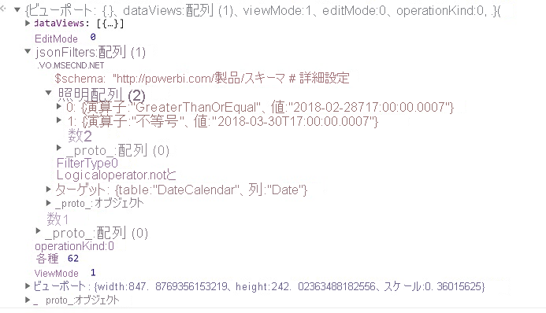

# <a name="the-visual-filters-api-in-power-bi-visuals"></a><span data-ttu-id="e1b08-103">Power BI ビジュアルでの Visual Filters API</span><span class="sxs-lookup"><span data-stu-id="e1b08-103">The Visual Filters API in Power BI visuals</span></span>

<span data-ttu-id="e1b08-104">Visual Filters API を使用すると、Power BI ビジュアルでデータをフィルター処理できます。</span><span class="sxs-lookup"><span data-stu-id="e1b08-104">The Visual Filters API allows you to filter data in Power BI visuals.</span></span> <span data-ttu-id="e1b08-105">他の選択肢との主な違いは、他のビジュアルでの強調表示のサポートに関係なく、他のビジュアルが任意の方法でフィルター処理されることです。</span><span class="sxs-lookup"><span data-stu-id="e1b08-105">The main difference from other selections is that other visuals will be filtered in any way, despite highlight support by other visual.</span></span>

<span data-ttu-id="e1b08-106">ビジュアルのフィルター処理を有効にするには、*capabilities.json* のコードの `general` セクションに `filter` オブジェクトが含まれている必要があります。</span><span class="sxs-lookup"><span data-stu-id="e1b08-106">To enable filtering for the visual, it should contain a `filter` object in the `general` section of *capabilities.json* code.</span></span>

```json
"objects": {
        "general": {
            "displayName": "General",
            "displayNameKey": "formattingGeneral",
            "properties": {
                "filter": {
                    "type": {
                        "filter": true
                    }
                }
            }
        }
    }
```

<span data-ttu-id="e1b08-107">Visual Filters API のインターフェイスは、[powerbi-models](https://www.npmjs.com/package/powerbi-models) パッケージで使用できます。</span><span class="sxs-lookup"><span data-stu-id="e1b08-107">Visual Filters API interfaces are available in the [powerbi-models](https://www.npmjs.com/package/powerbi-models) package.</span></span> <span data-ttu-id="e1b08-108">このパッケージには、フィルター インスタンスを作成するためのクラスも含まれています。</span><span class="sxs-lookup"><span data-stu-id="e1b08-108">The package also contains classes to create filter instances.</span></span>

```cmd
npm install powerbi-models --save
```

<span data-ttu-id="e1b08-109">ツールの古いバージョン (3.x.x より前) を使用する場合は、ビジュアル パッケージに `powerbi-models` を含める必要があります。</span><span class="sxs-lookup"><span data-stu-id="e1b08-109">If you use an older (earlier than 3.x.x) version of the tools, you should include `powerbi-models` in the visuals package.</span></span> <span data-ttu-id="e1b08-110">詳細については、簡単なガイド「[Advanced Filter API をカスタム ビジュアルに追加する](https://github.com/Microsoft/powerbi-visuals-sampleslicer/blob/master/doc/AddingAdvancedFilterAPI.md)」を参照してください。</span><span class="sxs-lookup"><span data-stu-id="e1b08-110">For more information, see the short guide, [Add the Advanced Filter API to the custom visual](https://github.com/Microsoft/powerbi-visuals-sampleslicer/blob/master/doc/AddingAdvancedFilterAPI.md).</span></span>

<span data-ttu-id="e1b08-111">次のコードで示すように、すべてのフィルターでは `IFilter` インターフェイスが拡張されています。</span><span class="sxs-lookup"><span data-stu-id="e1b08-111">All filters extend the `IFilter` interface, as shown in the following code:</span></span>

```typescript
export interface IFilter {
    $schema: string;
    target: IFilterTarget;
}
```
<span data-ttu-id="e1b08-112">ここで:</span><span class="sxs-lookup"><span data-stu-id="e1b08-112">Where:</span></span>
* <span data-ttu-id="e1b08-113">`target` は、データ ソースのテーブル列です。</span><span class="sxs-lookup"><span data-stu-id="e1b08-113">`target` is the table column on the data source.</span></span>

## <a name="the-basic-filter-api"></a><span data-ttu-id="e1b08-114">Basic Filter API</span><span class="sxs-lookup"><span data-stu-id="e1b08-114">The Basic Filter API</span></span>

<span data-ttu-id="e1b08-115">基本的なフィルターのインターフェイスは次のコードで示すとおりです。</span><span class="sxs-lookup"><span data-stu-id="e1b08-115">Basic filter interface is shown in the following code:</span></span>

```typescript
export interface IBasicFilter extends IFilter {
    operator: BasicFilterOperators;
    values: (string | number | boolean)[];
}
```

<span data-ttu-id="e1b08-116">ここで:</span><span class="sxs-lookup"><span data-stu-id="e1b08-116">Where:</span></span>
* <span data-ttu-id="e1b08-117">`operator` は列挙型であり、値は *In*、*NotIn*、*All* です。</span><span class="sxs-lookup"><span data-stu-id="e1b08-117">`operator` is an enumeration with the values *In*, *NotIn*, and *All*.</span></span>
* <span data-ttu-id="e1b08-118">`values` は、条件の値です。</span><span class="sxs-lookup"><span data-stu-id="e1b08-118">`values` are values for the condition.</span></span>

<span data-ttu-id="e1b08-119">基本フィルターの例:</span><span class="sxs-lookup"><span data-stu-id="e1b08-119">Example of a basic filter:</span></span>

```typescript
let basicFilter = {
    target: {
        column: "Col1"
    },
    operator: "In",
    values: [1,2,3]
}
```

<span data-ttu-id="e1b08-120">このフィルターは、"`col1` が値 1、2、または 3 に等しいすべての行を表示する" という意味です。</span><span class="sxs-lookup"><span data-stu-id="e1b08-120">The filter means, "Give me all rows where `col1` equals the value 1, 2, or 3."</span></span>

<span data-ttu-id="e1b08-121">対応する SQL は次のとおりです。</span><span class="sxs-lookup"><span data-stu-id="e1b08-121">The SQL equivalent is:</span></span>

```sql
SELECT * FROM table WHERE col1 IN ( 1 , 2 , 3 )
```

<span data-ttu-id="e1b08-122">フィルターを作成するには、`powerbi-models` の BasicFilter クラスを使用します。</span><span class="sxs-lookup"><span data-stu-id="e1b08-122">To create a filter, you can use the BasicFilter class in `powerbi-models`.</span></span>

<span data-ttu-id="e1b08-123">古いバージョンのツールを使用している場合は、次のコードで示すように、`window['powerbi-models']` を使用してウィンドウ オブジェクト内のモデルのインスタンスを取得する必要があります。</span><span class="sxs-lookup"><span data-stu-id="e1b08-123">If you use an older version of the tool, you should get an instance of models in the window object by using `window['powerbi-models']`, as shown in the following code:</span></span>

```javascript
let categories: DataViewCategoricalColumn = this.dataView.categorical.categories[0];

let target: IFilterColumnTarget = {
    table: categories.source.queryName.substr(0, categories.source.queryName.indexOf('.')),
    column: categories.source.displayName
};

let values = [ 1, 2, 3 ];

let filter: IBasicFilter = new window['powerbi-models'].BasicFilter(target, "In", values);
```

<span data-ttu-id="e1b08-124">ビジュアルでフィルターを呼び出すには、コンストラクターでビジュアルに対して提供されるホスト インターフェイス IVisualHost の applyJsonFilter() メソッドを使用します。</span><span class="sxs-lookup"><span data-stu-id="e1b08-124">The visual invokes the filter by using the applyJsonFilter() method on the host interface, IVisualHost, which is provided to the visual in the constructor.</span></span>

```typescript
visualHost.applyJsonFilter(filter, "general", "filter", FilterAction.merge);
```

## <a name="the-advanced-filter-api"></a><span data-ttu-id="e1b08-125">Advanced Filter API</span><span class="sxs-lookup"><span data-stu-id="e1b08-125">The Advanced Filter API</span></span>

<span data-ttu-id="e1b08-126">[Advanced Filter API](https://github.com/Microsoft/powerbi-models) を使用すると、複数の条件 (*LessThan*、*Contains*、*Is*、*IsBlank* など) に基づく複雑なクロスビジュアルのデータポイント選択およびフィルター処理のクエリが可能になります。</span><span class="sxs-lookup"><span data-stu-id="e1b08-126">The [Advanced Filter API](https://github.com/Microsoft/powerbi-models) enables complex cross-visual data-point selection and filtering queries that are based on multiple criteria, such as *LessThan*, *Contains*, *Is*, *IsBlank*, and so on).</span></span>

<span data-ttu-id="e1b08-127">このフィルターは、ビジュアル API 1.7.0 で導入されました。</span><span class="sxs-lookup"><span data-stu-id="e1b08-127">The filter was introduced in Visuals API 1.7.0.</span></span>

<span data-ttu-id="e1b08-128">Advanced Filter API には、`table` および `column` の名前を指定した `target` も必要です。</span><span class="sxs-lookup"><span data-stu-id="e1b08-128">The Advanced Filter API also requires `target` with a `table` and `column` name.</span></span> <span data-ttu-id="e1b08-129">ただし、Advanced Filter API の演算子は *And* と *Or* です。</span><span class="sxs-lookup"><span data-stu-id="e1b08-129">But the Advanced Filter API operators are *And* and *Or*.</span></span> 

<span data-ttu-id="e1b08-130">さらに、フィルターでは、インターフェイスでの値ではなく条件が使用されます。</span><span class="sxs-lookup"><span data-stu-id="e1b08-130">Additionally, the filter uses conditions instead of values with the interface:</span></span>

```typescript
interface IAdvancedFilterCondition {
    value: (string | number | boolean);
    operator: AdvancedFilterConditionOperators;
}
```

<span data-ttu-id="e1b08-131">`operator` パラメーターの条件演算子は、*None*、*LessThan*、*LessThanOrEqual*、*GreaterThan*、*GreaterThanOrEqual*、*Contains*、*DoesNotContain*、*StartsWith*、*DoesNotStartWith*、*Is*、*IsNot*、*IsBlank*、"IsNotBlank" です。</span><span class="sxs-lookup"><span data-stu-id="e1b08-131">Condition operators for the `operator` parameter are *None*, *LessThan*, *LessThanOrEqual*, *GreaterThan*, *GreaterThanOrEqual*, *Contains*, *DoesNotContain*, *StartsWith*, *DoesNotStartWith*, *Is*, *IsNot*, *IsBlank*, and "IsNotBlank"\`</span></span>

```javascript
let categories: DataViewCategoricalColumn = this.dataView.categorical.categories[0];

let target: IFilterColumnTarget = {
    table: categories.source.queryName.substr(0, categories.source.queryName.indexOf('.')), // table
    column: categories.source.displayName // col1
};

let conditions: IAdvancedFilterCondition[] = [];

conditions.push({
    operator: "LessThan",
    value: 0
});

let filter: IAdvancedFilter = new window['powerbi-models'].AdvancedFilter(target, "And", conditions);

// invoke the filter
visualHost.applyJsonFilter(filter, "general", "filter", FilterAction.merge);
```

<span data-ttu-id="e1b08-132">対応する SQL は次のとおりです。</span><span class="sxs-lookup"><span data-stu-id="e1b08-132">The SQL equivalent is:</span></span>

```sql
SELECT * FROM table WHERE col1 < 0;
```

<span data-ttu-id="e1b08-133">Advanced Filter API の使用に関する完全なサンプル コードについては、[Sampleslicer ビジュアル リポジトリ](https://github.com/Microsoft/powerbi-visuals-sampleslicer)を参照してください。</span><span class="sxs-lookup"><span data-stu-id="e1b08-133">For the complete sample code for using the Advanced Filter API, go to the [Sampleslicer visual repository](https://github.com/Microsoft/powerbi-visuals-sampleslicer).</span></span>

## <a name="the-tuple-filter-api-multi-column-filter"></a><span data-ttu-id="e1b08-134">Tuple Filter API (複数列フィルター)</span><span class="sxs-lookup"><span data-stu-id="e1b08-134">The Tuple Filter API (multi-column filter)</span></span>

<span data-ttu-id="e1b08-135">Tuple Filter API は、Visuals API 2.3.0 で導入されました。</span><span class="sxs-lookup"><span data-stu-id="e1b08-135">The Tuple Filter API was introduced in Visuals API 2.3.0.</span></span> <span data-ttu-id="e1b08-136">Basic Filter API に似ていますが、複数の列とテーブルに対して条件を定義することができます。</span><span class="sxs-lookup"><span data-stu-id="e1b08-136">It is similar to the Basic Filter API, but it allows you to define conditions for several columns and tables.</span></span>

<span data-ttu-id="e1b08-137">そのフィルター インターフェイスは次のコードで示すとおりです。</span><span class="sxs-lookup"><span data-stu-id="e1b08-137">The filter interface is shown in the following code:</span></span> 

```typescript
interface ITupleFilter extends IFilter {
    $schema: string;
    filterType: FilterType;
    operator: TupleFilterOperators;
    target: ITupleFilterTarget;
    values: TupleValueType[];
}
```

<span data-ttu-id="e1b08-138">ここで:</span><span class="sxs-lookup"><span data-stu-id="e1b08-138">Where:</span></span>
* <span data-ttu-id="e1b08-139">`target` は、テーブル名を持つ列の配列です。</span><span class="sxs-lookup"><span data-stu-id="e1b08-139">`target` is an array of columns with table names:</span></span>

    ```typescript
    declare type ITupleFilterTarget = IFilterTarget[];
    ```

  <span data-ttu-id="e1b08-140">そのフィルターは、さまざまなテーブルの列に対応できます。</span><span class="sxs-lookup"><span data-stu-id="e1b08-140">The filter can address columns from various tables.</span></span>

* <span data-ttu-id="e1b08-141">`$schema` は http://powerbi.com/product/schema#tuple です。</span><span class="sxs-lookup"><span data-stu-id="e1b08-141">`$schema` is http://powerbi.com/product/schema#tuple.</span></span>

* <span data-ttu-id="e1b08-142">`filterType` は *FilterType.Tuple* です。</span><span class="sxs-lookup"><span data-stu-id="e1b08-142">`filterType` is *FilterType.Tuple*.</span></span>

* <span data-ttu-id="e1b08-143">`operator` は *In* 演算子でのみ使用できます。</span><span class="sxs-lookup"><span data-stu-id="e1b08-143">`operator` allows use only in the *In* operator.</span></span>

* <span data-ttu-id="e1b08-144">`values` は値のタプルの配列であり、各タプルはターゲット列の値の許可された 1 つの組み合わせを表します。</span><span class="sxs-lookup"><span data-stu-id="e1b08-144">`values` is an array of value tuples, and each tuple represents one permitted combination of the target column values.</span></span> 

```typescript
declare type TupleValueType = ITupleElementValue[];

interface ITupleElementValue {
    value: PrimitiveValueType
}
```

<span data-ttu-id="e1b08-145">完全な例:</span><span class="sxs-lookup"><span data-stu-id="e1b08-145">Complete example:</span></span>

```typescript
let target: ITupleFilterTarget = [
    {
        table: "DataTable",
        column: "Team"
    },
    {
        table: "DataTable",
        column: "Value"
    }
];

let values = [
    [
        // the first column combination value (or the column tuple/vector value) that the filter will pass through
        {
            value: "Team1" // the value for the `Team` column of the `DataTable` table
        },
        {
            value: 5 // the value for the `Value` column of the `DataTable` table
        }
    ],
    [
        // the second column combination value (or the column tuple/vector value) that the filter will pass through
        {
            value: "Team2" // the value for `Team` column of `DataTable` table
        },
        {
            value: 6 // the value for `Value` column of `DataTable` table
        }
    ]
];

let filter: ITupleFilter = {
    $schema: "http://powerbi.com/product/schema#tuple",
    filterType: FilterType.Tuple,
    operator: "In",
    target: target,
    values: values
}

// invoke the filter
visualHost.applyJsonFilter(filter, "general", "filter", FilterAction.merge);
```

> [!IMPORTANT]
> <span data-ttu-id="e1b08-146">列名と条件値の順序が重要です。</span><span class="sxs-lookup"><span data-stu-id="e1b08-146">The order of the column names and condition values is sensitive.</span></span>

<span data-ttu-id="e1b08-147">対応する SQL は次のとおりです。</span><span class="sxs-lookup"><span data-stu-id="e1b08-147">The SQL equivalent is:</span></span>

```sql
SELECT * FROM DataTable WHERE ( Team = "Team1" AND Value = 5 ) OR ( Team = "Team2" AND Value = 6 );
```  

## <a name="restore-the-json-filter-from-the-data-view"></a><span data-ttu-id="e1b08-148">データ ビューから JSON フィルターを復元する</span><span class="sxs-lookup"><span data-stu-id="e1b08-148">Restore the JSON filter from the data view</span></span>

<span data-ttu-id="e1b08-149">API バージョン 2.2 以降では、次のコードで示すように、*VisualUpdateOptions* から JSON フィルターを復元できます。</span><span class="sxs-lookup"><span data-stu-id="e1b08-149">Starting with API version 2.2, you can restore the JSON filter from *VisualUpdateOptions*, as shown in the following code:</span></span>

```typescript
export interface VisualUpdateOptions extends extensibility.VisualUpdateOptions {
    viewport: IViewport;
    dataViews: DataView[];
    type: VisualUpdateType;
    viewMode?: ViewMode;
    editMode?: EditMode;
    operationKind?: VisualDataChangeOperationKind;
    jsonFilters?: IFilter[];
}
```

<span data-ttu-id="e1b08-150">ブックマークを切り替えると、Power BI によってビジュアルの `update` メソッドが呼び出されて、ビジュアルは対応する `filter` オブジェクトを取得します。</span><span class="sxs-lookup"><span data-stu-id="e1b08-150">When you switch, bookmarks, Power BI calls the `update` method of the visual, and the visual gets a corresponding `filter` object.</span></span> <span data-ttu-id="e1b08-151">詳細については、「[Power BI ビジュアルのブックマーク サポートを追加する](bookmarks-support.md)」を参照してください。</span><span class="sxs-lookup"><span data-stu-id="e1b08-151">For more information, see [Add bookmark support for Power BI visuals](bookmarks-support.md).</span></span>

### <a name="sample-json-filter"></a><span data-ttu-id="e1b08-152">JSON フィルターのサンプル</span><span class="sxs-lookup"><span data-stu-id="e1b08-152">Sample JSON filter</span></span>

<span data-ttu-id="e1b08-153">次の図では、JSON フィルターのコードのサンプルをいくつか示します。</span><span class="sxs-lookup"><span data-stu-id="e1b08-153">Some sample JSON filter code is shown in the following image:</span></span>



### <a name="clear-the-json-filter"></a><span data-ttu-id="e1b08-155">JSON フィルターをクリアする</span><span class="sxs-lookup"><span data-stu-id="e1b08-155">Clear the JSON filter</span></span>

<span data-ttu-id="e1b08-156">Filter API では、フィルターの `null` 値を *reset* または *clear* として受け入れます。</span><span class="sxs-lookup"><span data-stu-id="e1b08-156">The Filter API accepts the `null` value of the filter as *reset* or *clear*.</span></span>

```typescript
// invoke the filter
visualHost.applyJsonFilter(null, "general", "filter", FilterAction.merge);
```
