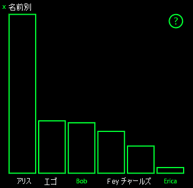

# <a name="high-contrast-mode-support-in-power-bi-visuals"></a><span data-ttu-id="8bb57-103">Power BI ビジュアルでのハイコントラスト モードのサポート</span><span class="sxs-lookup"><span data-stu-id="8bb57-103">High-contrast mode support in Power BI visuals</span></span>

<span data-ttu-id="8bb57-104">Windows の "*ハイコントラスト*" の設定を使用すると、よりはっきりした色で表示することで、テキストとアプリが見やすくなります。</span><span class="sxs-lookup"><span data-stu-id="8bb57-104">The Windows *high contrast* setting makes text and apps easier to see by displaying more distinct colors.</span></span> <span data-ttu-id="8bb57-105">この記事では、ハイコントラスト モードのサポートを Power BI ビジュアルに追加する方法について説明します。</span><span class="sxs-lookup"><span data-stu-id="8bb57-105">This article discusses how to add high-contrast mode support to Power BI visuals.</span></span> <span data-ttu-id="8bb57-106">詳細については、[Power BI でのハイコントラストのサポート](https://powerbi.microsoft.com/blog/power-bi-desktop-june-2018-feature-summary/#highContrast)に関するページを参照してください。</span><span class="sxs-lookup"><span data-stu-id="8bb57-106">For more information, see [high-contrast support in Power BI](https://powerbi.microsoft.com/blog/power-bi-desktop-june-2018-feature-summary/#highContrast).</span></span>

<span data-ttu-id="8bb57-107">ハイコントラストのサポートの実装を確認するには、[PowerBI-visuals-sampleBarChart ビジュアル リポジトリ](https://github.com/Microsoft/PowerBI-visuals-sampleBarChart/commit/61011c82b66ca0d3321868f1d089c65101ca42e6)を参照してください。</span><span class="sxs-lookup"><span data-stu-id="8bb57-107">To view an implementation of high-contrast support, go to the [PowerBI-visuals-sampleBarChart visual repository](https://github.com/Microsoft/PowerBI-visuals-sampleBarChart/commit/61011c82b66ca0d3321868f1d089c65101ca42e6).</span></span>

## <a name="on-initialization"></a><span data-ttu-id="8bb57-108">初期化時</span><span class="sxs-lookup"><span data-stu-id="8bb57-108">On initialization</span></span>

<span data-ttu-id="8bb57-109">`options.host` の colorPalette メンバーには、ハイコントラスト モード用のいくつかのプロパティがあります。</span><span class="sxs-lookup"><span data-stu-id="8bb57-109">The colorPalette member of `options.host` has several properties for high-contrast mode.</span></span> <span data-ttu-id="8bb57-110">これらのプロパティを使用して、ハイコントラスト モードがアクティブかどうかを判断し、アクティブの場合は使用する色を指定します。</span><span class="sxs-lookup"><span data-stu-id="8bb57-110">Use these properties to determine whether high-contrast mode is active and, if it is, what colors to use.</span></span>

### <a name="detect-that-power-bi-is-in-high-contrast-mode"></a><span data-ttu-id="8bb57-111">Power BI がハイコントラスト モードであることを検出する</span><span class="sxs-lookup"><span data-stu-id="8bb57-111">Detect that Power BI is in high-contrast mode</span></span>

<span data-ttu-id="8bb57-112">`host.colorPalette.isHighContrast` が `true` の場合は、ハイコントラスト モードがアクティブであり、ビジュアルはそれに応じて描画されます。</span><span class="sxs-lookup"><span data-stu-id="8bb57-112">If `host.colorPalette.isHighContrast` is `true`, high-contrast mode is active and the visual should draw itself accordingly.</span></span>

### <a name="get-high-contrast-colors"></a><span data-ttu-id="8bb57-113">ハイコントラストの色を取得する</span><span class="sxs-lookup"><span data-stu-id="8bb57-113">Get high-contrast colors</span></span>

<span data-ttu-id="8bb57-114">ハイコントラスト モードの場合、ビジュアルでは以下の設定だけを使用する必要があります。</span><span class="sxs-lookup"><span data-stu-id="8bb57-114">In high-contrast mode, your visual should limit itself to the following settings:</span></span>

* <span data-ttu-id="8bb57-115">**前景**色は、線、アイコン、テキスト、輪郭、または図形の塗りつぶしを描画するために使用されます。</span><span class="sxs-lookup"><span data-stu-id="8bb57-115">**Foreground** color is used to draw any lines, icons, text, and outline or fill of shapes.</span></span>
* <span data-ttu-id="8bb57-116">**背景**色は、背景および線で囲まれた図形の塗りつぶしの色として使用されます。</span><span class="sxs-lookup"><span data-stu-id="8bb57-116">**Background** color is used for background, and as the fill color of outlined shapes.</span></span>
* <span data-ttu-id="8bb57-117">**前景に選択された**色は、選択された要素またはアクティブな要素を示すために使用されます。</span><span class="sxs-lookup"><span data-stu-id="8bb57-117">**Foreground - selected** color is used to indicate a selected or active element.</span></span>
* <span data-ttu-id="8bb57-118">**ハイパーリンク**の色は、ハイパーリンク テキストに対してのみ使用されます。</span><span class="sxs-lookup"><span data-stu-id="8bb57-118">**Hyperlink** color is used only for hyperlink text.</span></span>

> [!NOTE]
> <span data-ttu-id="8bb57-119">2 番目の色が必要な場合は、ある程度の不透明度で前景色を使用できます (Power BI のネイティブ ビジュアルでは 40% の不透明度が使用されます)。</span><span class="sxs-lookup"><span data-stu-id="8bb57-119">If a secondary color is needed, foreground color may be used with some opacity (Power BI native visuals use 40% opacity).</span></span> <span data-ttu-id="8bb57-120">ビジュアルの詳細を見やすくするために、これは控えめに使用してください。</span><span class="sxs-lookup"><span data-stu-id="8bb57-120">Use this sparingly to keep the visual details easy to see.</span></span>

<span data-ttu-id="8bb57-121">初期化の間に、これらの値を格納できます。</span><span class="sxs-lookup"><span data-stu-id="8bb57-121">During initialization, you can store the following values:</span></span>

```typescript
private isHighContrast: boolean;

private foregroundColor: string;
private backgroundColor: string;
private foregroundSelectedColor: string;
private hyperlinkColor: string;
//...

constructor(options: VisualConstructorOptions) {
    this.host = options.host;
    let colorPalette: ISandboxExtendedColorPalette = host.colorPalette;
    //...
    this.isHighContrast = colorPalette.isHighContrast;
    if (this.isHighContrast) {
        this.foregroundColor = colorPalette.foreground.value;
        this.backgroundColor = colorPalette.background.value;
        this.foregroundSelectedColor = colorPalette.foregroundSelected.value;
        this.hyperlinkColor = colorPalette.hyperlink.value;
    }
```

<span data-ttu-id="8bb57-122">または、初期化の間に `host` オブジェクトを格納し、更新の間に関連する `colorPalette` プロパティにアクセスすることもできます。</span><span class="sxs-lookup"><span data-stu-id="8bb57-122">Or you can store the `host` object during initialization and access the relevant `colorPalette` properties during update.</span></span>

## <a name="on-update"></a><span data-ttu-id="8bb57-123">更新時</span><span class="sxs-lookup"><span data-stu-id="8bb57-123">On update</span></span>

<span data-ttu-id="8bb57-124">ハイコントラスト サポートの具体的な実装はビジュアルに応じて異なり、グラフィック デザインの詳細に依存します。</span><span class="sxs-lookup"><span data-stu-id="8bb57-124">The specific implementations of high-contrast support vary from visual to visual and depend on the details of the graphic design.</span></span> <span data-ttu-id="8bb57-125">重要な詳細情報を限られた色で区別しやすくするため、通常、ハイコントラスト モードでは、既定のモードとは若干異なるデザインが必要になります。</span><span class="sxs-lookup"><span data-stu-id="8bb57-125">To keep important details easy to distinguish with the limited colors, high-contrast mode ordinarily requires a design that's slightly different from the default mode.</span></span>

<span data-ttu-id="8bb57-126">Power BI のネイティブ ビジュアルは、次のガイドラインに従っています。</span><span class="sxs-lookup"><span data-stu-id="8bb57-126">Power BI native visuals follow these guidelines:</span></span>

* <span data-ttu-id="8bb57-127">すべてのデータ ポイントで同じ色 (前景) が使用されます。</span><span class="sxs-lookup"><span data-stu-id="8bb57-127">All data points use the same color (foreground).</span></span>
* <span data-ttu-id="8bb57-128">すべてのテキスト、軸、矢印、線などでは、前景色が使用されます。</span><span class="sxs-lookup"><span data-stu-id="8bb57-128">All text, axes, arrows, lines, and so on use the foreground color.</span></span>
* <span data-ttu-id="8bb57-129">厚みのある図形は、太いストローク (少なくとも 2 ピクセル) と背景色の塗りつぶしを使用して、枠線として描画されます。</span><span class="sxs-lookup"><span data-stu-id="8bb57-129">Thick shapes are drawn as outlines, with thick strokes (at least two pixels) and background color fill.</span></span>
* <span data-ttu-id="8bb57-130">データ ポイントが関連する場合、データ ポイントは異なるマーカー図形によって区別され、データ行は異なる破線によって区別されます。</span><span class="sxs-lookup"><span data-stu-id="8bb57-130">When data points are relevant, they're distinguished by different marker shapes, and data lines are distinguished by different dashing.</span></span>
* <span data-ttu-id="8bb57-131">あるデータ要素が強調表示されると、他のすべての要素の不透明度が 40% に変わります。</span><span class="sxs-lookup"><span data-stu-id="8bb57-131">When a data element is highlighted, all other elements change their opacity to 40%.</span></span>
* <span data-ttu-id="8bb57-132">スライサーの場合、アクティブなフィルター要素では前景に選択された色が使用されます。</span><span class="sxs-lookup"><span data-stu-id="8bb57-132">For slicers, active filter elements use foreground-selected color.</span></span>

<span data-ttu-id="8bb57-133">たとえば、次のサンプルの棒グラフでは、すべてのバーが太さ 2 ピクセルの前景の枠線および背景の塗りつぶしで描画されています。</span><span class="sxs-lookup"><span data-stu-id="8bb57-133">In the following sample bar chart, for example, all bars are drawn with two pixels of thick foreground outline and background fill.</span></span> <span data-ttu-id="8bb57-134">既定の色と、2 つのハイコントラスト テーマを使用した場合の外観を比較してください。</span><span class="sxs-lookup"><span data-stu-id="8bb57-134">Compare the way it looks with default colors and with a couple of high-contrast themes:</span></span>

<span data-ttu-id="8bb57-135">

</span><span class="sxs-lookup"><span data-stu-id="8bb57-135">

</span></span>

<span data-ttu-id="8bb57-136">次のセクションでは、ハイコントラストをサポートするために変更された `visualTransform` 関数の 1 つの場所を示します。</span><span class="sxs-lookup"><span data-stu-id="8bb57-136">The next section shows one place in the `visualTransform` function that was changed to support high contrast.</span></span> <span data-ttu-id="8bb57-137">それは、更新の間にレンダリングの一部として呼び出されます。</span><span class="sxs-lookup"><span data-stu-id="8bb57-137">It's called as part of rendering during the update.</span></span>

### <a name="before"></a><span data-ttu-id="8bb57-138">より前</span><span class="sxs-lookup"><span data-stu-id="8bb57-138">Before</span></span>

```typescript
for (let i = 0, len = Math.max(category.values.length, dataValue.values.length); i < len; i++) {
    let defaultColor: Fill = {
        solid: {
            color: colorPalette.getColor(category.values[i] + '').value
        }
    };

    barChartDataPoints.push({
        category: category.values[i] + '',
        value: dataValue.values[i],
        color: getCategoricalObjectValue<Fill>(category, i, 'colorSelector', 'fill', defaultColor).solid.color,
        selectionId: host.createSelectionIdBuilder()
            .withCategory(category, i)
            .createSelectionId()
    });
}
```

### <a name="after"></a><span data-ttu-id="8bb57-139">後</span><span class="sxs-lookup"><span data-stu-id="8bb57-139">After</span></span>

```typescript
for (let i = 0, len = Math.max(category.values.length, dataValue.values.length); i < len; i++) {
    const color: string = getColumnColorByIndex(category, i, colorPalette);

    const selectionId: ISelectionId = host.createSelectionIdBuilder()
        .withCategory(category, i)
        .createSelectionId();

    barChartDataPoints.push({
        color,
        strokeColor,
        strokeWidth,
        selectionId,
        value: dataValue.values[i],
        category: `${category.values[i]}`,
    });
}

//...

function getColumnColorByIndex(
    category: DataViewCategoryColumn,
    index: number,
    colorPalette: ISandboxExtendedColorPalette,
): string {
    if (colorPalette.isHighContrast) {
        return colorPalette.background.value;
    }

    const defaultColor: Fill = {
        solid: {
            color: colorPalette.getColor(`${category.values[index]}`).value,
        }
    };

    return getCategoricalObjectValue<Fill>(category, index, 'colorSelector', 'fill', defaultColor).solid.color;
}
```
