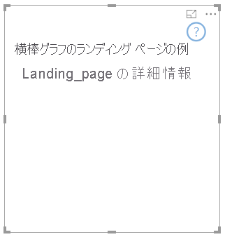

# <a name="add-a-landing-page-to-your-power-bi-visuals"></a><span data-ttu-id="8cf0f-103">Power BI ビジュアルにランディング ページを追加する</span><span class="sxs-lookup"><span data-stu-id="8cf0f-103">Add a landing page to your Power BI visuals</span></span>

<span data-ttu-id="8cf0f-104">API 2.3.0 では、Power BI のビジュアルにランディング ページを追加できます。</span><span class="sxs-lookup"><span data-stu-id="8cf0f-104">With API 2.3.0, you can add a landing page to your Power BI visuals.</span></span> <span data-ttu-id="8cf0f-105">それを行うには、機能に `supportsLandingPage` を追加して、true に設定します。</span><span class="sxs-lookup"><span data-stu-id="8cf0f-105">To do so, add `supportsLandingPage` to the capabilities, and set it to true.</span></span> <span data-ttu-id="8cf0f-106">これにより、データを追加する前にビジュアルが初期化されて更新されます。</span><span class="sxs-lookup"><span data-stu-id="8cf0f-106">This action initializes and updates your visual before you add data to it.</span></span> <span data-ttu-id="8cf0f-107">ビジュアルにはウォーターマークが表示されなくなるため、ビジュアルにデータがないときにビジュアルに表示される独自のランディング ページをデザインできます。</span><span class="sxs-lookup"><span data-stu-id="8cf0f-107">Because the visual no longer shows a watermark, you can design your own landing page to be displayed in the visual as long as it has no data.</span></span>

```typescript
export class BarChart implements IVisual {
    //...
    private element: HTMLElement;
    private isLandingPageOn: boolean;
    private LandingPageRemoved: boolean;
    private LandingPage: d3.Selection<any>;

    constructor(options: VisualConstructorOptions) {
            //...
            this.element = options.element;
            //...
    }

    public update(options: VisualUpdateOptions) {
    //...
        this.HandleLandingPage(options);
    }

    private HandleLandingPage(options: VisualUpdateOptions) {
        if(!options.dataViews || !options.dataViews.length) {
            if(!this.isLandingPageOn) {
                this.isLandingPageOn = true;
                const SampleLandingPage: Element = this.createSampleLandingPage(); //create a landing page
                this.element.appendChild(SampleLandingPage);
                this.LandingPage = d3.select(SampleLandingPage);
            }

        } else {
                if(this.isLandingPageOn && !this.LandingPageRemoved){
                    this.LandingPageRemoved = true;
                    this.LandingPage.remove();
                }
        }
    }
```

<span data-ttu-id="8cf0f-108">次の図に、ランディング ページの例を示します。</span><span class="sxs-lookup"><span data-stu-id="8cf0f-108">An example landing page is shown in the following image:</span></span>


