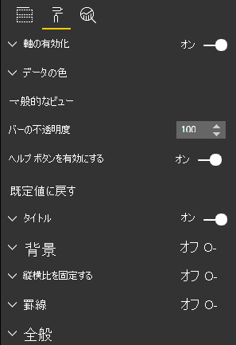

# <a name="create-a-launch-url"></a><span data-ttu-id="17060-103">起動 URL を作成する</span><span class="sxs-lookup"><span data-stu-id="17060-103">Create a launch URL</span></span>

<span data-ttu-id="17060-104">起動 URL を作成することにより、実際の処理を Power BI に任せて、新しいブラウザー タブ (またはウィンドウ) を開くことができます。</span><span class="sxs-lookup"><span data-stu-id="17060-104">By creating a launch URL, you can open a new browser tab (or window) by delegating the actual work to Power BI.</span></span>

## <a name="sample"></a><span data-ttu-id="17060-105">サンプル</span><span class="sxs-lookup"><span data-stu-id="17060-105">Sample</span></span>

```typescript
   this.host.launchUrl('https://powerbi.microsoft.com');
```

## <a name="usage"></a><span data-ttu-id="17060-106">Usage</span><span class="sxs-lookup"><span data-stu-id="17060-106">Usage</span></span>

<span data-ttu-id="17060-107">`host.launchUrl()` API 呼び出しを使用して、送信先 URL を文字列引数として渡します。</span><span class="sxs-lookup"><span data-stu-id="17060-107">Use the `host.launchUrl()` API call, passing your destination URL as a string argument:</span></span>

```typescript
this.host.launchUrl('http://some.link.net');
```

## <a name="restrictions"></a><span data-ttu-id="17060-108">制限事項</span><span class="sxs-lookup"><span data-stu-id="17060-108">Restrictions</span></span>

* <span data-ttu-id="17060-109">絶対パスのみを使用し、相対パスは使用しません。</span><span class="sxs-lookup"><span data-stu-id="17060-109">Use only absolute paths, not relative paths.</span></span> <span data-ttu-id="17060-110">たとえば、`http://some.link.net/subfolder/page.html` のような絶対パスを使用します。</span><span class="sxs-lookup"><span data-stu-id="17060-110">For example, use an absolute path such as `http://some.link.net/subfolder/page.html`.</span></span> <span data-ttu-id="17060-111">相対パス `/page.html` を開くことはできません。</span><span class="sxs-lookup"><span data-stu-id="17060-111">The relative path,`/page.html`, won't be opened.</span></span>

* <span data-ttu-id="17060-112">現在は、*HTTP* および *HTTPS* プロトコルのみがサポートされています。</span><span class="sxs-lookup"><span data-stu-id="17060-112">Currently, only *HTTP* and *HTTPS* protocols are supported.</span></span> <span data-ttu-id="17060-113">*FTP* や *MAILTO* などは使用しないでください。</span><span class="sxs-lookup"><span data-stu-id="17060-113">Avoid *FTP*, *MAILTO*, and so on.</span></span>

## <a name="best-practices"></a><span data-ttu-id="17060-114">ベスト プラクティス</span><span class="sxs-lookup"><span data-stu-id="17060-114">Best practices</span></span>

* <span data-ttu-id="17060-115">通常は、ユーザーの明示的なアクションへの応答としてのみリンクを開くことをお勧めします。</span><span class="sxs-lookup"><span data-stu-id="17060-115">Usually, it's best to open a link only as a response to a user's explicit action.</span></span> <span data-ttu-id="17060-116">リンクまたはボタンをクリックすると新しいタブが開くことを、ユーザーが容易に理解できるようにしてください。ユーザーのアクションがないまま、または別のアクションの副作用として `launchUrl()` 呼び出しをトリガーすると、ユーザーを混乱させたりユーザーに不満を抱かせたりする場合があります。</span><span class="sxs-lookup"><span data-stu-id="17060-116">Make it easy for the user to understand that clicking the link or button will result in opening a new tab. Triggering a `launchUrl()` call without a user's action, or as a side effect of a different action can be confusing or frustrating for the user.</span></span>

* <span data-ttu-id="17060-117">ビジュアルが正しく機能するためにリンクが必須ではない場合は、レポートの作成者に、リンクを無効にしたり非表示にしたりする方法を提供することをお勧めします。</span><span class="sxs-lookup"><span data-stu-id="17060-117">If the link isn't essential for the proper functioning of the visual, we recommend that you give the report's author a way to disable and hide the link.</span></span> <span data-ttu-id="17060-118">この推奨は特に、サードパーティのアプリケーションにレポートを埋め込む場合や、それを Web に公開する場合など、特殊な Power BI のユースケースに関連します。</span><span class="sxs-lookup"><span data-stu-id="17060-118">This recommendation is especially relevant for special Power BI use cases, such as embedding a report in a third-party application or publishing it to the web.</span></span>

* <span data-ttu-id="17060-119">`launchUrl()` の呼び出しを、ループ内、ビジュアルの `update` 関数、またはその他の頻繁に繰り返されるコードから、トリガーしないようにします。</span><span class="sxs-lookup"><span data-stu-id="17060-119">Avoid triggering a `launchUrl()` call from inside a loop, the visual's `update` function, or any other frequently recurring code.</span></span>

## <a name="a-step-by-step-example"></a><span data-ttu-id="17060-120">ステップバイステップの例</span><span class="sxs-lookup"><span data-stu-id="17060-120">A step-by-step example</span></span>

### <a name="add-a-link-launching-element"></a><span data-ttu-id="17060-121">リンク起動要素を追加する</span><span class="sxs-lookup"><span data-stu-id="17060-121">Add a link-launching element</span></span>

<span data-ttu-id="17060-122">次の行がビジュアルの `constructor` 関数に追加されました。</span><span class="sxs-lookup"><span data-stu-id="17060-122">The following lines were added to the visual's `constructor` function:</span></span>

```typescript
    this.helpLinkElement = this.createHelpLinkElement();
    options.element.appendChild(this.helpLinkElement);
```

<span data-ttu-id="17060-123">アンカー要素を作成してアタッチするプライベート関数を追加します。</span><span class="sxs-lookup"><span data-stu-id="17060-123">A private function that creates and attaches the anchor element was added:</span></span>

```typescript
private createHelpLinkElement(): Element {
    let linkElement = document.createElement("a");
    linkElement.textContent = "?";
    linkElement.setAttribute("title", "Open documentation");
    linkElement.setAttribute("class", "helpLink");
    linkElement.addEventListener("click", () => {
        this.host.launchUrl("https://docs.microsoft.com/power-bi/developer/visuals/custom-visual-develop-tutorial");
    });
    return linkElement;
};
```

<span data-ttu-id="17060-124">最後に、*visual.less* ファイル内のエントリで、リンク要素のスタイルを定義します。</span><span class="sxs-lookup"><span data-stu-id="17060-124">Finally, an entry in the *visual.less* file defines the style for the link element:</span></span>

```less
.helpLink {
    position: absolute;
    top: 0px;
    right: 12px;
    display: block;
    width: 20px;
    height: 20px;
    border: 2px solid #80B0E0;
    border-radius: 20px;
    color: #80B0E0;
    text-align: center;
    font-size: 16px;
    line-height: 20px;
    background-color: #FFFFFF;
    transition: all 900ms ease;

    &:hover {
        background-color: #DDEEFF;
        color: #5080B0;
        border-color: #5080B0;
        transition: all 250ms ease;
    }

    &.hidden {
        display: none;
    }
}
```

### <a name="add-a-toggling-mechanism"></a><span data-ttu-id="17060-125">切り替えメカニズムを追加する</span><span class="sxs-lookup"><span data-stu-id="17060-125">Add a toggling mechanism</span></span>

<span data-ttu-id="17060-126">切り替えメカニズムを追加するには、レポートの作成者がリンク要素の表示を切り替えることができるように、静的なオブジェクトを追加する必要があります。</span><span class="sxs-lookup"><span data-stu-id="17060-126">To add a toggling mechanism, you need to add a static object so that the report's author can toggle the visibility of the link element.</span></span> <span data-ttu-id="17060-127">(既定では "*非表示*" に設定されています。)詳細については、[静的オブジェクトのチュートリアル](https://microsoft.github.io/PowerBI-visuals/docs/concepts/objects-and-properties)に関するページを参照してください。</span><span class="sxs-lookup"><span data-stu-id="17060-127">(The default is set to *hidden*.) For more information, see the [static object tutorial](https://microsoft.github.io/PowerBI-visuals/docs/concepts/objects-and-properties).</span></span>

<span data-ttu-id="17060-128">次のコードに示すように、ブール型の静的オブジェクト `showHelpLink` が、*capabilities.json* ファイルの objects エントリに追加されています。</span><span class="sxs-lookup"><span data-stu-id="17060-128">A `showHelpLink` Boolean static object was added to the *capabilities.json* file's objects entry, as shown in the following code:</span></span>

```typescript
"objects": {
    "generalView": {
            "displayName": "General View",
            "properties":
                "showHelpLink": {
                    "displayName": "Show Help Button",
                    "type": {
                        "bool": true
                    }
                }
            }
        }
    }
```



<span data-ttu-id="17060-130">また、ビジュアルの `update` 関数に次の行が追加されました。</span><span class="sxs-lookup"><span data-stu-id="17060-130">And, in the visual's `update` function, the following lines were added:</span></span>

```typescript
if (settings.generalView.showHelpLink) {
    this.helpLinkElement.classList.remove("hidden");
} else {
    this.helpLinkElement.classList.add("hidden");
}
```

<span data-ttu-id="17060-131">要素の表示を制御するために、*hidden* クラスが *visual.less* ファイルで定義されています。</span><span class="sxs-lookup"><span data-stu-id="17060-131">The *hidden* class is defined in the *visual.less* file to control the display of the element.</span></span>
