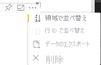

# <a name="sorting-options-for-power-bi-visuals"></a><span data-ttu-id="aa67a-103">Power BI ビジュアルの並べ替えオプション</span><span class="sxs-lookup"><span data-stu-id="aa67a-103">Sorting options for Power BI visuals</span></span>

<span data-ttu-id="aa67a-104">この記事では、"*並べ替え*" オプションで Power BI ビジュアルの並べ替え動作を指定する方法について説明します。</span><span class="sxs-lookup"><span data-stu-id="aa67a-104">This article describes how *sorting* options specify the sorting behavior for Power BI visuals.</span></span> 

<span data-ttu-id="aa67a-105">並べ替え機能を利用するには、次のいずれかのパラメーターが必要です。</span><span class="sxs-lookup"><span data-stu-id="aa67a-105">The sorting capability requires one of the following parameters.</span></span>

## <a name="default-sorting"></a><span data-ttu-id="aa67a-106">既定の並べ替え</span><span class="sxs-lookup"><span data-stu-id="aa67a-106">Default sorting</span></span>

<span data-ttu-id="aa67a-107">`default` オプションは最も単純な形式です。</span><span class="sxs-lookup"><span data-stu-id="aa67a-107">The `default` option is the simplest form.</span></span> <span data-ttu-id="aa67a-108">"DataMappings" セクションに表示されるデータを並べ替えることができます。</span><span class="sxs-lookup"><span data-stu-id="aa67a-108">It allows sorting the data presented in the 'DataMappings' section.</span></span> <span data-ttu-id="aa67a-109">そのオプションにより、ユーザーによるデータ マッピングの並べ替えができるようになり、並べ替えの方向を指定できます。</span><span class="sxs-lookup"><span data-stu-id="aa67a-109">The option enables sorting of the data mappings by the user and specifies the sorting direction.</span></span>

```json
    "sorting": {
        "default": {   }
    }
```



## <a name="implicit-sorting"></a><span data-ttu-id="aa67a-111">暗黙的な並べ替え</span><span class="sxs-lookup"><span data-stu-id="aa67a-111">Implicit sorting</span></span>

<span data-ttu-id="aa67a-112">暗黙的な並べ替えは、各データ ロールの並べ替えが記述されている配列パラメーター `clauses` による並べ替えです。</span><span class="sxs-lookup"><span data-stu-id="aa67a-112">Implicit sorting is sorting with the array parameter `clauses`, which describes sorting for each data role.</span></span> <span data-ttu-id="aa67a-113">`implicit` は、ビジュアルのユーザーが並べ替え順序を変更できないことを意味します。</span><span class="sxs-lookup"><span data-stu-id="aa67a-113">`implicit` means that the visual's user can't change the sorting order.</span></span> <span data-ttu-id="aa67a-114">Power BI のビジュアルのメニューには、並べ替えオプションは表示されません。</span><span class="sxs-lookup"><span data-stu-id="aa67a-114">Power BI doesn't display sorting options in the visual's menu.</span></span> <span data-ttu-id="aa67a-115">ただし、Power BI では、指定された設定に従ってデータが並べ替えられます。</span><span class="sxs-lookup"><span data-stu-id="aa67a-115">However, Power BI does sort data according to specified settings.</span></span>

<span data-ttu-id="aa67a-116">`clauses` パラメーターには、次の 2 つのパラメーターを持つ複数のオブジェクトを含めることができます。</span><span class="sxs-lookup"><span data-stu-id="aa67a-116">`clauses` parameters can contain several objects with two parameters:</span></span>

- <span data-ttu-id="aa67a-117">`role`:並べ替える `DataMapping` を決定します</span><span class="sxs-lookup"><span data-stu-id="aa67a-117">`role`: Determines `DataMapping` for sorting</span></span>
- <span data-ttu-id="aa67a-118">`direction`:並べ替えの方向を決定します (1 = 昇順、2 = 降順)</span><span class="sxs-lookup"><span data-stu-id="aa67a-118">`direction`: Determines sort direction (1 = Ascending, 2 = Descending)</span></span>

```json
    "sorting": {
        "implicit": {
            "clauses": [
                {
                    "role": "category",
                    "direction": 1
                },
                {
                    "role": "measure",
                    "direction": 2
                }
            ]
        }
    }
```

## <a name="custom-sorting"></a><span data-ttu-id="aa67a-119">カスタム並べ替え</span><span class="sxs-lookup"><span data-stu-id="aa67a-119">Custom sorting</span></span>

<span data-ttu-id="aa67a-120">カスタム並べ替えとは、開発者がビジュアルのコードで並べ替えを管理することを意味します。</span><span class="sxs-lookup"><span data-stu-id="aa67a-120">Custom sorting means that the sorting is managed by the developer in the visual's code.</span></span>
