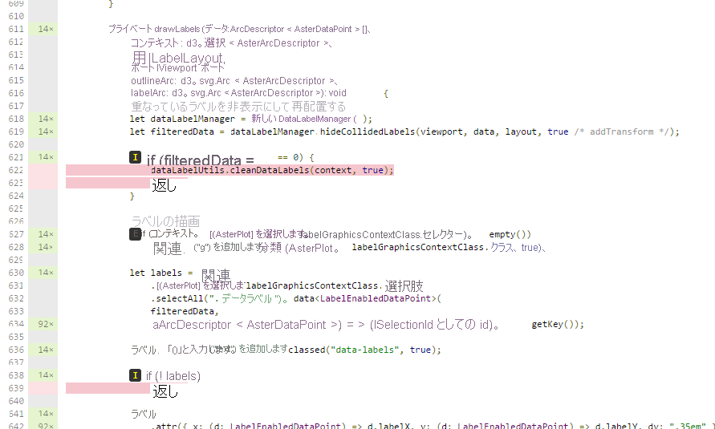

# <a name="tutorial-add-unit-tests-for-power-bi-visual-projects"></a><span data-ttu-id="b7cf0-103">チュートリアル:Power BI のビジュアル プロジェクトの単体テストを追加する</span><span class="sxs-lookup"><span data-stu-id="b7cf0-103">Tutorial: Add unit tests for Power BI visual projects</span></span>

<span data-ttu-id="b7cf0-104">この記事では、以下のことを行う方法など、Power BI のビジュアルに関する単体テストを作成するときの基本事項について説明します。</span><span class="sxs-lookup"><span data-stu-id="b7cf0-104">This article describes the basics of writing unit tests for your Power BI visuals, including how to:</span></span>

* <span data-ttu-id="b7cf0-105">Karma JavaScript テスト ランナー テスト フレームワークである Jasmine を設定します。</span><span class="sxs-lookup"><span data-stu-id="b7cf0-105">Set up the Karma JavaScript test runner testing framework, Jasmine.</span></span>
* <span data-ttu-id="b7cf0-106">powerbi-visuals-utils-testutils パッケージを使用します。</span><span class="sxs-lookup"><span data-stu-id="b7cf0-106">Use the powerbi-visuals-utils-testutils package.</span></span>
* <span data-ttu-id="b7cf0-107">モックとフェイクを使用して Power BI のビジュアルの単体テストを簡略化します。</span><span class="sxs-lookup"><span data-stu-id="b7cf0-107">Use mocks and fakes to help simplify unit testing of Power BI visuals.</span></span>

## <a name="prerequisites"></a><span data-ttu-id="b7cf0-108">前提条件</span><span class="sxs-lookup"><span data-stu-id="b7cf0-108">Prerequisites</span></span>

* <span data-ttu-id="b7cf0-109">Power BI のビジュアル プロジェクトがインストールされている</span><span class="sxs-lookup"><span data-stu-id="b7cf0-109">An installed Power BI visuals project</span></span>
* <span data-ttu-id="b7cf0-110">Node.js 環境が構成されている</span><span class="sxs-lookup"><span data-stu-id="b7cf0-110">A configured Node.js environment</span></span>

## <a name="install-and-configure-the-karma-javascript-test-runner-and-jasmine"></a><span data-ttu-id="b7cf0-111">Karma JavaScript テスト ランナーと Jasmine をインストールして構成する</span><span class="sxs-lookup"><span data-stu-id="b7cf0-111">Install and configure the Karma JavaScript test runner and Jasmine</span></span>

<span data-ttu-id="b7cf0-112">必要なライブラリを *package.json* ファイルの `devDependencies` セクションに追加します。</span><span class="sxs-lookup"><span data-stu-id="b7cf0-112">Add the required libraries to the *package.json* file in the `devDependencies` section:</span></span>

```json
"@babel/polyfill": "^7.2.5",
"@types/d3": "5.5.0",
"@types/jasmine": "2.5.37",
"@types/jasmine-jquery": "1.5.28",
"@types/jquery": "2.0.41",
"@types/karma": "3.0.0",
"@types/lodash-es": "4.17.1",
"coveralls": "3.0.2",
"istanbul-instrumenter-loader": "^3.0.1",
"jasmine": "2.5.2",
"jasmine-core": "2.5.2",
"jasmine-jquery": "2.1.1",
"jquery": "3.1.1",
"karma": "3.1.1",
"karma-chrome-launcher": "2.2.0",
"karma-coverage": "1.1.2",
"karma-coverage-istanbul-reporter": "^2.0.4",
"karma-jasmine": "2.0.1",
"karma-junit-reporter": "^1.2.0",
"karma-sourcemap-loader": "^0.3.7",
"karma-typescript": "^3.0.13",
"karma-typescript-preprocessor": "0.4.0",
"karma-webpack": "3.0.5",
"puppeteer": "1.17.0",
"style-loader": "0.23.1",
"ts-loader": "5.3.0",
"ts-node": "7.0.1",
"tslint": "^5.12.0",
"webpack": "4.26.0"
```

<span data-ttu-id="b7cf0-113">パッケージの詳細については、説明を参照してください。</span><span class="sxs-lookup"><span data-stu-id="b7cf0-113">To learn more about the package, see the description at.</span></span>

<span data-ttu-id="b7cf0-114">*package.json* ファイルを保存し、その `package.json` の場所で次のコマンドを実行します。</span><span class="sxs-lookup"><span data-stu-id="b7cf0-114">Save the *package.json* file and, at the `package.json` location, run the following command:</span></span>

```cmd
npm install
```

<span data-ttu-id="b7cf0-115">パッケージ マネージャーによって、*package.json* に追加されるすべての新しいパッケージがインストールされます。</span><span class="sxs-lookup"><span data-stu-id="b7cf0-115">The package manager installs all new packages that are added to *package.json*.</span></span>

<span data-ttu-id="b7cf0-116">単体テストを実行するには、テスト ランナー `webpack` の構成を構成します。</span><span class="sxs-lookup"><span data-stu-id="b7cf0-116">To run unit tests, configure the test runner and `webpack` config.</span></span>

<span data-ttu-id="b7cf0-117">次のコードは、*test.webpack.config.js* ファイルのサンプルです。</span><span class="sxs-lookup"><span data-stu-id="b7cf0-117">The following code is a sample of the *test.webpack.config.js* file:</span></span>

```typescript
const path = require('path');
const webpack = require("webpack");

module.exports = {
    devtool: 'source-map',
    mode: 'development',
    optimization : {
        concatenateModules: false,
        minimize: false
    },
    module: {
        rules: [
            {
                test: /\.tsx?$/,
                use: 'ts-loader',
                exclude: /node_modules/
            },
            {
                test: /\.json$/,
                loader: 'json-loader'
            },
            {
                test: /\.tsx?$/i,
                enforce: 'post',
                include: /(src)/,
                exclude: /(node_modules|resources\/js\/vendor)/,
                loader: 'istanbul-instrumenter-loader',
                options: { esModules: true }
            },
            {
                test: /\.less$/,
                use: [
                    {
                        loader: 'style-loader'
                    },
                    {
                        loader: 'css-loader'
                    },
                    {
                        loader: 'less-loader',
                        options: {
                            paths: [path.resolve(__dirname, 'node_modules')]
                        }
                    }
                ]
            }
        ]
    },
    externals: {
        "powerbi-visuals-api": '{}'
    },
    resolve: {
        extensions: ['.tsx', '.ts', '.js', '.css']
    },
    output: {
        path: path.resolve(__dirname, ".tmp/test")
    },
    plugins: [
        new webpack.ProvidePlugin({
            'powerbi-visuals-api': null
        })
    ]
};
```

<span data-ttu-id="b7cf0-118">次のコードは、*karma.conf.ts* ファイルのサンプルです。</span><span class="sxs-lookup"><span data-stu-id="b7cf0-118">The following code is a sample of the *karma.conf.ts* file:</span></span>

```typescript
"use strict";

const webpackConfig = require("./test.webpack.config.js");
const tsconfig = require("./test.tsconfig.json");
const path = require("path");

const testRecursivePath = "test/visualTest.ts";
const srcOriginalRecursivePath = "src/**/*.ts";
const coverageFolder = "coverage";

process.env.CHROME_BIN = require("puppeteer").executablePath();

import { Config, ConfigOptions } from "karma";

module.exports = (config: Config) => {
    config.set(<ConfigOptions>{
        mode: "development",
        browserNoActivityTimeout: 100000,
        browsers: ["ChromeHeadless"], // or Chrome to use locally installed Chrome browser
        colors: true,
        frameworks: ["jasmine"],
        reporters: [
            "progress",
            "junit",
            "coverage-istanbul"
        ],
        junitReporter: {
            outputDir: path.join(__dirname, coverageFolder),
            outputFile: "TESTS-report.xml",
            useBrowserName: false
        },
        singleRun: true,
        plugins: [
            "karma-coverage",
            "karma-typescript",
            "karma-webpack",
            "karma-jasmine",
            "karma-sourcemap-loader",
            "karma-chrome-launcher",
            "karma-junit-reporter",
            "karma-coverage-istanbul-reporter"
        ],
        files: [
            "node_modules/jquery/dist/jquery.min.js",
            "node_modules/jasmine-jquery/lib/jasmine-jquery.js",
            {
                pattern: './capabilities.json',
                watched: false,
                served: true,
                included: false
            },
            testRecursivePath,
            {
                pattern: srcOriginalRecursivePath,
                included: false,
                served: true
            }
        ],
        preprocessors: {
            [testRecursivePath]: ["webpack", "coverage"]
        },
        typescriptPreprocessor: {
            options: tsconfig.compilerOptions
        },
        coverageIstanbulReporter: {
            reports: ["html", "lcovonly", "text-summary", "cobertura"],
            dir: path.join(__dirname, coverageFolder),
            'report-config': {
                html: {
                    subdir: 'html-report'
                }
            },
            combineBrowserReports: true,
            fixWebpackSourcePaths: true,
            verbose: false
        },
        coverageReporter: {
            dir: path.join(__dirname, coverageFolder),
            reporters: [
                // reporters not supporting the `file` property
                { type: 'html', subdir: 'html-report' },
                { type: 'lcov', subdir: 'lcov' },
                // reporters supporting the `file` property, use `subdir` to directly
                // output them in the `dir` directory
                { type: 'cobertura', subdir: '.', file: 'cobertura-coverage.xml' },
                { type: 'lcovonly', subdir: '.', file: 'report-lcovonly.txt' },
                { type: 'text-summary', subdir: '.', file: 'text-summary.txt' },
            ]
        },
        mime: {
            "text/x-typescript": ["ts", "tsx"]
        },
        webpack: webpackConfig,
        webpackMiddleware: {
            stats: "errors-only"
        }
    });
};
```

<span data-ttu-id="b7cf0-119">この構成は、必要に応じて変更できます。</span><span class="sxs-lookup"><span data-stu-id="b7cf0-119">If necessary, you can modify this configuration.</span></span>

<span data-ttu-id="b7cf0-120">*karma.conf.js* のコードには、次の変数が含まれています。</span><span class="sxs-lookup"><span data-stu-id="b7cf0-120">The code in *karma.conf.js* contains the following variable:</span></span>

* <span data-ttu-id="b7cf0-121">`recursivePathToTests`:テスト コードの場所を示します</span><span class="sxs-lookup"><span data-stu-id="b7cf0-121">`recursivePathToTests`: Locates the test code</span></span>

* <span data-ttu-id="b7cf0-122">`srcRecursivePath`:コンパイル後に出力される JavaScript コードの場所を示します</span><span class="sxs-lookup"><span data-stu-id="b7cf0-122">`srcRecursivePath`: Locates the output JavaScript code after compiling</span></span>

* <span data-ttu-id="b7cf0-123">`srcCssRecursivePath`:スタイル情報が含まれる less ファイルのコンパイル後に出力される CSS の場所を示します</span><span class="sxs-lookup"><span data-stu-id="b7cf0-123">`srcCssRecursivePath`: Locates the output CSS after compiling less file with styles</span></span>

* <span data-ttu-id="b7cf0-124">`srcOriginalRecursivePath`:ビジュアルのソース コードの場所を示します</span><span class="sxs-lookup"><span data-stu-id="b7cf0-124">`srcOriginalRecursivePath`: Locates the source code of your visual</span></span>

* <span data-ttu-id="b7cf0-125">`coverageFolder`:カバレッジ レポートが作成される場所を決定します</span><span class="sxs-lookup"><span data-stu-id="b7cf0-125">`coverageFolder`: Determines where the coverage report is to be created</span></span>

<span data-ttu-id="b7cf0-126">構成ファイルには、次のプロパティが含まれます。</span><span class="sxs-lookup"><span data-stu-id="b7cf0-126">The configuration file includes the following properties:</span></span>

* <span data-ttu-id="b7cf0-127">`singleRun: true`:テストは、継続的インテグレーション (CI) システムで実行するか、または 1 回実行することができます。</span><span class="sxs-lookup"><span data-stu-id="b7cf0-127">`singleRun: true`: Tests are run on a continuous integration (CI) system, or they can be run one time.</span></span> <span data-ttu-id="b7cf0-128">テストをデバッグする場合は、この設定を *false* に変更できます。</span><span class="sxs-lookup"><span data-stu-id="b7cf0-128">You can change the setting to *false* for debugging your tests.</span></span> <span data-ttu-id="b7cf0-129">Karma では、デバッグにコンソールを使用できるように、ブラウザーは実行されたままになります。</span><span class="sxs-lookup"><span data-stu-id="b7cf0-129">Karma keeps the browser running so that you can use the console for debugging.</span></span>

* <span data-ttu-id="b7cf0-130">`files: [...]`:この配列では、ブラウザーに読み込むファイルを指定できます。</span><span class="sxs-lookup"><span data-stu-id="b7cf0-130">`files: [...]`: In this array, you can specify the files to load to the browser.</span></span> <span data-ttu-id="b7cf0-131">通常は、ソース ファイル、テスト ケース、ライブラリ (jasmine、テスト ユーティリティ) があります。</span><span class="sxs-lookup"><span data-stu-id="b7cf0-131">Usually, there are source files, test cases, libraries (Jasmine, test utilities).</span></span> <span data-ttu-id="b7cf0-132">必要に応じて、リストにファイルを追加できます。</span><span class="sxs-lookup"><span data-stu-id="b7cf0-132">You can add additional files to the list, as necessary.</span></span>

* <span data-ttu-id="b7cf0-133">`preprocessors`:このセクションでは、単体テストを実行する前に実行するアクションを構成します。</span><span class="sxs-lookup"><span data-stu-id="b7cf0-133">`preprocessors`: In this section, you configure actions that run before the unit tests run.</span></span> <span data-ttu-id="b7cf0-134">それらでは、TypeScript が JavaScript にプリコンパイルされ、ソース マップ ファイルが準備されて、コード カバレッジ レポートが生成されます。</span><span class="sxs-lookup"><span data-stu-id="b7cf0-134">They precompile the typescript to JavaScript, prepare source map files, and generate code coverage report.</span></span> <span data-ttu-id="b7cf0-135">テストをデバッグするときは、`coverage` を無効にできます。</span><span class="sxs-lookup"><span data-stu-id="b7cf0-135">You can disable `coverage` when you debug your tests.</span></span> <span data-ttu-id="b7cf0-136">カバレッジではテスト カバレッジに対するチェック コード用に追加のコードが生成されるので、テストのデバッグが複雑になります。</span><span class="sxs-lookup"><span data-stu-id="b7cf0-136">Coverage generates additional code for check code for the test coverage, which complicates debugging tests.</span></span>

<span data-ttu-id="b7cf0-137">すべての Karma 構成の説明については、[Karma 構成ファイル](https://karma-runner.github.io/1.0/config/configuration-file.html)のページを参照してください。</span><span class="sxs-lookup"><span data-stu-id="b7cf0-137">For descriptions of all Karma configurations, go to the [Karma Configuration File](https://karma-runner.github.io/1.0/config/configuration-file.html) page.</span></span>

<span data-ttu-id="b7cf0-138">便宜のため、テスト コマンドを `scripts` に追加できます。</span><span class="sxs-lookup"><span data-stu-id="b7cf0-138">For your convenience, you can add a test command into `scripts`:</span></span>

```json
{
    "scripts": {
        "pbiviz": "pbiviz",
        "start": "pbiviz start",
        "typings":"node node_modules/typings/dist/bin.js i",
        "lint": "tslint -r \"node_modules/tslint-microsoft-contrib\"  \"+(src|test)/**/*.ts\"",
        "pretest": "pbiviz package --resources --no-minify --no-pbiviz --no-plugin",
        "test": "karma start"
    }
    ...
}
```

<span data-ttu-id="b7cf0-139">これで、単体テストの作成を始める準備ができました。</span><span class="sxs-lookup"><span data-stu-id="b7cf0-139">You're now ready to begin writing your unit tests.</span></span>

## <a name="check-the-dom-element-of-the-visual"></a><span data-ttu-id="b7cf0-140">ビジュアルの DOM 要素を確認する</span><span class="sxs-lookup"><span data-stu-id="b7cf0-140">Check the DOM element of the visual</span></span>

<span data-ttu-id="b7cf0-141">ビジュアルをテストするには、最初にビジュアルのインスタンスを作成します。</span><span class="sxs-lookup"><span data-stu-id="b7cf0-141">To test the visual, first create an instance of visual.</span></span>

### <a name="create-a-visual-instance-builder"></a><span data-ttu-id="b7cf0-142">ビジュアル インスタンス ビルダーを作成する</span><span class="sxs-lookup"><span data-stu-id="b7cf0-142">Create a visual instance builder</span></span>

<span data-ttu-id="b7cf0-143">次のコードを使用して、*visualBuilder.ts* ファイルを *test* フォルダーに追加します。</span><span class="sxs-lookup"><span data-stu-id="b7cf0-143">Add a *visualBuilder.ts* file to the *test* folder by using the following code:</span></span>

```typescript
import {
    VisualBuilderBase
} from "powerbi-visuals-utils-testutils";

import {
    BarChart as VisualClass
} from "../src/visual";

import  powerbi from "powerbi-visuals-api";
import VisualConstructorOptions = powerbi.extensibility.visual.VisualConstructorOptions;

export class BarChartBuilder extends VisualBuilderBase<VisualClass> {
    constructor(width: number, height: number) {
        super(width, height);
    }

    protected build(options: VisualConstructorOptions) {
        return new VisualClass(options);
    }

    public get mainElement() {
        return this.element.children("svg.barChart");
    }
}
```

<span data-ttu-id="b7cf0-144">`build` メソッドは、ビジュアルのインスタンスを作成するためのものです。</span><span class="sxs-lookup"><span data-stu-id="b7cf0-144">There's `build` method for creating an instance of your visual.</span></span> <span data-ttu-id="b7cf0-145">`mainElement` は get メソッドで、ビジュアル内の "ルート" ドキュメント オブジェクト モデル (DOM) 要素のインスタンスを返します。</span><span class="sxs-lookup"><span data-stu-id="b7cf0-145">`mainElement` is a get method, which returns an instance of "root" document object model (DOM) element in your visual.</span></span> <span data-ttu-id="b7cf0-146">このゲッターは省略可能ですが、単体テストの作成が容易になります。</span><span class="sxs-lookup"><span data-stu-id="b7cf0-146">The getter is optional, but it makes writing the unit test easier.</span></span>

<span data-ttu-id="b7cf0-147">これで、ビジュアルのインスタンスのビルドが完成です。</span><span class="sxs-lookup"><span data-stu-id="b7cf0-147">You now have a build of an instance of your visual.</span></span> <span data-ttu-id="b7cf0-148">テスト ケースを作成してみましょう。</span><span class="sxs-lookup"><span data-stu-id="b7cf0-148">Let's write the test case.</span></span> <span data-ttu-id="b7cf0-149">テスト ケースでは、ビジュアルが表示されるときに作成される SVG 要素がチェックされます。</span><span class="sxs-lookup"><span data-stu-id="b7cf0-149">The test case checks the SVG elements that are created when your visual is displayed.</span></span>

### <a name="create-a-typescript-file-to-write-test-cases"></a><span data-ttu-id="b7cf0-150">TypeScript ファイルを作成してテスト ケースを記述する</span><span class="sxs-lookup"><span data-stu-id="b7cf0-150">Create a typescript file to write test cases</span></span>

<span data-ttu-id="b7cf0-151">次のコードを使用して、テスト ケースの *visualTest.ts* ファイルを追加します。</span><span class="sxs-lookup"><span data-stu-id="b7cf0-151">Add a *visualTest.ts* file for the test cases by using the following code:</span></span>

```typescript
import powerbi from "powerbi-visuals-api";

import { BarChartBuilder } from "./VisualBuilder";

import {
    BarChart as VisualClass
} from "../src/visual";

import VisualBuilder = powerbi.extensibility.visual.test.BarChartBuilder;

describe("BarChart", () => {
    let visualBuilder: VisualBuilder;
    let dataView: DataView;

    beforeEach(() => {
        visualBuilder = new VisualBuilder(500, 500);
    });

    it("root DOM element is created", () => {
        expect(visualBuilder.mainElement).toBeInDOM();
    });
});
```

<span data-ttu-id="b7cf0-152">複数のメソッドが呼び出されます。</span><span class="sxs-lookup"><span data-stu-id="b7cf0-152">Several methods are called:</span></span>

* <span data-ttu-id="b7cf0-153">[`describe`](https://jasmine.github.io/api/2.6/global.html#describe): テスト ケースが記述されます。</span><span class="sxs-lookup"><span data-stu-id="b7cf0-153">[`describe`](https://jasmine.github.io/api/2.6/global.html#describe): Describes a test case.</span></span> <span data-ttu-id="b7cf0-154">Jasmine フレームワークのコンテキストでは、多くの場合、スペックのスイートまたはグループが記述されます。</span><span class="sxs-lookup"><span data-stu-id="b7cf0-154">In the context of the Jasmine framework, it often describes a suite or group of specs.</span></span>

* <span data-ttu-id="b7cf0-155">`beforeEach`:[`describe`](https://jasmine.github.io/api/2.6/global.html#beforeEach) メソッドで定義されている `it` メソッドの各呼び出しの前に呼び出されます。</span><span class="sxs-lookup"><span data-stu-id="b7cf0-155">`beforeEach`: Is called before each call of the `it` method, which is defined in the [`describe`](https://jasmine.github.io/api/2.6/global.html#beforeEach) method.</span></span>

* <span data-ttu-id="b7cf0-156">[`it`](https://jasmine.github.io/api/2.6/global.html#it): 1 つのスペックが定義されます。`it` メソッドには、`expectations` が 1 つ以上含まれている必要があります。</span><span class="sxs-lookup"><span data-stu-id="b7cf0-156">[`it`](https://jasmine.github.io/api/2.6/global.html#it): Defines a single spec. The `it` method should contain one or more `expectations`.</span></span>

* <span data-ttu-id="b7cf0-157">[`expect`](https://jasmine.github.io/api/2.6/global.html#expect): スペックの要求項目が作成されます。要求項目のすべてに合格すると (不合格の項目が 1 つもなければ) スペックが成功となります。</span><span class="sxs-lookup"><span data-stu-id="b7cf0-157">[`expect`](https://jasmine.github.io/api/2.6/global.html#expect): Creates an expectation for a spec. A spec succeeds if all expectations pass without any failures.</span></span>

* <span data-ttu-id="b7cf0-158">`toBeInDOM`:"*matchers*" メソッドの 1 つです。</span><span class="sxs-lookup"><span data-stu-id="b7cf0-158">`toBeInDOM`: One of the *matchers* methods.</span></span> <span data-ttu-id="b7cf0-159">マッチャーの詳細については、[Jasmine の名前空間 matchers](https://jasmine.github.io/api/2.6/matchers.html) に関するページを参照してください。</span><span class="sxs-lookup"><span data-stu-id="b7cf0-159">For more information about matchers, see [Jasmine Namespace: matchers](https://jasmine.github.io/api/2.6/matchers.html).</span></span>

<span data-ttu-id="b7cf0-160">Jasmine の詳細については、[Jasmine framework のドキュメント](https://jasmine.github.io/)のページを参照してください。</span><span class="sxs-lookup"><span data-stu-id="b7cf0-160">For more information about Jasmine, see the [Jasmine framework documentation](https://jasmine.github.io/) page.</span></span>

### <a name="launch-unit-tests"></a><span data-ttu-id="b7cf0-161">単体テストを開始する</span><span class="sxs-lookup"><span data-stu-id="b7cf0-161">Launch unit tests</span></span>

<span data-ttu-id="b7cf0-162">このテストでは、ビジュアルのルートの SVG 要素が作成できているかどうかを検査します。</span><span class="sxs-lookup"><span data-stu-id="b7cf0-162">This test checks that root SVG element of the visuals is created.</span></span> <span data-ttu-id="b7cf0-163">単体テストを実行するには、コマンドライン ツールで次のコマンドを入力します。</span><span class="sxs-lookup"><span data-stu-id="b7cf0-163">To run the unit test, enter the following command in the command-line tool:</span></span>

```cmd
npm run test
```

<span data-ttu-id="b7cf0-164">`karma.js` では、Chrome ブラウザーでテスト ケースが実行されます。</span><span class="sxs-lookup"><span data-stu-id="b7cf0-164">`karma.js` runs the test case in the Chrome browser.</span></span>


> [!NOTE]
> <span data-ttu-id="b7cf0-166">Google Chrome をローカル環境にインストールする必要があります。</span><span class="sxs-lookup"><span data-stu-id="b7cf0-166">You must install Google Chrome locally.</span></span>

<span data-ttu-id="b7cf0-167">コマンドライン ウィンドウに、次の出力が表示されます。</span><span class="sxs-lookup"><span data-stu-id="b7cf0-167">In the command-line window, you'll get following output:</span></span>

```cmd
> karma start

23 05 2017 12:24:26.842:WARN [watcher]: Pattern "E:/WORKSPACE/PowerBI/PowerBI-visuals-sampleBarChart/data/*.csv" does not match any file.
23 05 2017 12:24:30.836:WARN [karma]: No captured browser, open http://localhost:9876/
23 05 2017 12:24:30.849:INFO [karma]: Karma v1.3.0 server started at http://localhost:9876/
23 05 2017 12:24:30.850:INFO [launcher]: Launching browser Chrome with unlimited concurrency
23 05 2017 12:24:31.059:INFO [launcher]: Starting browser Chrome
23 05 2017 12:24:33.160:INFO [Chrome 58.0.3029 (Windows 10 0.0.0)]: Connected on socket /#2meR6hjXFmsE_fjiAAAA with id 5875251
Chrome 58.0.3029 (Windows 10 0.0.0): Executed 1 of 1 SUCCESS (0.194 secs / 0.011 secs)

=============================== Coverage summary ===============================
Statements   : 27.43% ( 65/237 )
Branches     : 19.84% ( 25/126 )
Functions    : 43.86% ( 25/57 )
Lines        : 20.85% ( 44/211 )
================================================================================
```

### <a name="how-to-add-static-data-for-unit-tests"></a><span data-ttu-id="b7cf0-168">単体テスト用の静的データを追加する方法</span><span class="sxs-lookup"><span data-stu-id="b7cf0-168">How to add static data for unit tests</span></span>

<span data-ttu-id="b7cf0-169">次のコードを使用して、*visualData.ts* ファイルを *test* フォルダーに作成します。</span><span class="sxs-lookup"><span data-stu-id="b7cf0-169">Create the *visualData.ts* file in the *test* folder by using the following code:</span></span>

```typescript
import powerbi from "powerbi-visuals-api";
import DataView = powerbi.DataView;

import {
    testDataViewBuilder,
    getRandomNumbers
} from "powerbi-visuals-utils-testutils";

export class SampleBarChartDataBuilder extends TestDataViewBuilder {
    public static CategoryColumn: string = "category";
    public static MeasureColumn: string = "measure";

    public constructor() {
        super();
        ...
    }

    public getDataView(columnNames?: string[]): DataView {
        let dateView: any = this.createCategoricalDataViewBuilder([
            ...
        ],
        [
            ...
        ], columnNames).build();

        // there's client side computed maxValue
        let maxLocal = 0;
        this.valuesMeasure.forEach((item) => {
                if (item > maxLocal) {
                    maxLocal = item;
                }
        });
        (<any>dataView).categorical.values[0].maxLocal = maxLocal;
    }
}
```

<span data-ttu-id="b7cf0-170">`SampleBarChartDataBuilder` クラスでは `TestDataViewBuilder` が拡張され、抽象メソッド `getDataView` が実装されます。</span><span class="sxs-lookup"><span data-stu-id="b7cf0-170">The `SampleBarChartDataBuilder` class extends `TestDataViewBuilder` and implements the abstract method `getDataView`.</span></span>

<span data-ttu-id="b7cf0-171">データをデータ フィールド バケットに入れると、Power BI により、そのデータに基づくカテゴリの `dataview` オブジェクトが生成されます。</span><span class="sxs-lookup"><span data-stu-id="b7cf0-171">When you put data into data-field buckets, Power BI produces a categorical `dataview` object that's based on your data.</span></span>


<span data-ttu-id="b7cf0-173">単体テストでは、データを再生成するための Power BI コア機能はありません。</span><span class="sxs-lookup"><span data-stu-id="b7cf0-173">In unit tests, you don't have Power BI core functions to reproduce the data.</span></span> <span data-ttu-id="b7cf0-174">ただし、静的データをカテゴリの `dataview` にマップする必要があります。</span><span class="sxs-lookup"><span data-stu-id="b7cf0-174">But you need to map your static data to the categorical `dataview`.</span></span> <span data-ttu-id="b7cf0-175">`TestDataViewBuilder` クラスがそれをマップするのに役立ちます。</span><span class="sxs-lookup"><span data-stu-id="b7cf0-175">The `TestDataViewBuilder` class can help you map it.</span></span>

<span data-ttu-id="b7cf0-176">データ ビュー マッピングの詳細については、「[DataViewMappings](https://github.com/Microsoft/PowerBI-visuals/blob/master/Capabilities/DataViewMappings.md)」を参照してください。</span><span class="sxs-lookup"><span data-stu-id="b7cf0-176">For more information about Data View mapping, see [DataViewMappings](https://github.com/Microsoft/PowerBI-visuals/blob/master/Capabilities/DataViewMappings.md).</span></span>

<span data-ttu-id="b7cf0-177">`getDataView` メソッドでは、データを指定して `createCategoricalDataViewBuilder` メソッドを呼び出します。</span><span class="sxs-lookup"><span data-stu-id="b7cf0-177">In the `getDataView` method, you call the `createCategoricalDataViewBuilder` method with your data.</span></span>

<span data-ttu-id="b7cf0-178">`sampleBarChart` ビジュアルの [capabilities.json](https://github.com/Microsoft/PowerBI-visuals-sampleBarChart/blob/master/capabilities.json#L2) ファイルには、dataRoles オブジェクトと dataViewMapping オブジェクトがあります。</span><span class="sxs-lookup"><span data-stu-id="b7cf0-178">In `sampleBarChart` visual [capabilities.json](https://github.com/Microsoft/PowerBI-visuals-sampleBarChart/blob/master/capabilities.json#L2) file, we have dataRoles and dataViewMapping objects:</span></span>

```json
"dataRoles": [
    {
        "displayName": "Category Data",
        "name": "category",
        "kind": "Grouping"
    },
    {
        "displayName": "Measure Data",
        "name": "measure",
        "kind": "Measure"
    }
],
"dataViewMappings": [
    {
        "conditions": [
            {
                "category": {
                    "max": 1
                },
                "measure": {
                    "max": 1
                }
            }
        ],
        "categorical": {
            "categories": {
                "for": {
                    "in": "category"
                }
            },
            "values": {
                "select": [
                    {
                        "bind": {
                            "to": "measure"
                        }
                    }
                ]
            }
        }
    }
],
```

<span data-ttu-id="b7cf0-179">同じマッピングを生成するには、`createCategoricalDataViewBuilder` メソッドに次のパラメーターを設定する必要があります。</span><span class="sxs-lookup"><span data-stu-id="b7cf0-179">To generate the same mapping, you must set the following params to `createCategoricalDataViewBuilder` method:</span></span>

```typescript
([
    {
        source: {
            displayName: "Category",
            queryName: SampleBarChartData.ColumnCategory,
            type: ValueType.fromDescriptor({ text: true }),
            roles: {
                Category: true
            },
        },
        values: this.valuesCategory
    }
],
[
    {
        source: {
            displayName: "Measure",
            isMeasure: true,
            queryName: SampleBarChartData.MeasureColumn,
            type: ValueType.fromDescriptor({ numeric: true }),
            roles: {
                Measure: true
            },
        },
        values: this.valuesMeasure
    },
], columnNames)
```

<span data-ttu-id="b7cf0-180">`this.valuesCategory` は、カテゴリの配列です。</span><span class="sxs-lookup"><span data-stu-id="b7cf0-180">Where `this.valuesCategory` is an array of categories:</span></span>

```ts
public valuesCategory: string[] = ["Monday", "Tuesday", "Wednesday", "Thursday", "Friday", "Saturday", "Sunday"];
```

<span data-ttu-id="b7cf0-181">`this.valuesMeasure` は、各カテゴリのメジャーの配列です。</span><span class="sxs-lookup"><span data-stu-id="b7cf0-181">And `this.valuesMeasure` is an array of measures for each category:</span></span>

```ts
public valuesMeasure: number[] = [742731.43, 162066.43, 283085.78, 300263.49, 376074.57, 814724.34, 570921.34];
```

<span data-ttu-id="b7cf0-182">これで、単体テストで `SampleBarChartDataBuilder` クラスを使用できるようになりました。</span><span class="sxs-lookup"><span data-stu-id="b7cf0-182">Now, you can use the `SampleBarChartDataBuilder` class in your unit test.</span></span>

<span data-ttu-id="b7cf0-183">`ValueType` クラスは、powerbi-visuals-utils-testutils パッケージで定義されています。</span><span class="sxs-lookup"><span data-stu-id="b7cf0-183">The `ValueType` class is defined in the powerbi-visuals-utils-testutils package.</span></span> <span data-ttu-id="b7cf0-184">また、`createCategoricalDataViewBuilder` メソッドには `lodash` ライブラリが必要です。</span><span class="sxs-lookup"><span data-stu-id="b7cf0-184">And the `createCategoricalDataViewBuilder` method requires the `lodash` library.</span></span>

<span data-ttu-id="b7cf0-185">これらのパッケージを依存関係に追加します。</span><span class="sxs-lookup"><span data-stu-id="b7cf0-185">Add these packages to the dependencies.</span></span>

<span data-ttu-id="b7cf0-186">場所は `package.json` の `devDependencies` セクションです。</span><span class="sxs-lookup"><span data-stu-id="b7cf0-186">In `package.json` at `devDependencies` section</span></span>

```json
"lodash-es": "4.17.1",
"powerbi-visuals-utils-testutils": "2.2.0"
```

<span data-ttu-id="b7cf0-187">次を呼び出します。</span><span class="sxs-lookup"><span data-stu-id="b7cf0-187">Call</span></span>

```cmd
npm install
```

<span data-ttu-id="b7cf0-188">これで、`lodash-es` ライブラリがインストールされます。</span><span class="sxs-lookup"><span data-stu-id="b7cf0-188">to install `lodash-es` library.</span></span>

<span data-ttu-id="b7cf0-189">これで、単体テストをもう一度実行できるようになりました。</span><span class="sxs-lookup"><span data-stu-id="b7cf0-189">Now, you can run the unit test again.</span></span> <span data-ttu-id="b7cf0-190">次の出力を取得する必要があります。</span><span class="sxs-lookup"><span data-stu-id="b7cf0-190">You must get the following output:</span></span>

```cmd
> karma start

23 05 2017 16:19:54.318:WARN [watcher]: Pattern "E:/WORKSPACE/PowerBI/PowerBI-visuals-sampleBarChart/data/*.csv" does not match any file.
23 05 2017 16:19:58.333:WARN [karma]: No captured browser, open http://localhost:9876/
23 05 2017 16:19:58.346:INFO [karma]: Karma v1.3.0 server started at http://localhost:9876/
23 05 2017 16:19:58.346:INFO [launcher]: Launching browser Chrome with unlimited concurrency
23 05 2017 16:19:58.394:INFO [launcher]: Starting browser Chrome
23 05 2017 16:19:59.873:INFO [Chrome 58.0.3029 (Windows 10 0.0.0)]: Connected on socket /#NcNTAGH9hWfGMCuEAAAA with id 3551106
Chrome 58.0.3029 (Windows 10 0.0.0): Executed 1 of 1 SUCCESS (1.266 secs / 1.052 secs)

=============================== Coverage summary ===============================
Statements   : 56.72% ( 135/238 )
Branches     : 32.54% ( 41/126 )
Functions    : 66.67% ( 38/57 )
Lines        : 52.83% ( 112/212 )
================================================================================
```

<span data-ttu-id="b7cf0-191">次のように、Chrome ブラウザーでビジュアルが開きます。</span><span class="sxs-lookup"><span data-stu-id="b7cf0-191">Your visual opens in the Chrome browser, as shown:</span></span>


<span data-ttu-id="b7cf0-193">概要では、カバレッジが増加したことが示されます。</span><span class="sxs-lookup"><span data-stu-id="b7cf0-193">The summary shows that coverage has increased.</span></span> <span data-ttu-id="b7cf0-194">現在のコード カバレッジに関する詳細を確認するには、`coverage\index.html` を開きます。</span><span class="sxs-lookup"><span data-stu-id="b7cf0-194">To learn more about current code coverage, open `coverage\index.html`.</span></span>


<span data-ttu-id="b7cf0-196">または、`src` フォルダーのスコープを確認します。</span><span class="sxs-lookup"><span data-stu-id="b7cf0-196">Or look at the scope of the `src` folder:</span></span>


<span data-ttu-id="b7cf0-198">ファイルのスコープでは、ソース コードを確認できます。</span><span class="sxs-lookup"><span data-stu-id="b7cf0-198">In the scope of file, you can view the source code.</span></span> <span data-ttu-id="b7cf0-199">単体テストの間に特定のコードが実行されない場合、`Coverage` ユーティリティではその行が赤で強調表示されます。</span><span class="sxs-lookup"><span data-stu-id="b7cf0-199">The `Coverage` utilities would highlight the row in red if certain code isn't executed during the unit tests.</span></span>



> [!IMPORTANT]
> <span data-ttu-id="b7cf0-201">コード カバレッジはビジュアルの機能のカバレッジが十分であることを意味するものではありません。</span><span class="sxs-lookup"><span data-stu-id="b7cf0-201">Code coverage doesn't mean that you have good functionality coverage of the visual.</span></span> <span data-ttu-id="b7cf0-202">1 つの簡単な単体テストで、`src\visual.ts` の 96% 以上のカバレッジが提供されています。</span><span class="sxs-lookup"><span data-stu-id="b7cf0-202">One simple unit test provides over 96 percent coverage in `src\visual.ts`.</span></span>

## <a name="next-steps"></a><span data-ttu-id="b7cf0-203">次の手順</span><span class="sxs-lookup"><span data-stu-id="b7cf0-203">Next steps</span></span>

<span data-ttu-id="b7cf0-204">ビジュアルの準備ができたら、発行用に送信できます。</span><span class="sxs-lookup"><span data-stu-id="b7cf0-204">When your visual is ready, you can submit it for publication.</span></span> <span data-ttu-id="b7cf0-205">詳細については、「[Power BI ビジュアルを AppSource に発行する](../office-store.md)」をご覧ください。</span><span class="sxs-lookup"><span data-stu-id="b7cf0-205">For more information, see [Publish Power BI visuals to AppSource](../office-store.md).</span></span>
